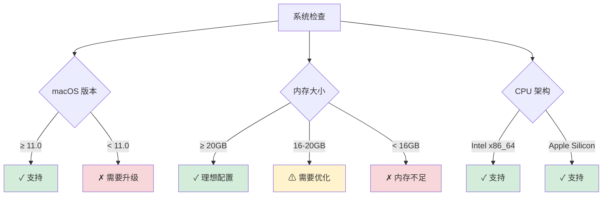
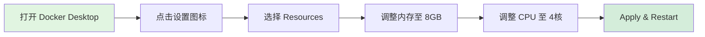
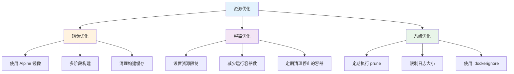

# 第一章：环境搭建

在开始学习容器和 Kubernetes 之前，我们需要搭建一个稳定、高效的本地开发环境。本章将指导你完成所有必要的环境配置。

## 🎯 学习目标

完成本章学习后，你将：
- ✅ 配置好完整的 macOS 开发环境
- ✅ 安装并配置 Docker Desktop
- ✅ 安装 Kubernetes 相关工具链
- ✅ 验证环境配置正确性
- ✅ 了解资源优化策略

## 📋 环境要求

### 系统要求



### 硬件配置建议

| 组件 | 最低要求 | 推荐配置 | 用途说明 |
|------|---------|---------|---------|
| **内存** | 16GB | 20GB+ | Docker 8GB + Kind 4GB + 系统 4GB |
| **CPU** | 4 核心 | 8 核心+ | 容器构建和运行 |
| **存储** | 40GB | 60GB+ | 镜像和容器存储 |
| **网络** | 稳定连接 | 高速网络 | 下载镜像 |

## 🛠 环境搭建步骤

### Step 1: 安装 Homebrew

Homebrew 是 macOS 的包管理器，我们将用它来安装所有必要的工具。

```bash
# 检查是否已安装
brew --version

# 如果未安装，执行以下命令
/bin/bash -c "$(curl -fsSL https://raw.githubusercontent.com/Homebrew/install/HEAD/install.sh)"

# 更新 Homebrew
brew update
brew upgrade
```

### Step 2: 运行自动安装脚本

我们提供了一键安装脚本，自动完成所有工具的安装：

```bash
# 进入项目目录
cd /Users/evenluo/src/k8s_pro

# 运行安装脚本
./tools/setup/install-dependencies.sh
```

脚本将安装以下工具：
- **Docker Desktop** - 容器运行环境
- **kubectl** - Kubernetes 命令行工具
- **Kind** - 本地 Kubernetes 集群
- **Helm** - Kubernetes 包管理器
- **Go** - 后端开发语言
- **Node.js** - 前端开发环境
- **辅助工具** - k9s, jq, yq

### Step 3: 配置 Docker Desktop

#### 3.1 启动 Docker Desktop

```bash
# 启动 Docker Desktop
open -a Docker

# 等待 Docker 启动完成（状态栏图标变绿）
```

#### 3.2 配置资源分配

按照以下步骤配置 Docker Desktop 资源：



详细配置说明：

1. **打开设置面板**
   - 点击 Docker Desktop 菜单栏图标
   - 选择 `Preferences` 或 `Settings`

2. **资源配置** (Resources → Advanced)
   ```yaml
   Memory: 8192 MB  # 8GB
   CPUs: 4          # 4 核心
   Swap: 2 GB       # 交换空间
   Disk: 60 GB      # 磁盘空间
   ```

3. **应用更改**
   - 点击 `Apply & Restart`
   - 等待 Docker 重启（约 30 秒）

> 💡 **提示**: 详细的 Docker 配置指南请参考 [Docker Desktop 配置指南](../../../resources/guides/docker-setup.md)

### Step 4: 验证安装

运行环境验证脚本，确保所有组件正确安装：

```bash
# 运行验证脚本
./tools/validation/check-environment.sh
```

预期输出示例：

```
═══════════════════════════════════════════
    Kubernetes 学习环境验证
═══════════════════════════════════════════

▶ Stage 1: 系统基础要求
────────────────────────────────────────
✓ macOS 版本: 14.0 (满足 ≥11.0 要求)
✓ 系统内存: 32GB (满足 ≥20GB 要求)
✓ CPU 架构: arm64 (支持)

▶ Stage 2: Docker 环境
────────────────────────────────────────
✓ Docker 版本: 24.0.6 (满足 ≥20.10 要求)
✓ Docker 内存配置: 8GB (满足 ≥8GB 要求)

▶ Stage 3: Kubernetes 工具
────────────────────────────────────────
✓ kubectl 版本: v1.29.0 (满足 ≥v1.25 要求)
✓ Kind 已安装: v0.20.0
✓ Helm 已安装: v3.13.0

✅ 环境验证通过！
```

### Step 5: 配置开发环境

#### 5.1 配置 kubectl 自动补全

```bash
# 为 zsh 配置自动补全
echo 'source <(kubectl completion zsh)' >> ~/.zshrc

# 为 bash 配置自动补全
echo 'source <(kubectl completion bash)' >> ~/.bashrc

# 重新加载配置
source ~/.zshrc  # 或 source ~/.bashrc
```

#### 5.2 配置常用别名

```bash
# 添加 kubectl 别名
echo 'alias k=kubectl' >> ~/.zshrc
echo 'alias kgp="kubectl get pods"' >> ~/.zshrc
echo 'alias kgs="kubectl get svc"' >> ~/.zshrc
echo 'alias kgn="kubectl get nodes"' >> ~/.zshrc

# 重新加载配置
source ~/.zshrc
```

#### 5.3 安装 VS Code 扩展（可选）

如果使用 VS Code 作为编辑器，推荐安装以下扩展：

```bash
# Kubernetes 扩展
code --install-extension ms-kubernetes-tools.vscode-kubernetes-tools

# Docker 扩展
code --install-extension ms-azuretools.vscode-docker

# YAML 支持
code --install-extension redhat.vscode-yaml
```

## 🔧 常见问题解决

### 问题 1: Docker Desktop 无法启动

**症状**: Docker Desktop 启动失败或卡住

**解决方案**:
```bash
# 1. 完全退出 Docker
killall Docker

# 2. 清理缓存
rm -rf ~/Library/Containers/com.docker.docker
rm -rf ~/.docker

# 3. 重新启动
open -a Docker
```

### 问题 2: 内存不足警告

**症状**: Docker 报告内存不足

**解决方案**:
1. 检查系统可用内存
   ```bash
   vm_stat | grep "Pages free"
   ```

2. 清理 Docker 资源
   ```bash
   # 清理未使用的资源
   docker system prune -a --volumes
   ```

3. 调整 Docker 内存配置（降低到 6GB）

### 问题 3: kubectl 无法连接

**症状**: kubectl 命令超时或拒绝连接

**解决方案**:
```bash
# 检查配置
kubectl config view

# 重置配置
rm ~/.kube/config
```

## 📊 资源监控

### 监控 Docker 资源使用

```bash
# 查看 Docker 系统信息
docker system df

# 实时监控容器资源
docker stats

# 查看详细信息
docker system info
```

### 资源优化建议



## ✅ 检查清单

完成环境搭建后，请确认以下项目：

- [ ] Homebrew 已安装并更新
- [ ] Docker Desktop 已安装并运行
- [ ] Docker 内存配置 ≥ 8GB
- [ ] kubectl 已安装（版本 ≥ 1.25）
- [ ] Kind 已安装
- [ ] 环境验证脚本通过
- [ ] kubectl 自动补全已配置
- [ ] 能够运行 `docker run hello-world`

## 🎯 动手练习

### 练习 1: 验证 Docker 安装

```bash
# 1. 拉取测试镜像
docker pull nginx:alpine

# 2. 运行测试容器
docker run -d --name test-nginx -p 8080:80 nginx:alpine

# 3. 访问测试
curl http://localhost:8080

# 4. 清理
docker stop test-nginx
docker rm test-nginx
```

### 练习 2: 检查资源使用

```bash
# 查看 Docker 资源占用
docker system df

# 查看运行中的容器
docker ps

# 查看所有镜像
docker images
```

## 📚 延伸阅读

- [Docker Desktop for Mac 文档](https://docs.docker.com/desktop/mac/)
- [kubectl 安装指南](https://kubernetes.io/docs/tasks/tools/install-kubectl-macos/)
- [Kind 快速入门](https://kind.sigs.k8s.io/docs/user/quick-start/)
- [macOS 开发环境最佳实践](https://sourabhbajaj.com/mac-setup/)

## 🚀 下一步

恭喜你完成环境搭建！现在你已经拥有了一个完整的容器学习环境。

接下来，让我们进入 [02-容器基础](../02-容器基础/README.md) 章节，深入了解容器技术的核心概念。

---

💡 **学习建议**: 环境搭建是学习的第一步，请确保所有工具都正确安装。如果遇到问题，不要跳过，因为后续的学习都依赖于这个环境。记得保存好验证脚本的输出，以便排查问题。