# 第二章：容器基础

容器技术是云原生时代的核心技术之一。本章将深入探讨容器的核心概念，帮助你建立对容器技术的全面理解。

## 🎯 学习目标

完成本章学习后，你将：
- ✅ 理解容器与虚拟机的本质区别
- ✅ 掌握 Linux 容器的核心技术
- ✅ 了解容器的隔离和资源限制机制
- ✅ 熟悉容器生态系统和标准
- ✅ 理解容器在实际应用中的优势

## 📚 核心概念

### 1. 什么是容器？

容器是一种轻量级的虚拟化技术，它将应用程序及其所有依赖打包在一起，确保应用在任何环境中都能一致运行。

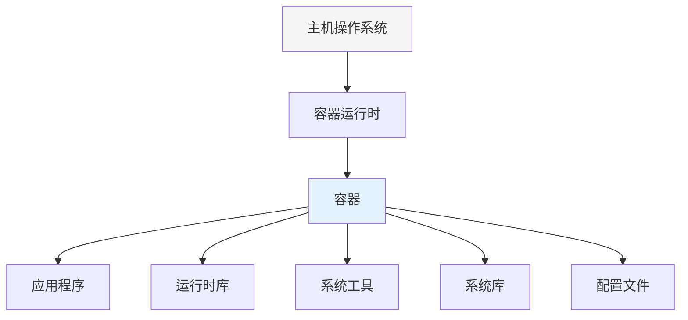

### 2. 容器 vs 虚拟机

理解容器和虚拟机的区别是掌握容器技术的关键：

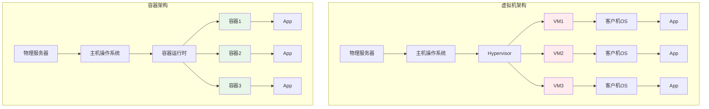

#### 对比分析

| 特性 | 容器 | 虚拟机 |
|------|------|---------|
| **启动时间** | 秒级 | 分钟级 |
| **资源占用** | MB 级别 | GB 级别 |
| **性能损耗** | 接近原生 | 5-15% 损耗 |
| **隔离级别** | 进程级隔离 | 完全隔离 |
| **系统支持** | 共享内核 | 独立内核 |
| **部署密度** | 单机 100+ | 单机 10-20 |
| **可移植性** | 极高 | 一般 |
| **安全性** | 较好 | 很好 |

### 3. Linux 容器核心技术

容器技术基于 Linux 内核的几个关键特性：

#### 3.1 Namespaces（命名空间）

Namespaces 提供了容器的隔离性，让每个容器看起来像一个独立的系统。

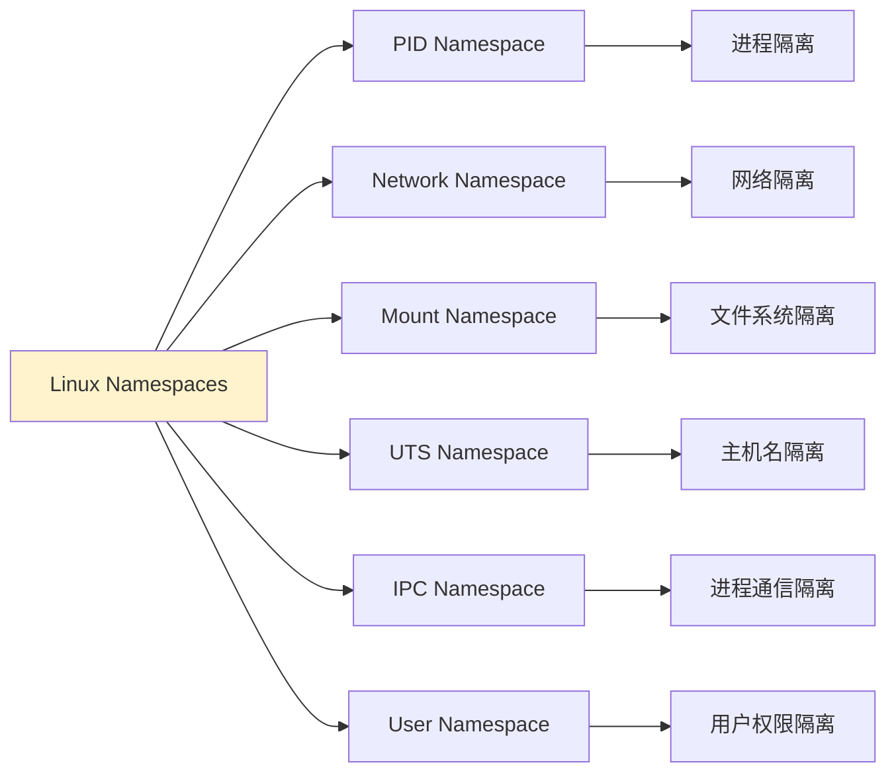

**各 Namespace 详解：**

1. **PID Namespace**
   - 隔离进程 ID
   - 容器内 PID 1 是容器的主进程
   - 容器看不到宿主机的其他进程

2. **Network Namespace**
   - 独立的网络栈
   - 独立的网络设备、IP 地址、路由表
   - 容器间网络隔离

3. **Mount Namespace**
   - 独立的文件系统挂载点
   - 容器有自己的根文件系统
   - 挂载操作不影响宿主机

4. **UTS Namespace**
   - 独立的主机名和域名
   - 每个容器可以有自己的 hostname

5. **IPC Namespace**
   - 隔离进程间通信资源
   - 独立的消息队列、共享内存、信号量

6. **User Namespace**
   - 用户和组 ID 映射
   - 容器内 root 可映射为宿主机普通用户

#### 3.2 Cgroups（控制组）

Cgroups 用于限制和监控容器的资源使用：

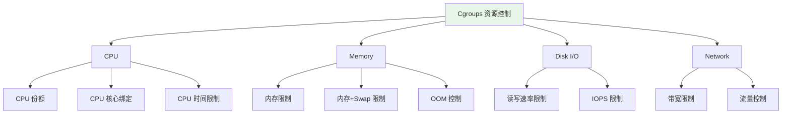

**实际应用示例：**

```bash
# 限制容器使用 512MB 内存
docker run -m 512m nginx

# 限制容器使用 0.5 个 CPU
docker run --cpus="0.5" nginx

# 限制容器 I/O 速率
docker run --device-read-bps /dev/sda:1mb nginx
```

#### 3.3 Union File System（联合文件系统）

Union FS 实现了容器的分层存储：

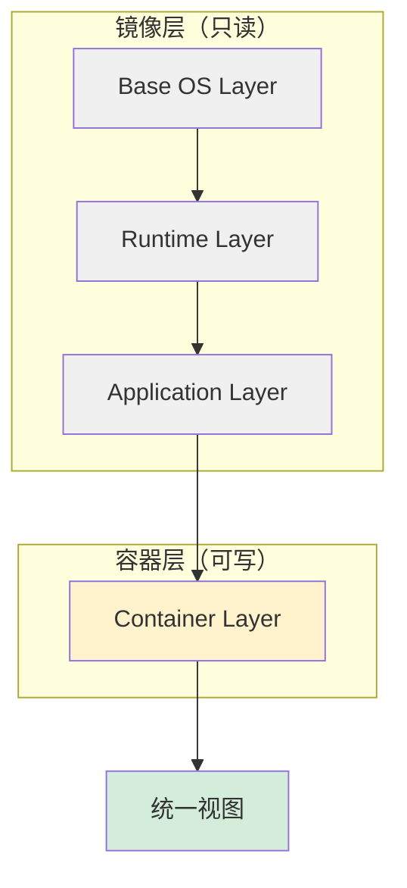

**分层的优势：**
- **存储效率**：层可以被多个镜像共享
- **传输效率**：只需传输变化的层
- **构建效率**：利用缓存加速构建

### 4. 容器运行时

#### 4.1 容器运行时架构

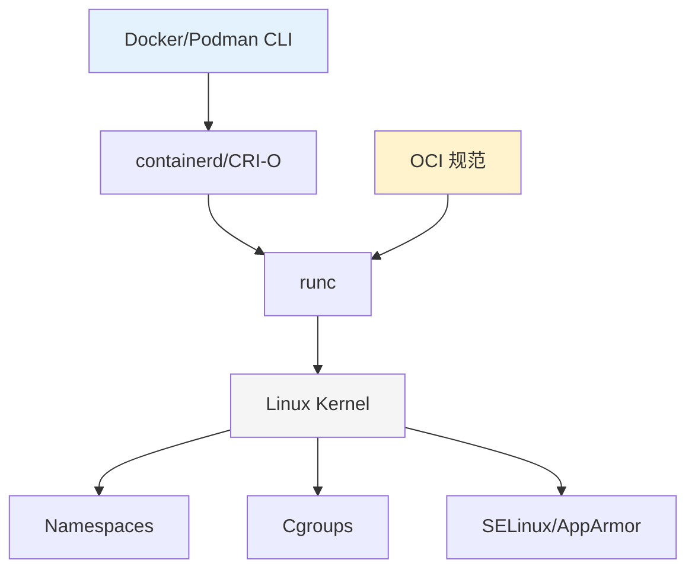

#### 4.2 主流容器运行时

| 运行时 | 特点 | 使用场景 |
|--------|------|----------|
| **Docker** | 最流行，生态完善 | 开发环境、小规模生产 |
| **containerd** | 轻量级，CNCF 项目 | Kubernetes 默认 |
| **CRI-O** | 专为 Kubernetes 设计 | OpenShift |
| **Podman** | 无守护进程，兼容 Docker | RHEL/Fedora |
| **runc** | OCI 参考实现 | 底层运行时 |

### 5. 容器镜像

#### 5.1 镜像结构

容器镜像是一个只读模板，包含运行容器所需的一切：

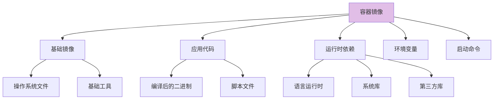

#### 5.2 镜像大小优化

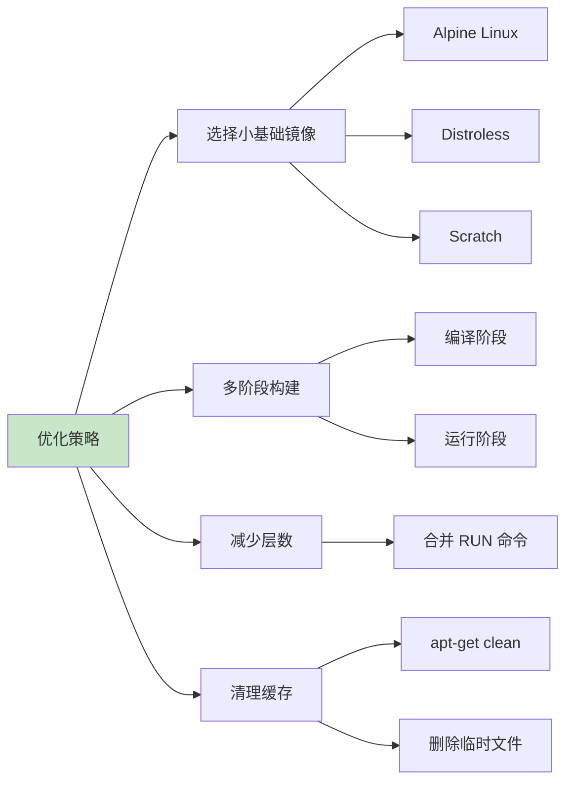

### 6. 容器网络

#### 6.1 网络模式

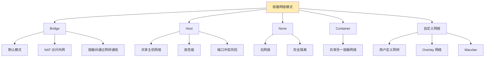

### 7. 容器存储

#### 7.1 存储类型

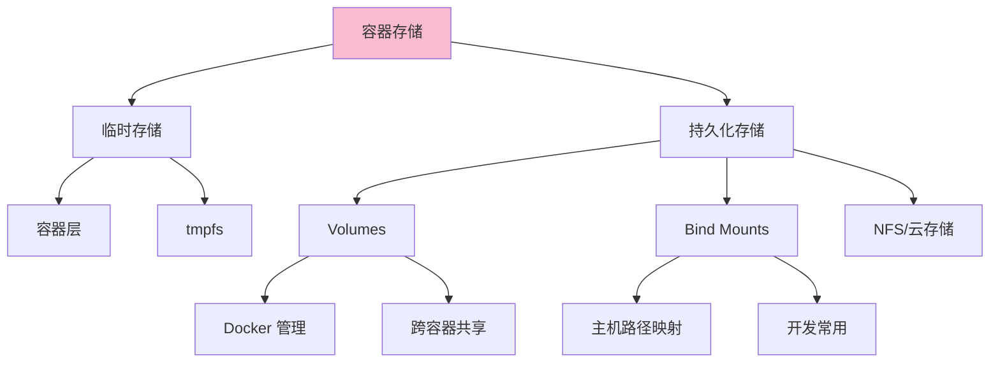

## 🔍 深入理解

### 容器安全

#### 安全机制

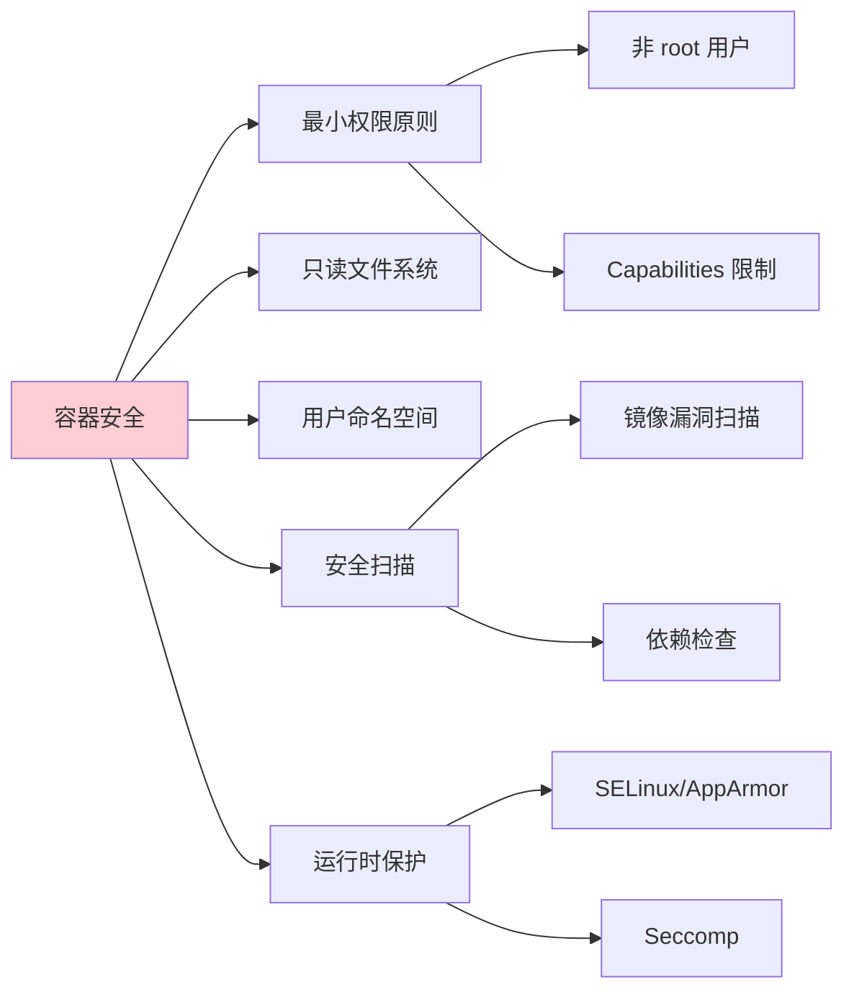

### 容器编排需求

当容器数量增多时，需要编排系统（如 Kubernetes）来管理：

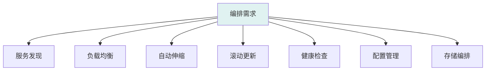

## 🎓 实践练习

### 练习 1：探索 Namespace 隔离

```bash
# 1. 运行一个容器
docker run -d --name test-namespace nginx

# 2. 查看容器的进程 (在容器内是 PID 1)
docker exec test-namespace ps aux

# 3. 查看主机上的进程
ps aux | grep nginx

# 4. 进入容器的 namespace
docker exec -it test-namespace /bin/bash

# 在容器内执行
hostname  # 查看主机名
ip addr   # 查看网络
mount     # 查看挂载点
```

### 练习 2：体验 Cgroups 资源限制

```bash
# 1. 运行一个内存受限的容器
docker run -d --name mem-test --memory=128m nginx

# 2. 查看内存限制
docker stats mem-test --no-stream

# 3. 运行 CPU 受限的容器
docker run -d --name cpu-test --cpus="0.5" nginx

# 4. 查看资源使用
docker stats --no-stream
```

### 练习 3：理解镜像分层

```bash
# 1. 查看镜像历史
docker history nginx:alpine

# 2. 查看镜像层
docker inspect nginx:alpine | jq '.[0].RootFS.Layers'

# 3. 创建自己的镜像观察分层
cat > Dockerfile <<EOF
FROM alpine:latest
RUN apk add --no-cache curl
RUN apk add --no-cache wget
CMD ["/bin/sh"]
EOF

docker build -t my-image .
docker history my-image
```

## 💡 关键要点总结

1. **容器是轻量级虚拟化**
   - 共享主机内核，启动快，资源占用少
   - 通过 Namespace 和 Cgroups 实现隔离和资源限制

2. **容器 vs 虚拟机**
   - 容器：进程级隔离，秒级启动，MB 级资源
   - 虚拟机：系统级隔离，分钟级启动，GB 级资源

3. **核心技术栈**
   - Namespaces：提供隔离性
   - Cgroups：控制资源
   - Union FS：实现分层存储

4. **容器生态系统**
   - OCI 标准确保互操作性
   - 多种运行时可选择
   - 丰富的工具链支持

## 📚 扩展阅读

- [Linux Namespaces 详解](https://man7.org/linux/man-pages/man7/namespaces.7.html)
- [Cgroups v2 文档](https://www.kernel.org/doc/html/latest/admin-guide/cgroup-v2.html)
- [OCI 规范](https://opencontainers.org/release-notices/overview/)
- [容器安全最佳实践](https://docs.docker.com/develop/security-best-practices/)

## ✅ 自测问题

1. 容器和虚拟机的主要区别是什么？
2. Linux Namespaces 提供了哪些类型的隔离？
3. Cgroups 如何限制容器的资源使用？
4. 为什么容器镜像要设计成分层结构？
5. 容器网络有哪些常见模式？

## 🚀 下一步

现在你已经理解了容器的核心概念和技术原理。接下来，让我们进入 [03-Docker入门](../03-Docker入门/README.md) 章节，通过实践来掌握 Docker 的使用。

---

🎯 **学习提示**: 理解容器的底层原理非常重要，这将帮助你在使用 Docker 和 Kubernetes 时更好地理解其行为和解决问题。建议你动手完成所有练习，通过实践加深理解。