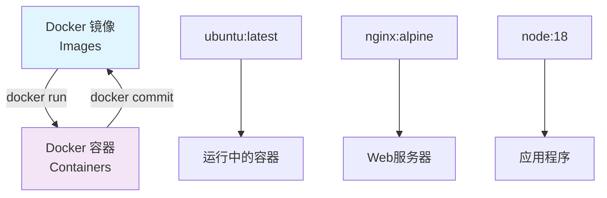

[TOC]

# Docker 入门 (Docker Basics)

## 学习目标

完成本模块后，您将能够：
- 理解 Docker 的核心概念和工作原理
- 熟练使用 Docker 命令行工具
- 创建和管理 Docker 容器
- 构建自定义 Docker 镜像
- 理解 Docker 网络和存储基础

## 概念卡速记

> 📌 **概念卡：Docker Engine（容器运行引擎）**  
> **定义**：Docker 的核心守护进程与 CLI 组合，负责镜像管理、容器生命周期与网络/存储抽象。  
> **课程中作用**：后续所有 `docker` 命令均与 Docker Engine 交互，理解它有助于排查常见 Daemon 问题。  
> **快速命令**：`docker info`、`docker version`

> 📌 **概念卡：Docker Image（容器镜像）**  
> **定义**：分层存储的只读模板，包含应用代码、依赖与启动命令；通过 OCI 镜像规范描述。  
> **课程中作用**：镜像是创建容器的前提，后续 Kubernetes 中的 Pod 也依赖镜像作为运行单元。  
> **快速命令**：`docker pull nginx:alpine`、`docker images`

> 📌 **概念卡：Docker Container（容器实例）**  
> **定义**：镜像运行后的实例，包含可写层与运行态配置；生命周期受 Docker Engine 管理。  
> **课程中作用**：掌握容器的启动、停止、日志查看，是理解 Pod 行为的基础。  
> **快速命令**：`docker run -d nginx`、`docker ps`

> 📌 **概念卡：Dockerfile（镜像构建脚本）**  
> **定义**：描述镜像构建步骤的声明式文件，通过层级缓存实现高效构建。  
> **课程中作用**：后续任务需编写 Dockerfile 支持自定义应用镜像，理解各指令语义避免构建陷阱。  
> **快速命令**：`docker build -t demo:latest -f Dockerfile .`

> 📌 **概念卡：Docker Volume（数据卷）**  
> **定义**：由 Docker 管理的持久化存储，可在容器间共享并独立于容器生命周期。  
> **课程中作用**：支撑实验中的数据持久化与状态共享，后续 Kubernetes Volume 学习的铺垫。  
> **关键命令**：`docker volume create data-vol`、`docker volume inspect data-vol`

> 📌 **概念卡：Docker Compose（多容器编排）**  
> **定义**：通过 `docker-compose.yaml` 定义多容器应用的服务、网络与卷，实现一键启动和管理。  
> **课程中作用**：提前熟悉声明式容器编排思路，为 Kubernetes 的 YAML 清单做准备。  
> **关键命令**：`docker compose up -d`

## 前置要求

- 已完成"容器基础"模块
- Docker Desktop 已安装并运行
- 基本命令行操作能力

## Docker 核心概念

### 镜像 (Images) vs 容器 (Containers)



**关键理解**：
- **镜像**：只读的模板，包含运行应用所需的代码、库和依赖
- **容器**：镜像的运行实例，可读写的执行环境

## 实战练习

### 练习 1：运行第一个容器

```bash
# 1. 拉取并运行 Hello World 容器
docker run hello-world

# 2. 运行交互式 Ubuntu 容器
docker run -it ubuntu:20.04 /bin/bash
```

**在容器内尝试**：
```bash
# 查看操作系统版本
cat /etc/os-release

# 安装软件包
apt update && apt install -y curl

# 测试网络连接
curl -I https://www.baidu.com

# 退出容器
exit
```

### 练习 2：容器生命周期管理

```bash
# 1. 后台运行 nginx 容器
docker run -d --name my-nginx -p 8080:80 nginx:alpine

# 2. 查看运行中的容器
docker ps

# 3. 查看容器日志
docker logs my-nginx

# 4. 进入运行中的容器
docker exec -it my-nginx /bin/sh

# 5. 在容器内查看进程
ps aux

# 6. 退出但不停止容器
exit

# 7. 停止容器
docker stop my-nginx

# 8. 查看所有容器（包括已停止的）
docker ps -a

# 9. 重新启动容器
docker start my-nginx

# 10. 删除容器
docker rm -f my-nginx
```

### 练习 3：端口映射和网络

```bash
# 1. 运行 nginx 并映射不同端口
docker run -d --name web1 -p 8081:80 nginx:alpine
docker run -d --name web2 -p 8082:80 nginx:alpine

# 2. 测试端口映射
curl http://localhost:8081
curl http://localhost:8082

# 3. 查看端口映射
docker port web1
docker port web2

# 4. 清理
docker rm -f web1 web2
```

### 练习 4：数据卷 (Volumes)

```bash
# 1. 创建命名数据卷
docker volume create my-data

# 2. 使用数据卷运行容器
docker run -d --name db-container -v my-data:/data alpine sleep 3600

# 3. 在容器中写入数据
docker exec db-container sh -c 'echo "Hello from container" > /data/test.txt'

# 4. 停止并删除容器
docker rm -f db-container

# 5. 创建新容器使用相同数据卷
docker run -d --name new-container -v my-data:/data alpine sleep 3600

# 6. 验证数据持久化
docker exec new-container cat /data/test.txt

# 7. 清理
docker rm -f new-container
docker volume rm my-data
```

### 练习 5：构建自定义镜像

创建一个简单的 Web 应用：

```bash
# 1. 创建工作目录
mkdir docker-demo && cd docker-demo
```

**创建 `index.html`**：
```html
<!DOCTYPE html>
<html>
<head>
    <title>My Docker App</title>
</head>
<body>
    <h1>Hello from Docker!</h1>
    <p>Current time: <span id="time"></span></p>
    <script>
        document.getElementById('time').textContent = new Date().toLocaleString();
    </script>
</body>
</html>
```

**创建 `Dockerfile`**：
```dockerfile
# 使用官方 nginx 基础镜像
FROM nginx:alpine

# 复制 HTML 文件到 nginx 默认目录
COPY index.html /usr/share/nginx/html/

# 暴露 80 端口
EXPOSE 80

# nginx 会自动启动，无需额外 CMD
```

**构建和运行**：
```bash
# 2. 构建镜像
docker build -t my-web-app .

# 3. 查看构建的镜像
docker images my-web-app

# 4. 运行自定义镜像
docker run -d --name my-app -p 8080:80 my-web-app

# 5. 测试应用
curl http://localhost:8080

# 6. 清理
docker rm -f my-app
docker rmi my-web-app
```

### 练习 6：多阶段构建

创建一个 Node.js 应用的高效镜像：

**创建 `package.json`**：
```json
{
  "name": "docker-node-app",
  "version": "1.0.0",
  "main": "server.js",
  "scripts": {
    "start": "node server.js"
  },
  "dependencies": {
    "express": "^4.18.0"
  }
}
```

**创建 `server.js`**：
```javascript
const express = require('express');
const app = express();
const PORT = 3000;

app.get('/', (req, res) => {
  res.json({
    message: 'Hello from Node.js in Docker!',
    timestamp: new Date().toISOString(),
    env: process.env.NODE_ENV || 'development'
  });
});

app.listen(PORT, '0.0.0.0', () => {
  console.log(`Server running on port ${PORT}`);
});
```

**创建多阶段 `Dockerfile`**：
```dockerfile
# 第一阶段：构建阶段
FROM node:18-alpine AS builder

WORKDIR /app

# 复制 package 文件
COPY package*.json ./

# 安装依赖
RUN npm ci --only=production

# 第二阶段：运行阶段
FROM node:18-alpine AS runner

WORKDIR /app

# 从构建阶段复制依赖
COPY --from=builder /app/node_modules ./node_modules

# 复制应用代码
COPY server.js package.json ./

# 创建非 root 用户
RUN addgroup -g 1001 -S nodejs && \
    adduser -S nodejs -u 1001

USER nodejs

EXPOSE 3000

CMD ["npm", "start"]
```

**构建和测试**：
```bash
# 构建镜像
docker build -t node-app:multistage .

# 比较镜像大小
docker images | grep node-app

# 运行应用
docker run -d --name node-app -p 3000:3000 node-app:multistage

# 测试 API
curl http://localhost:3000

# 清理
docker rm -f node-app
```

## 常用 Docker 命令总结

### 镜像管理
```bash
# 搜索镜像
docker search nginx

# 拉取镜像
docker pull nginx:alpine

# 列出本地镜像
docker images

# 删除镜像
docker rmi image_name:tag

# 清理未使用的镜像
docker image prune
```

### 容器管理
```bash
# 运行容器
docker run [options] image [command]

# 列出容器
docker ps          # 运行中的容器
docker ps -a       # 所有容器

# 停止/启动/重启容器
docker stop container_name
docker start container_name
docker restart container_name

# 删除容器
docker rm container_name
docker rm -f container_name  # 强制删除

# 查看容器信息
docker inspect container_name
docker logs container_name
docker stats container_name
```

### 系统清理
```bash
# 清理所有未使用的资源
docker system prune

# 清理所有数据（危险操作）
docker system prune -a --volumes
```

## 实用技巧

### 1. 环境变量使用
```bash
# 传递环境变量
docker run -e NODE_ENV=production -e PORT=3000 node-app

# 使用环境文件
echo "NODE_ENV=production" > .env
echo "PORT=3000" >> .env
docker run --env-file .env node-app
```

### 2. 资源限制
```bash
# 限制内存和 CPU
docker run -m 512m --cpus="0.5" nginx:alpine

# 查看资源使用
docker stats
```

### 3. 健康检查
```dockerfile
HEALTHCHECK --interval=30s --timeout=3s --start-period=5s --retries=3 \
  CMD curl -f http://localhost:3000/health || exit 1
```

## 最佳实践

### Dockerfile 优化
1. **使用多阶段构建**减少最终镜像大小
2. **合并 RUN 指令**减少镜像层数
3. **使用 .dockerignore**排除不必要的文件
4. **不要在容器中运行 root 用户**
5. **使用特定版本标签**而不是 `latest`

### 安全考虑
```dockerfile
# 创建非 root 用户
RUN addgroup -S appgroup && adduser -S appuser -G appgroup
USER appuser

# 使用只读文件系统
docker run --read-only --tmpfs /tmp my-app

# 移除不必要的包和文件
RUN apt-get update && \
    apt-get install -y --no-install-recommends curl && \
    apt-get clean && \
    rm -rf /var/lib/apt/lists/*
```

## 故障排查

### 常见问题和解决方案

**问题 1**: 容器启动后立即退出
```bash
# 查看退出状态和日志
docker ps -a
docker logs container_name

# 以交互模式进入容器调试
docker run -it image_name /bin/sh
```

**问题 2**: 端口映射不生效
```bash
# 检查端口映射
docker port container_name

# 检查防火墙设置
netstat -tlnp | grep 8080
```

**问题 3**: 容器内无法访问外网
```bash
# 检查 DNS 设置
docker run --rm alpine nslookup google.com

# 手动指定 DNS
docker run --dns 8.8.8.8 alpine nslookup google.com
```

## 验证检查清单

完成所有练习后，请确认：

- [ ] 成功运行了第一个 Hello World 容器
- [ ] 能够管理容器的生命周期（启动、停止、删除）
- [ ] 理解端口映射并成功访问容器服务
- [ ] 使用数据卷实现数据持久化
- [ ] 成功构建自定义 Docker 镜像
- [ ] 实现了多阶段构建优化
- [ ] 掌握常用 Docker 命令
- [ ] 了解 Docker 安全最佳实践

## 下一步

恭喜完成 Docker 入门！接下来您可以：

1. 进入"核心 K8s 课程"学习容器编排
2. 深入学习 Docker Compose 多容器应用
3. 探索容器镜像安全扫描和优化

## 参考资源

- [Docker 官方文档](https://docs.docker.com/)
- [Docker Hub](https://hub.docker.com/)
- [Dockerfile 最佳实践](https://docs.docker.com/develop/dev-best-practices/)
- [Docker 安全指南](https://docs.docker.com/engine/security/)
