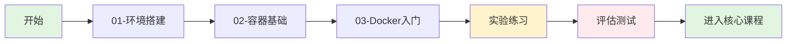

[TOC]

# 基础课程：容器与 Docker 入门

欢迎来到 Kubernetes 学习之旅的第一站！本课程将帮助你建立容器技术的坚实基础。

## 📚 课程概述

本课程专为零基础学习者设计，通过循序渐进的方式，帮助你理解容器技术的核心概念，并掌握 Docker 的基本使用。

### 学习目标

完成本课程后，你将能够：
- ✅ 搭建完整的 Kubernetes 学习环境
- ✅ 理解容器技术的原理和优势
- ✅ 熟练使用 Docker 管理容器和镜像
- ✅ 为学习 Kubernetes 打下坚实基础

## 概念卡速记

> 📌 **概念卡：基础课程三部曲（Environment → Container → Docker）**  
> **定义**：基础课程由环境搭建、容器原理、Docker 实践三大模块组成，逐层抽象、逐步深化。  
> **学习提醒**：严格按顺序完成，每个模块的输出（脚本、笔记）将在后续核心课程中复用。  
> **路径记忆**：T001-T011 对应目录 `01-环境搭建/` → `02-容器基础/` → `03-Docker入门/`

> 📌 **概念卡：学习产出物（Learning Artifacts）**  
> **定义**：指每个任务生成的脚本、YAML、Markdown 说明，构成课程累积资产。  
> **学习提醒**：完成后需自检 `labs/` 与 `assessment/` 是否同步更新，确保后续课程调用不缺漏。  
> **快速检查**：运行 `./tools/validation/check-environment.sh` 并对照任务列表勾选。

> 📌 **概念卡：渐进式实验（Progressive Labs）**  
> **定义**：由浅入深的实验设计，先从 Docker 操作练手，再扩展到网络、存储与配置管理。  
> **学习提醒**：完成每个实验后记录`问题-分析-结论`，为核心课程故障排查提供素材。  
> **参考位置**：`courses/00-foundation/labs/`

## 📖 课程模块

### [01-环境搭建](./01-环境搭建/README.md)
**学习时间**: 30 分钟

搭建和验证本地开发环境：
- macOS 环境准备
- Docker Desktop 安装与配置
- 开发工具链配置
- 环境验证

### [02-容器基础](./02-容器基础/README.md)
**学习时间**: 45 分钟

深入理解容器技术的核心概念：
- 容器 vs 虚拟机
- Linux 容器技术原理
- 容器的隔离与资源限制
- 容器生态系统介绍

### [03-Docker入门](./03-Docker入门/README.md)
**学习时间**: 60 分钟

动手实践 Docker 基本操作：
- Docker 架构与组件
- 镜像管理（拉取、构建、推送）
- 容器生命周期管理
- 数据持久化与网络配置

## 🧪 实验练习

### [labs/](./labs/)
包含所有动手实验：

1. **docker-basics.yaml** - Docker 基础操作练习
   - 运行第一个容器
   - 镜像和容器管理
   - Dockerfile 编写

2. **container-networking.yaml** - 容器网络实验
   - 容器间通信
   - 端口映射
   - 自定义网络

3. **data-persistence.yaml** - 数据持久化实验
   - Volume 挂载
   - Bind mount
   - 数据共享

## 📝 评估测试

### [assessment/](./assessment/)
课程评估材料：

- **quiz.json** - 概念理解测试（20 道选择题）
- **practical-tasks.md** - 实操任务清单
- **troubleshooting.md** - 故障排查场景

## 🚀 学习路径

## 📋 前置要求

- **硬件要求**:
  - macOS 11.0+ 或 Linux
  - 至少 8GB RAM（推荐 16GB）
  - 20GB 可用磁盘空间

- **软件要求**:
  - Homebrew（macOS）
  - 终端基本使用经验

## 🎯 学习建议

1. **循序渐进**: 请按照模块顺序学习，每个模块都建立在前一个的基础上
2. **动手实践**: 理论学习后立即进行实验练习
3. **记录笔记**: 记录学习过程中的问题和心得
4. **寻求帮助**: 遇到问题时查阅文档或搜索解决方案

## 📚 推荐资源

### 官方文档
- [Docker 官方文档](https://docs.docker.com/)
- [Docker Hub](https://hub.docker.com/)
- [Docker 最佳实践](https://docs.docker.com/develop/dev-best-practices/)

### 扩展学习
- [容器技术原理深入](https://www.redhat.com/en/topics/containers)
- [OCI 规范](https://opencontainers.org/)
- [CNCF 云原生技术栈](https://landscape.cncf.io/)

## ✅ 完成标准

完成以下任务即可进入下一阶段：

- [ ] 环境搭建完成并通过验证脚本
- [ ] 完成所有三个模块的学习
- [ ] 完成至少 2 个实验练习
- [ ] 通过概念测试（正确率 ≥ 80%）
- [ ] 完成一个实操任务

## 💡 提示

> **学习容器技术就像学习驾驶**：先了解原理（为什么需要容器），再学习操作（如何使用 Docker），最后通过大量练习形成肌肉记忆。不要急于求成，扎实的基础将让后续的 Kubernetes 学习事半功倍！

## 🆘 需要帮助？

- 查看 [常见问题](../../resources/guides/troubleshooting.md)
- 运行诊断脚本: `./tools/validation/check-environment.sh`
- 查阅 [Docker 速查表](../../resources/cheatsheets/docker-commands.md)

---

准备好了吗？让我们从 [环境搭建](./01-环境搭建/README.md) 开始你的容器技术学习之旅！

🎉 **祝学习愉快！**
