[TOC]

# Kubernetes 架构 (Kubernetes Architecture)

## 学习目标

完成本模块后，您将能够：
- 理解 Kubernetes 分布式架构设计理念
- 掌握 Master 和 Worker 节点的核心组件
- 了解组件间的交互机制和数据流
- 理解 K8s 网络和存储架构模型

## 概念卡速记

> 📌 **概念卡：Control Plane（控制平面）**  
> **定义**：由 API Server、etcd、Scheduler、Controller Manager 等组件组成，负责整个集群的状态管理与调度决策。  
> **学习提醒**：控制平面高可用是生产级集群重点，理解其组件职责是后续故障排查的起点。  
> **关键命令**：`kubectl get componentstatuses`、`kubectl get nodes --selector='node-role.kubernetes.io/control-plane'`

> 📌 **概念卡：Data Plane（数据平面/工作节点）**  
> **定义**：运行应用工作负载的节点，由 kubelet、kube-proxy 与容器运行时协同工作。  
> **学习提醒**：kubelet 上报节点状态，kube-proxy 维护服务网络，两者健康度直接影响 Pod 生命周期。  
> **关键命令**：`kubectl describe node <node-name>`

> 📌 **概念卡：API Server（集群 API 服务）**  
> **定义**：控制平面核心入口，提供 RESTful API、认证授权与准入控制，是所有命令与控制器的交互枢纽。  
> **学习提醒**：排查集群问题时优先检查 API Server 日志与健康状态。  
> **关键命令**：`kubectl get --raw='/healthz'`

> 📌 **概念卡：etcd（分布式键值存储）**  
> **定义**：保存集群期望状态与配置的高一致性键值存储，支持事务与快照。  
> **学习提醒**：etcd 性能与备份策略决定集群可靠性，需掌握备份/恢复流程。  
> **关键命令**：`ETCDCTL_API=3 etcdctl snapshot save backup.db`

## 前置知识

- 容器和 Docker 基础概念
- 分布式系统基本理解
- Linux 系统和网络基础
- YAML 配置文件格式

## Kubernetes 整体架构

Kubernetes 采用 **Master-Worker** 分布式架构，通过声明式 API 管理容器化应用的生命周期。

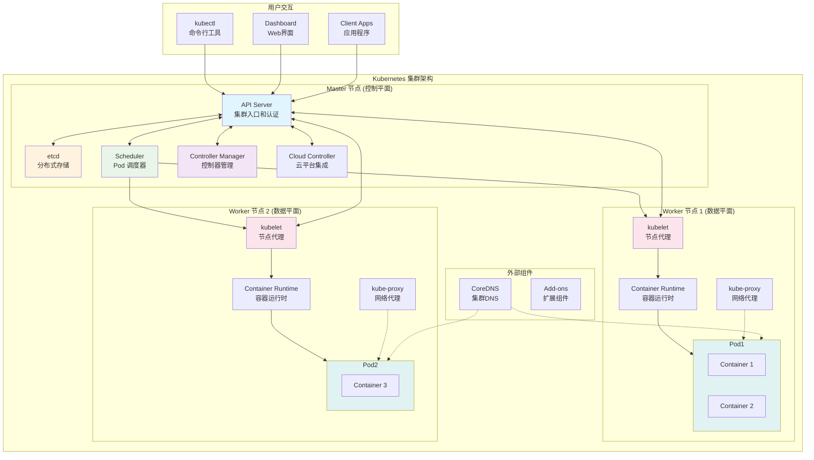

## Master 节点组件 (控制平面)

Master 节点负责集群的管理和控制，包含以下核心组件：

### 🌐 API Server

**作用**: 集群的统一入口，提供 RESTful API

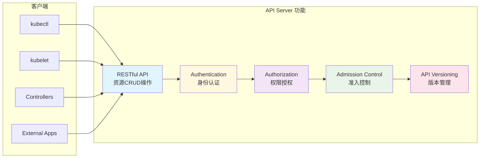

**核心职责**：
- 🔐 **API 网关**: 所有集群操作的唯一入口
- 🔑 **认证授权**: 用户和组件身份验证
- 📝 **资源验证**: API 对象格式和语义检查
- 🔄 **状态同步**: 与 etcd 进行数据交互
- 📡 **事件通知**: 资源变化的 Watch 机制

**交互流程**：
1. 客户端发送 HTTP/HTTPS 请求
2. 身份认证 (Authentication)
3. 权限检查 (Authorization)
4. 准入控制 (Admission Control)
5. 资源验证和存储到 etcd
6. 返回操作结果

### 🗄️ etcd

**作用**: 分布式键值存储，集群的"数据库"

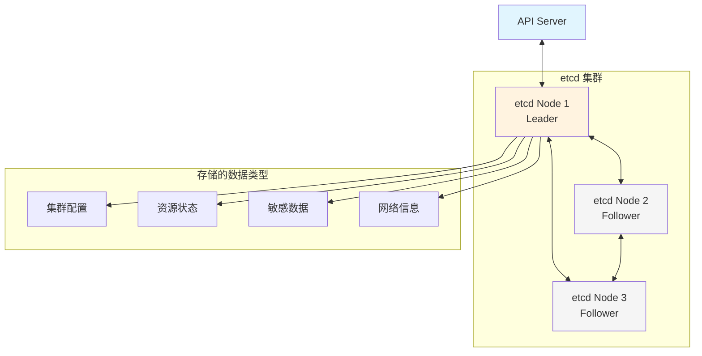

**核心特性**：
- 🔄 **一致性**: 使用 Raft 算法保证强一致性
- 🚀 **高可用**: 支持集群部署，自动故障转移
- ⚡ **高性能**: 针对读多写少场景优化
- 🔐 **安全性**: 支持 TLS 加密和 RBAC 权限控制

**存储内容**：
- 所有 Kubernetes 资源对象 (Pod、Service、Deployment 等)
- 集群配置信息和网络拓扑
- 密钥和证书等敏感数据
- 集群状态和元数据

### 📅 Scheduler

**作用**: 负责 Pod 的调度决策，选择最合适的节点

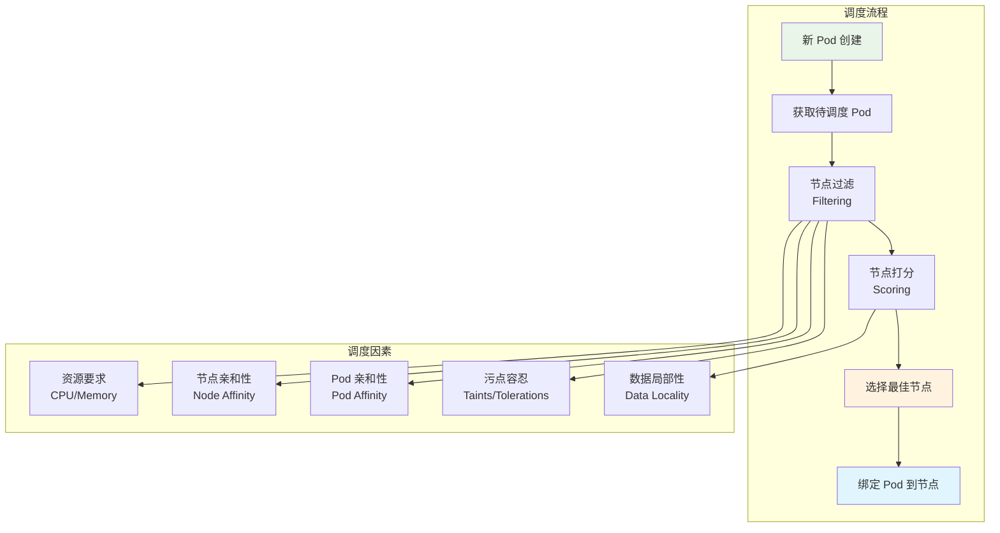

**调度策略**：

1. **过滤阶段 (Filtering)**：
   - 资源充足性检查 (CPU、内存、存储)
   - 端口冲突检查
   - 节点选择器匹配
   - 亲和性和反亲和性规则
   - 污点和容忍度检查

2. **打分阶段 (Scoring)**：
   - 资源均衡分布
   - 镜像拉取速度优化
   - 数据局部性考虑
   - 自定义调度策略

### ⚙️ Controller Manager

**作用**: 运行各种控制器，维护集群期望状态

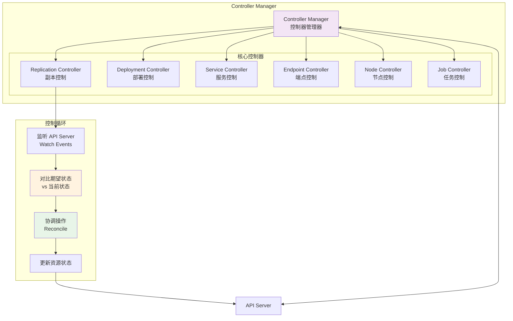

**主要控制器**：

- **Deployment Controller**: 管理 ReplicaSet 和滚动更新
- **ReplicaSet Controller**: 确保 Pod 副本数量
- **Service Controller**: 管理 Service 和 Endpoints
- **Node Controller**: 监控节点健康状态
- **Job Controller**: 管理批量任务和定时任务
- **Namespace Controller**: 处理命名空间生命周期

## Worker 节点组件 (数据平面)

Worker 节点运行实际的容器工作负载：

### 🤖 kubelet

**作用**: 节点上的 Kubernetes 代理，管理 Pod 生命周期

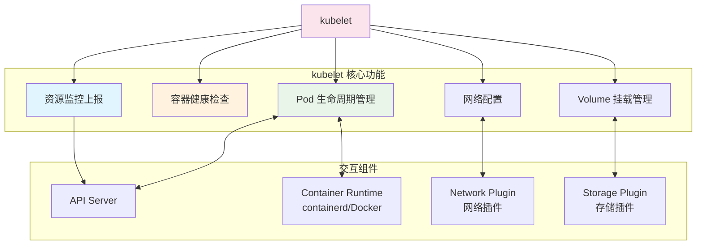

**核心职责**：
- 📦 **Pod 管理**: 创建、启动、停止、删除 Pod
- 🩺 **健康检查**: 执行存活探针和就绪探针
- 📊 **资源监控**: 收集节点和 Pod 的资源使用情况
- 💾 **存储管理**: 挂载和卸载 Volume
- 🌐 **网络配置**: 配置 Pod 网络接口

### 🌐 kube-proxy

**作用**: 维护网络规则，实现 Service 的负载均衡

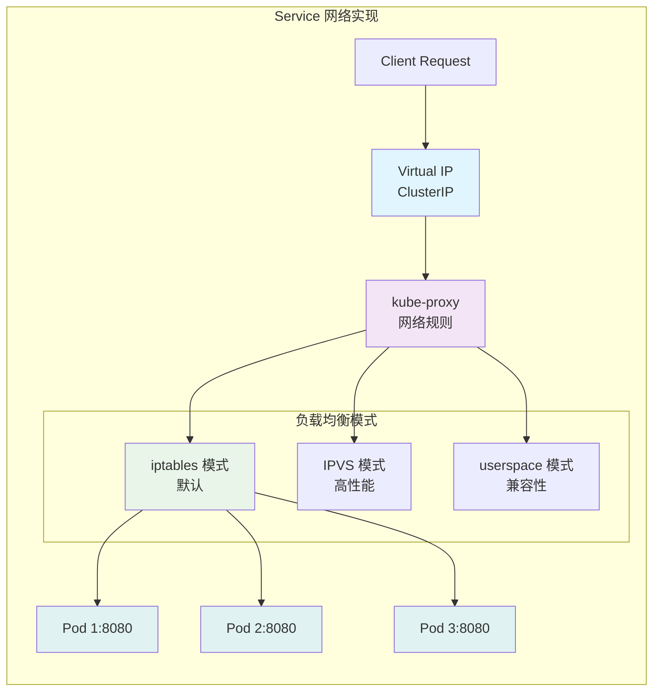

**实现模式**：

1. **iptables 模式** (默认)：
   - 使用 iptables 规则实现负载均衡
   - 随机或轮询分发请求
   - 适合中小规模集群

2. **IPVS 模式** (推荐)：
   - 基于 Linux 内核的 IPVS 模块
   - 支持多种负载均衡算法
   - 更好的性能和可扩展性

3. **userspace 模式** (已废弃)：
   - 早期版本的实现方式
   - 性能较差，主要用于兼容

### 🐳 Container Runtime

**作用**: 实际运行容器的底层系统

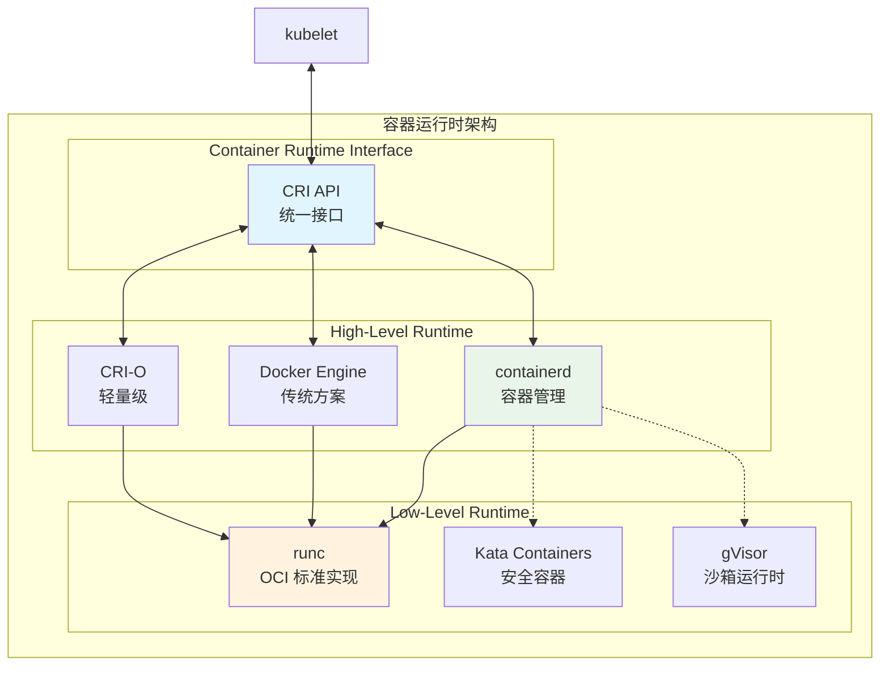

**主要实现**：
- **containerd**: Cloud Native Computing Foundation 项目，Docker 的核心组件
- **CRI-O**: 专为 Kubernetes 设计的轻量级运行时
- **Docker**: 传统容器运行时，通过 dockershim 集成

## 网络架构模型

Kubernetes 网络遵循以下基本要求：

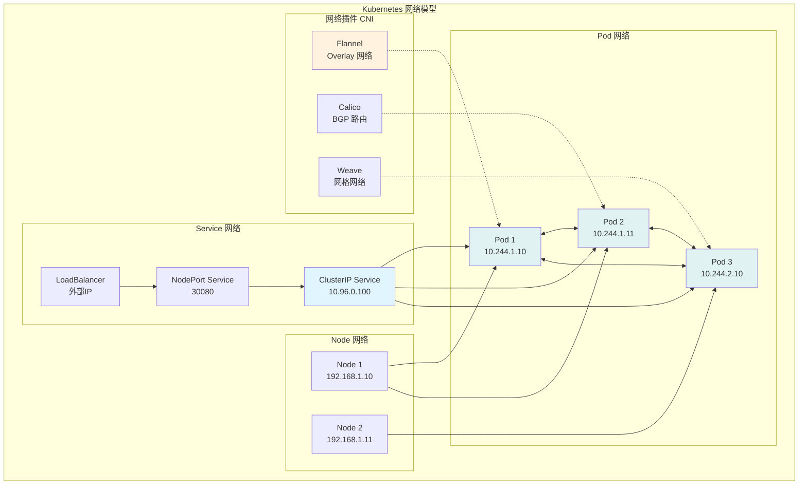

**网络要求**：
1. 🔗 **Pod 互通**: 任意两个 Pod 可以直接通信，无需 NAT
2. 🌐 **节点到 Pod**: 节点可以与所有 Pod 通信
3. 📍 **Pod 身份**: Pod 看到的自己 IP 与其他 Pod 看到的相同
4. 🔒 **网络隔离**: 支持 NetworkPolicy 进行访问控制

## 存储架构模型

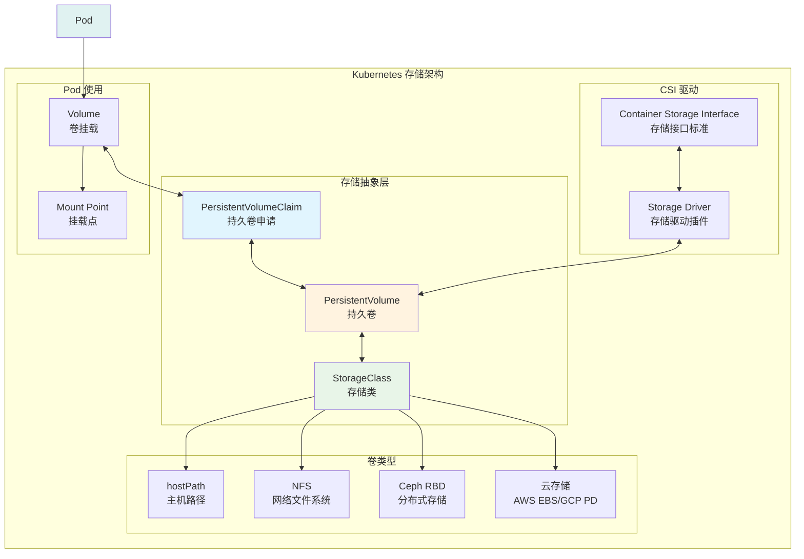

## 组件通信流程

### Pod 创建完整流程

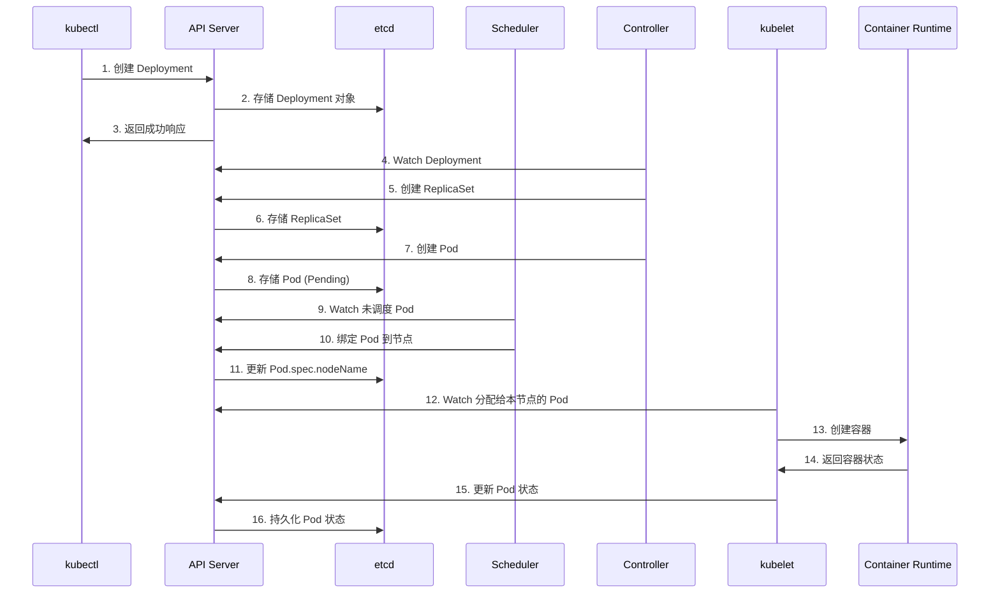

### Service 访问流程

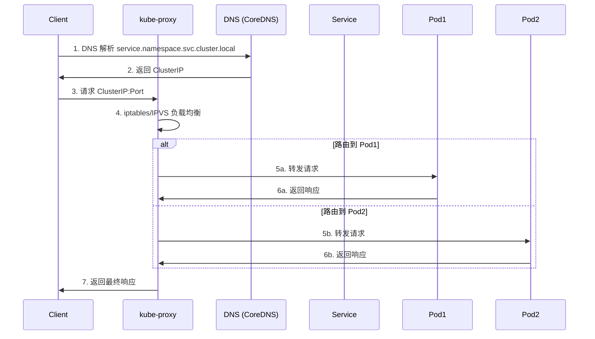

## 高可用架构

生产环境中的高可用 Kubernetes 集群：

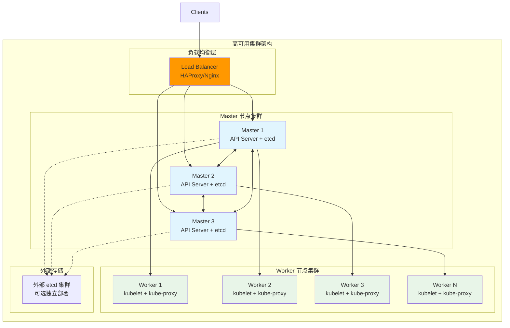

**高可用要点**：
- 🔄 **多 Master**: 至少 3 个 Master 节点，奇数个避免脑裂
- 💾 **etcd 集群**: 独立的 etcd 集群或与 Master 节点混部
- ⚖️ **负载均衡**: API Server 前端负载均衡器
- 🌐 **网络冗余**: 多网络接口和路由路径
- 📊 **监控告警**: 全方位的集群健康监控

## 实际应用场景

### 1. 开发环境
- **单节点**: minikube、Kind、Docker Desktop
- **资源**: 2-4 CPU, 4-8GB 内存
- **特点**: 快速启动，功能完整，适合学习

### 2. 测试环境
- **多节点**: 3 Master + 3-5 Worker
- **资源**: 中等配置，接近生产
- **特点**: 稳定性测试，集成测试

### 3. 生产环境
- **高可用**: 3+ Master + 多 Worker
- **资源**: 高配置，充足冗余
- **特点**: 高可用、高性能、安全加固

## 常见问题和排查

### 🔍 架构相关问题

**问题 1**: API Server 无法访问
```bash
# 检查 API Server 状态
kubectl cluster-info
systemctl status kube-apiserver

# 检查证书和网络
openssl x509 -in /etc/kubernetes/pki/apiserver.crt -text -noout
netstat -tlnp | grep 6443
```

**问题 2**: etcd 数据不一致
```bash
# 检查 etcd 集群健康
kubectl exec -n kube-system etcd-master -- etcdctl cluster-health
kubectl exec -n kube-system etcd-master -- etcdctl member list

# 检查数据一致性
kubectl get events --all-namespaces
```

**问题 3**: Pod 调度失败
```bash
# 查看调度器日志
kubectl logs -n kube-system kube-scheduler-master

# 检查节点状态和资源
kubectl get nodes -o wide
kubectl describe node <node-name>
kubectl top nodes
```

## 学习检验

### 🎯 理解检查

1. **架构概念**:
   - 解释 Master-Worker 架构的优势
   - 描述控制平面和数据平面的职责分工
   - 说明 API Server 在整个架构中的作用

2. **组件交互**:
   - 绘制 Pod 创建的完整流程图
   - 解释 Service 访问的网络路径
   - 描述控制器的工作机制

3. **网络存储**:
   - 说明 K8s 网络模型的基本要求
   - 解释 CNI 插件的作用和选择
   - 描述 CSI 存储接口的价值

### ✅ 实践验证

在接下来的实验中，您将：
- 使用 Kind 搭建本地 K8s 集群
- 观察各组件的启动和交互过程
- 通过实际操作加深对架构的理解

## 下一步学习

- **[核心组件详解](../02-核心组件/README.md)**: 深入学习 Pod、Service、Deployment
- **[应用部署实践](../03-应用部署/README.md)**: 掌握 kubectl 和 YAML 配置
- **[集群搭建实验](../labs/)**: 动手搭建和管理 K8s 集群

---

通过本模块的学习，您现在应该对 Kubernetes 的整体架构有了清晰的理解。这个架构设计体现了云原生的核心理念：**声明式**、**可扩展**、**高可用**。在后续的学习中，我们将深入每个组件的具体功能和使用方法。
