[TOC]

# Kubernetes 核心组件 (Core Components)

## 学习目标

完成本模块后，您将能够：
- 深入理解 Pod 作为最小调度单元的设计理念
- 掌握 Deployment 的滚动更新和版本管理机制
- 熟练使用 Service 进行服务发现和负载均衡
- 运用 Namespace 实现多租户资源隔离
- 理解各组件间的协作关系和最佳实践

## 概念卡速记

> 📌 **概念卡：Pod（最小调度单元）**  
> **定义**：Pod 是 Kubernetes 中可被调度的最小单元，包含一个或多个共享网络与存储的容器。  
> **学习提醒**：Pod 生命周期短暂，适合作为应用运行时封装，状态数据需挂载 Volume。  
> **关键命令**：`kubectl get pods`、`kubectl describe pod <name>`

> 📌 **概念卡：ReplicaSet（副本控制器）**  
> **定义**：管理 Pod 副本数量的控制器，确保实际副本数与期望一致。  
> **学习提醒**：ReplicaSet 通常由 Deployment 自动创建，手动管理场景少，但理解其作用有助于掌握滚动更新流程。  
> **关键命令**：`kubectl get rs`、`kubectl scale rs <name> --replicas=3`

> 📌 **概念卡：Deployment（部署控制器）**  
> **定义**：提供声明式更新的控制器，通过管理 ReplicaSet 实现滚动发布、回滚和版本历史。  
> **学习提醒**：Deployment 是生产环境最常用的工作负载，理解其策略字段（`strategy.rollingUpdate`）尤为重要。  
> **关键命令**：`kubectl rollout status deployment/<name>`、`kubectl rollout undo deployment/<name>`

> 📌 **概念卡：Service（服务抽象）**  
> **定义**：为一组 Pod 提供稳定的虚拟 IP 和 DNS 名称，并实现负载均衡。  
> **学习提醒**：根据访问需求选择 `ClusterIP`、`NodePort`、`LoadBalancer` 类型，理解 `selector` 与 Endpoints 的关系。  
> **关键命令**：`kubectl get svc`、`kubectl describe svc <name>`

> 📌 **概念卡：Namespace（命名空间）**  
> **定义**：逻辑隔离机制，将资源划分到不同的命名空间，支持多租户与资源配额。  
> **学习提醒**：实践中需要结合 RBAC 与 ResourceQuota 才能实现完整隔离。  
> **关键命令**：`kubectl get ns`、`kubectl create namespace staging`

> 📌 **概念卡：ConfigMap（配置映射）**  
> **定义**：以键值对形式存储非敏感配置数据，可通过环境变量或文件挂载注入容器。  
> **学习提醒**：配置修改默认不会自动热加载，需要结合注解或 `rollout restart` 触发更新。  
> **关键命令**：`kubectl create configmap app-config --from-file=config/`

> 📌 **概念卡：Secret（敏感信息对象）**  
> **定义**：专门用于保存凭证、密钥等敏感数据的资源，数据以 Base64 编码存储。  
> **学习提醒**：结合 RBAC、命名空间隔离和加密存储，避免明文泄露；与 ConfigMap 的使用方式类似但权限更严格。  
> **关键命令**：`kubectl create secret generic db-credentials --from-literal=password=xxx`

> 📌 **概念卡：PersistentVolume / PersistentVolumeClaim（持久卷与声明）**  
> **定义**：PersistentVolume (PV) 表示集群中已供给的存储资源，PersistentVolumeClaim (PVC) 是工作负载请求存储的声明。  
> **学习提醒**：PVC 与 PV 通过访问模式和存储类匹配，Pod 挂载 PVC 以实现数据持久化。  
> **快速命令**：`kubectl get pv`、`kubectl get pvc`

## 前置知识

- 完成 Kubernetes 架构学习
- 理解容器和 Docker 基础概念
- 熟悉 YAML 配置文件格式
- 掌握基本的 Linux 命令和网络概念

## 核心组件概览

Kubernetes 通过一系列抽象资源来管理容器化应用，核心组件之间的关系如下：

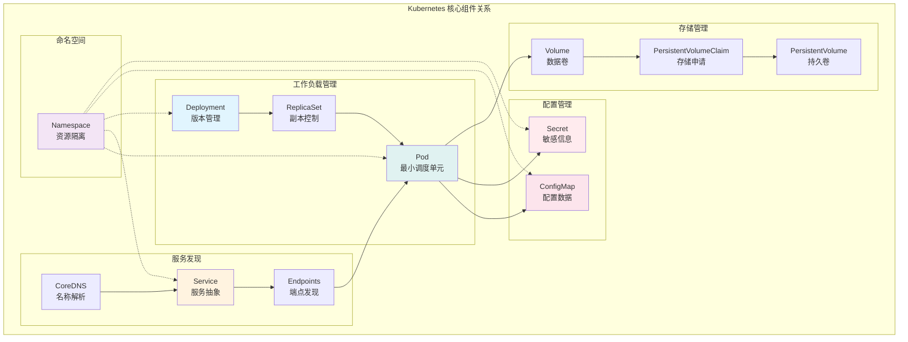

## Pod：最小调度单元

Pod 是 Kubernetes 中最基本的部署单元，封装了一个或多个容器及其共享资源。

### Pod 基本概念

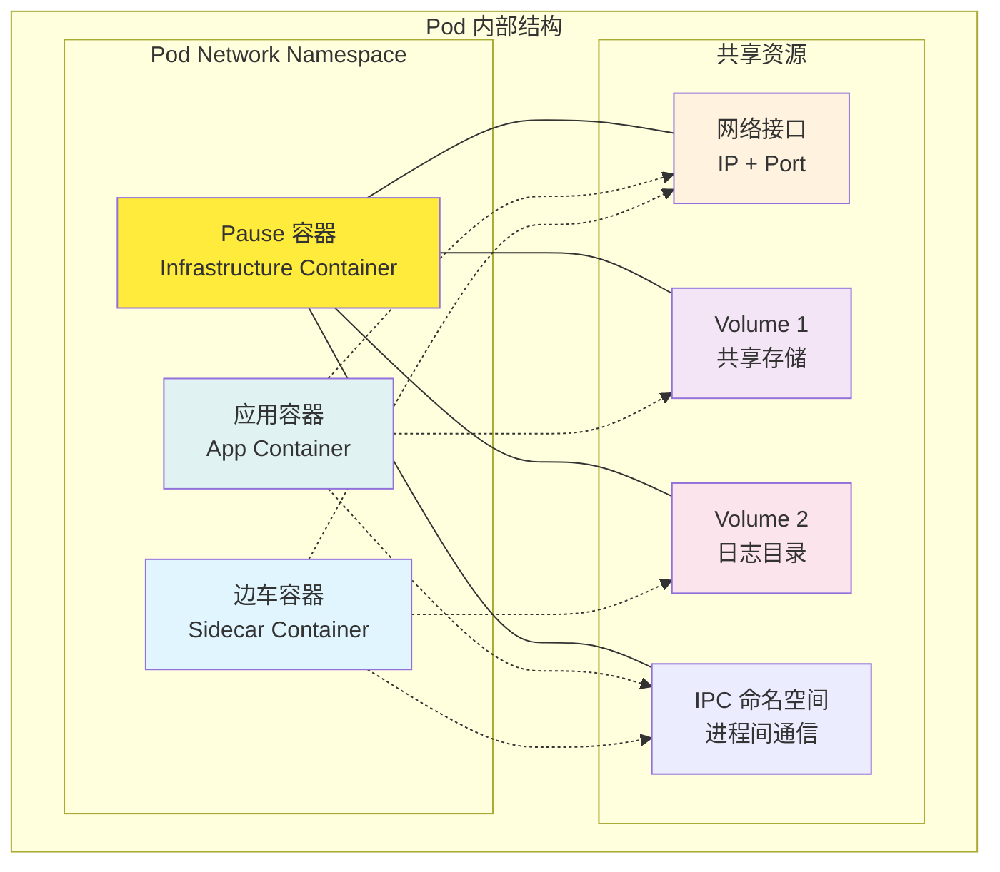

**Pod 设计原则**：
- 🔗 **紧密耦合**: 容器间需要紧密协作
- 🌐 **共享网络**: 同一 Pod 内容器共享 IP 地址和端口空间
- 💾 **共享存储**: 通过 Volume 共享数据
- ⚡ **原子调度**: Pod 内所有容器作为整体进行调度

### Pod 生命周期

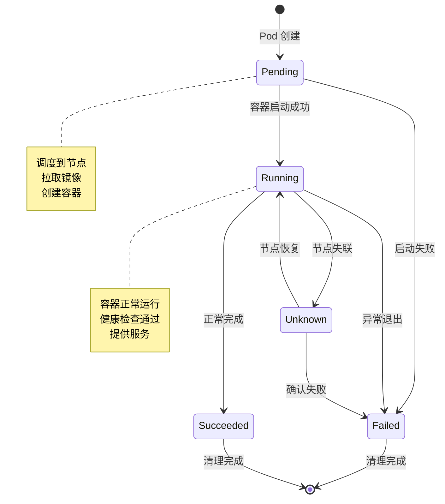

**生命周期阶段**：

1. **Pending（待调度）**:
   - Pod 已创建但未调度到节点
   - 可能原因：资源不足、调度约束

2. **Running（运行中）**:
   - Pod 已调度到节点且至少一个容器运行
   - 所有容器启动完成

3. **Succeeded（成功完成）**:
   - 所有容器成功终止且不会重启
   - 适用于批处理任务

4. **Failed（失败）**:
   - 至少一个容器异常终止
   - 需要检查日志分析原因

5. **Unknown（未知）**:
   - 无法获取 Pod 状态
   - 通常是节点通信问题

### Pod 配置示例

**基础 Pod 配置**：
```yaml
apiVersion: v1
kind: Pod
metadata:
  name: nginx-pod
  labels:
    app: nginx
    version: v1
spec:
  containers:
  - name: nginx
    image: nginx:1.20
    ports:
    - containerPort: 80
      protocol: TCP
    resources:
      requests:
        cpu: 100m
        memory: 128Mi
      limits:
        cpu: 200m
        memory: 256Mi
    livenessProbe:
      httpGet:
        path: /
        port: 80
      initialDelaySeconds: 30
      periodSeconds: 10
    readinessProbe:
      httpGet:
        path: /
        port: 80
      initialDelaySeconds: 5
      periodSeconds: 5
```

**多容器 Pod（Sidecar 模式）**：
```yaml
apiVersion: v1
kind: Pod
metadata:
  name: app-with-sidecar
spec:
  containers:
  # 主应用容器
  - name: app
    image: my-app:latest
    ports:
    - containerPort: 8080
    volumeMounts:
    - name: shared-logs
      mountPath: /var/log/app

  # 日志收集边车容器
  - name: log-collector
    image: fluent/fluentd:latest
    volumeMounts:
    - name: shared-logs
      mountPath: /var/log/app
      readOnly: true
    - name: fluentd-config
      mountPath: /fluentd/etc

  volumes:
  - name: shared-logs
    emptyDir: {}
  - name: fluentd-config
    configMap:
      name: fluentd-config
```

### Pod 健康检查

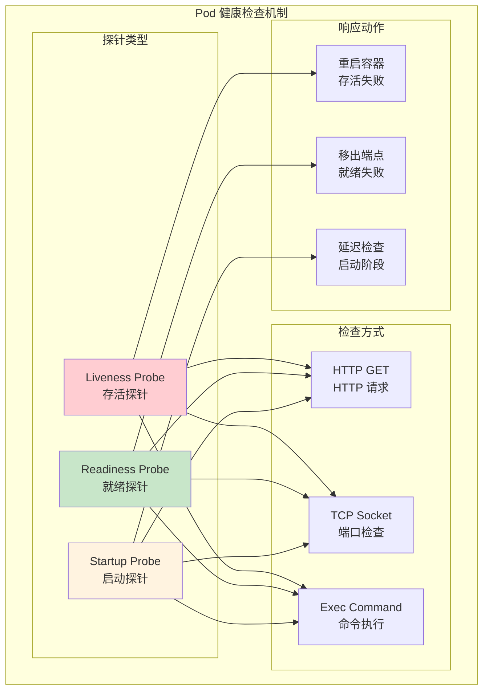

**探针配置详解**：
```yaml
# 存活探针 - 检查容器是否运行正常
livenessProbe:
  httpGet:
    path: /healthz
    port: 8080
    httpHeaders:
    - name: Custom-Header
      value: liveness
  initialDelaySeconds: 30  # 初始延迟
  periodSeconds: 10        # 检查间隔
  timeoutSeconds: 5        # 超时时间
  successThreshold: 1      # 成功阈值
  failureThreshold: 3      # 失败阈值

# 就绪探针 - 检查容器是否准备接收流量
readinessProbe:
  httpGet:
    path: /ready
    port: 8080
  initialDelaySeconds: 5
  periodSeconds: 5
  timeoutSeconds: 3
  successThreshold: 1
  failureThreshold: 3

# 启动探针 - 检查容器是否已启动完成
startupProbe:
  httpGet:
    path: /startup
    port: 8080
  initialDelaySeconds: 10
  periodSeconds: 10
  timeoutSeconds: 5
  failureThreshold: 30     # 给慢启动应用更多时间
```

## ReplicaSet：副本控制

ReplicaSet 确保指定数量的 Pod 副本始终运行，是 Deployment 的底层实现。

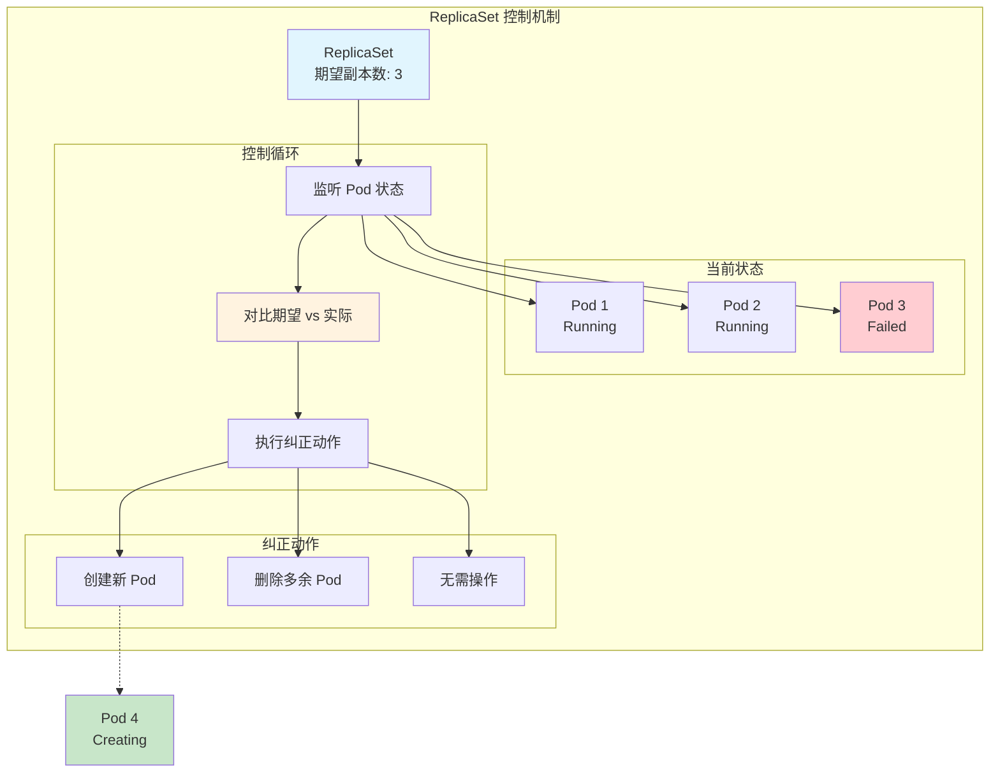

**ReplicaSet 配置示例**：
```yaml
apiVersion: apps/v1
kind: ReplicaSet
metadata:
  name: nginx-replicaset
  labels:
    app: nginx
spec:
  # 期望的副本数量
  replicas: 3

  # 选择器 - 决定管理哪些 Pod
  selector:
    matchLabels:
      app: nginx
      version: v1

  # Pod 模板
  template:
    metadata:
      labels:
        app: nginx
        version: v1
    spec:
      containers:
      - name: nginx
        image: nginx:1.20
        ports:
        - containerPort: 80
        resources:
          requests:
            cpu: 100m
            memory: 128Mi
          limits:
            cpu: 200m
            memory: 256Mi
```

## Deployment：声明式部署

Deployment 是生产环境中部署应用的首选方式，提供滚动更新、版本回滚等高级功能。

### Deployment 架构

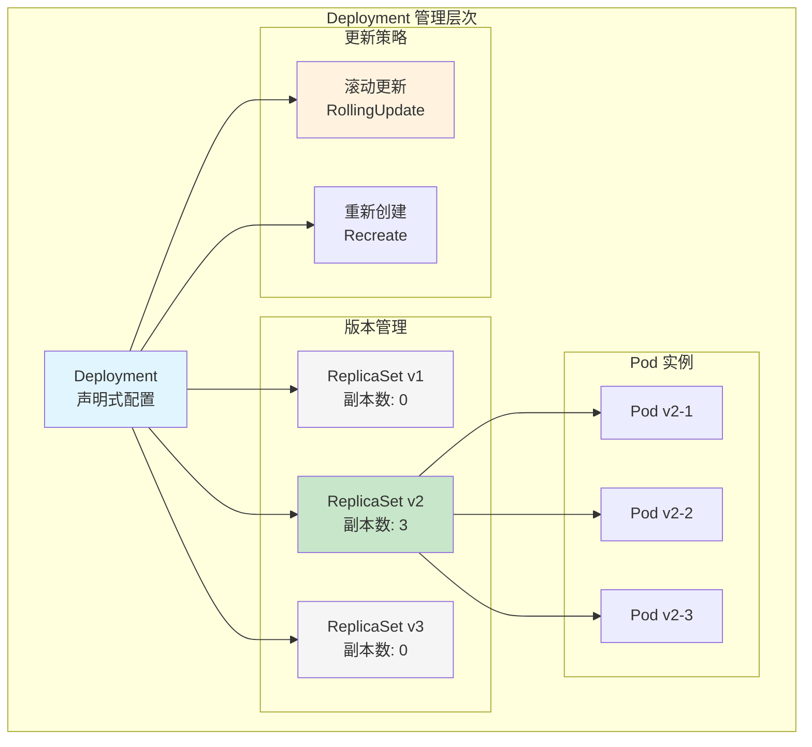

### 滚动更新机制

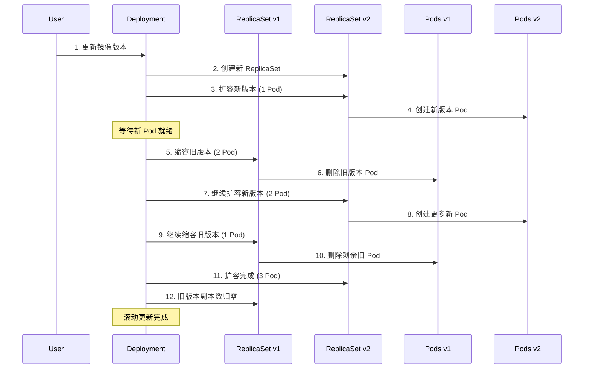

### Deployment 配置详解

```yaml
apiVersion: apps/v1
kind: Deployment
metadata:
  name: nginx-deployment
  labels:
    app: nginx
spec:
  # 副本数量
  replicas: 3

  # 更新策略
  strategy:
    type: RollingUpdate
    rollingUpdate:
      maxUnavailable: 1      # 更新过程中不可用 Pod 数量
      maxSurge: 1           # 更新过程中超出期望副本数的 Pod 数量

  # 版本历史保留数量
  revisionHistoryLimit: 10

  # 选择器
  selector:
    matchLabels:
      app: nginx

  template:
    metadata:
      labels:
        app: nginx
    spec:
      containers:
      - name: nginx
        image: nginx:1.20
        ports:
        - containerPort: 80
        resources:
          requests:
            cpu: 100m
            memory: 128Mi
          limits:
            cpu: 200m
            memory: 256Mi

        # 健康检查
        livenessProbe:
          httpGet:
            path: /
            port: 80
          initialDelaySeconds: 30
          periodSeconds: 10

        readinessProbe:
          httpGet:
            path: /
            port: 80
          initialDelaySeconds: 5
          periodSeconds: 5

        # 环境变量
        env:
        - name: NGINX_PORT
          value: "80"

        # 配置挂载
        volumeMounts:
        - name: nginx-config
          mountPath: /etc/nginx/conf.d
          readOnly: true

      volumes:
      - name: nginx-config
        configMap:
          name: nginx-config
```

### Deployment 操作命令

```bash
# 创建 Deployment
kubectl create deployment nginx --image=nginx:1.20
kubectl apply -f nginx-deployment.yaml

# 查看 Deployment 状态
kubectl get deployments
kubectl describe deployment nginx-deployment

# 滚动更新
kubectl set image deployment/nginx-deployment nginx=nginx:1.21
kubectl rollout status deployment/nginx-deployment

# 版本历史
kubectl rollout history deployment/nginx-deployment
kubectl rollout history deployment/nginx-deployment --revision=2

# 回滚操作
kubectl rollout undo deployment/nginx-deployment
kubectl rollout undo deployment/nginx-deployment --to-revision=2

# 扩缩容
kubectl scale deployment nginx-deployment --replicas=5
kubectl autoscale deployment nginx-deployment --min=2 --max=10 --cpu-percent=80

# 暂停和恢复更新
kubectl rollout pause deployment/nginx-deployment
kubectl rollout resume deployment/nginx-deployment
```

## Service：服务发现和负载均衡

Service 为 Pod 提供稳定的网络访问方式，解决 Pod IP 动态变化的问题。

### Service 类型

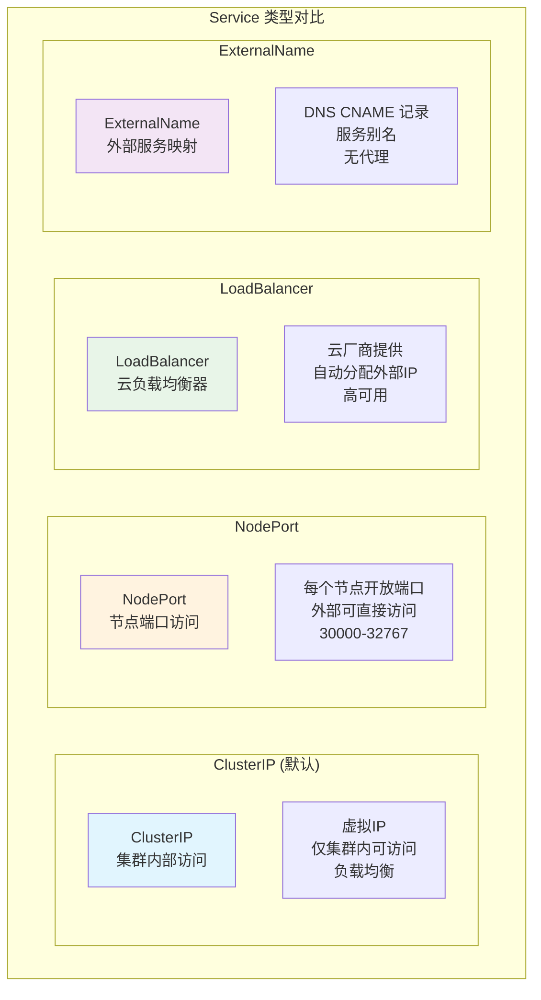

### Service 网络实现

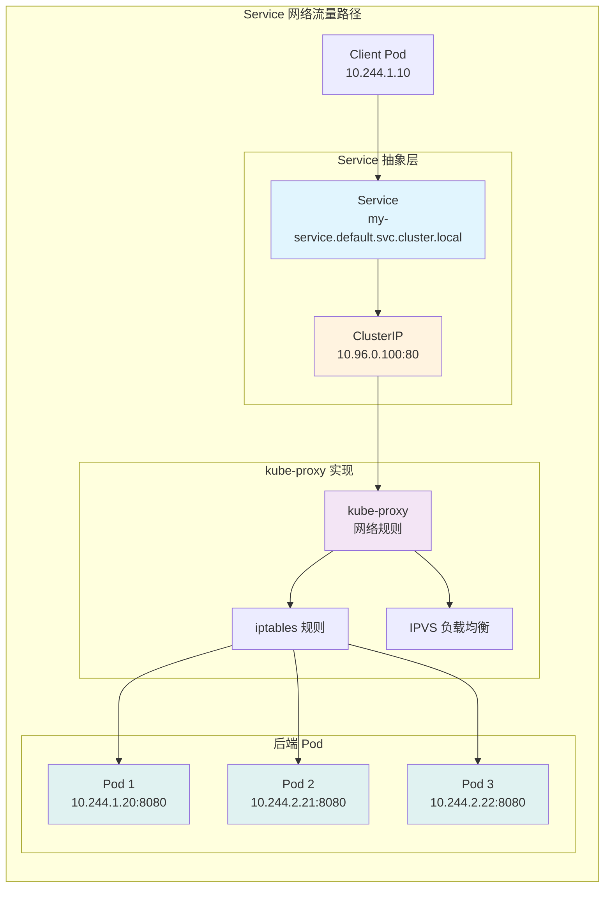

### Service 配置示例

**ClusterIP Service（默认类型）**：
```yaml
apiVersion: v1
kind: Service
metadata:
  name: nginx-service
  labels:
    app: nginx
spec:
  type: ClusterIP
  selector:
    app: nginx
  ports:
  - name: http
    port: 80          # Service 端口
    targetPort: 80    # Pod 端口
    protocol: TCP

  # 会话亲和性
  sessionAffinity: None  # None 或 ClientIP
```

**NodePort Service（外部访问）**：
```yaml
apiVersion: v1
kind: Service
metadata:
  name: nginx-nodeport
spec:
  type: NodePort
  selector:
    app: nginx
  ports:
  - name: http
    port: 80
    targetPort: 80
    nodePort: 30080    # 可选，不指定则自动分配
    protocol: TCP
```

**LoadBalancer Service（云环境）**：
```yaml
apiVersion: v1
kind: Service
metadata:
  name: nginx-loadbalancer
  annotations:
    # 云厂商特定注解
    service.beta.kubernetes.io/aws-load-balancer-type: "nlb"
spec:
  type: LoadBalancer
  selector:
    app: nginx
  ports:
  - name: http
    port: 80
    targetPort: 80
  loadBalancerSourceRanges:
  - "10.0.0.0/8"      # 限制访问来源
```

**Headless Service（无头服务）**：
```yaml
apiVersion: v1
kind: Service
metadata:
  name: nginx-headless
spec:
  clusterIP: None     # 无头服务
  selector:
    app: nginx
  ports:
  - name: http
    port: 80
    targetPort: 80
```

### Endpoints 和服务发现

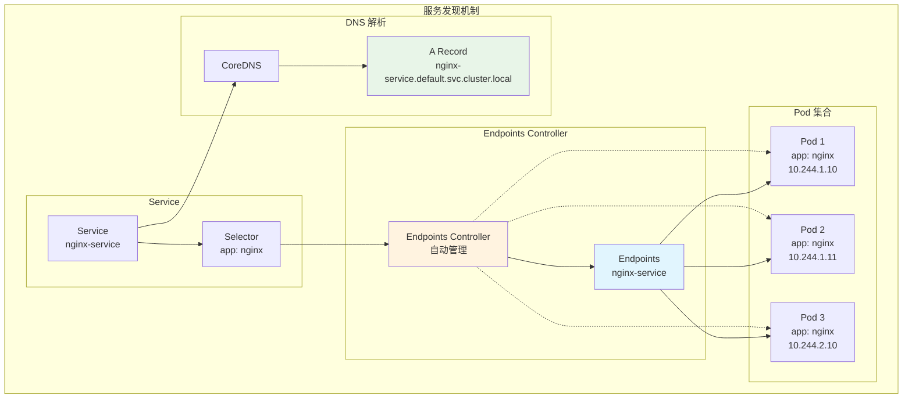

## ConfigMap 和 Secret：配置管理

### ConfigMap：非敏感配置

ConfigMap 用于存储非敏感的配置数据，以键值对形式保存。

```yaml
# ConfigMap 创建示例
apiVersion: v1
kind: ConfigMap
metadata:
  name: app-config
data:
  # 键值对配置
  database.host: "mysql.example.com"
  database.port: "3306"
  log.level: "info"

  # 配置文件内容
  nginx.conf: |
    server {
        listen 80;
        server_name localhost;

        location / {
            root /usr/share/nginx/html;
            index index.html;
        }

        location /api/ {
            proxy_pass http://backend:8080/;
        }
    }

  # JSON 格式配置
  app-settings.json: |
    {
      "features": {
        "authentication": true,
        "logging": true,
        "monitoring": false
      },
      "limits": {
        "maxUsers": 1000,
        "requestsPerSecond": 100
      }
    }
```

**ConfigMap 使用方式**：
```yaml
apiVersion: v1
kind: Pod
metadata:
  name: app-pod
spec:
  containers:
  - name: app
    image: my-app:latest

    # 方式1: 环境变量
    env:
    - name: DATABASE_HOST
      valueFrom:
        configMapKeyRef:
          name: app-config
          key: database.host
    - name: LOG_LEVEL
      valueFrom:
        configMapKeyRef:
          name: app-config
          key: log.level

    # 方式2: 批量环境变量
    envFrom:
    - configMapRef:
        name: app-config

    # 方式3: 文件挂载
    volumeMounts:
    - name: config-volume
      mountPath: /etc/config
    - name: nginx-config
      mountPath: /etc/nginx/nginx.conf
      subPath: nginx.conf

  volumes:
  - name: config-volume
    configMap:
      name: app-config
  - name: nginx-config
    configMap:
      name: app-config
      items:
      - key: nginx.conf
        path: nginx.conf
```

### Secret：敏感信息管理

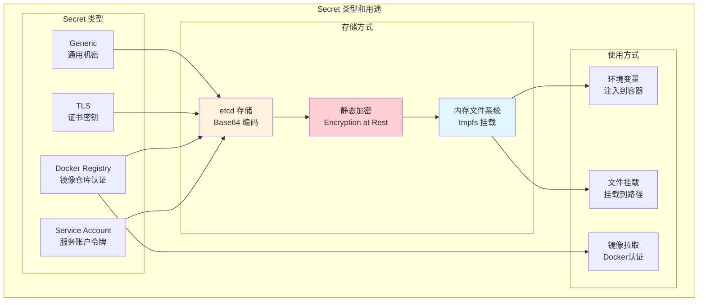

**Secret 配置示例**：
```yaml
# 1. Generic Secret
apiVersion: v1
kind: Secret
metadata:
  name: app-secrets
type: Opaque
data:
  # Base64 编码的值
  database-password: bXlwYXNzd29yZA==  # mypassword
  api-key: YWJjZGVmZ2hpams=            # abcdefghijk
stringData:
  # 明文值，系统自动编码
  admin-password: "supersecret"
  jwt-secret: "my-jwt-secret-key"

---
# 2. TLS Secret
apiVersion: v1
kind: Secret
metadata:
  name: tls-secret
type: kubernetes.io/tls
data:
  tls.crt: |
    LS0tLS1CRUdJTi... # certificate content
  tls.key: |
    LS0tLS1CRUdJTi... # private key content

---
# 3. Docker Registry Secret
apiVersion: v1
kind: Secret
metadata:
  name: docker-registry-secret
type: kubernetes.io/dockerconfigjson
data:
  .dockerconfigjson: eyJhdXRocyI6... # Docker config JSON
```

**Secret 使用示例**：
```yaml
apiVersion: v1
kind: Pod
metadata:
  name: app-pod
spec:
  # 使用镜像拉取密钥
  imagePullSecrets:
  - name: docker-registry-secret

  containers:
  - name: app
    image: private-registry.com/my-app:latest

    # 环境变量方式
    env:
    - name: DB_PASSWORD
      valueFrom:
        secretKeyRef:
          name: app-secrets
          key: database-password

    # 文件挂载方式
    volumeMounts:
    - name: secret-volume
      mountPath: /etc/secrets
      readOnly: true
    - name: tls-certs
      mountPath: /etc/ssl/certs
      readOnly: true

  volumes:
  - name: secret-volume
    secret:
      secretName: app-secrets
      defaultMode: 0400  # 文件权限
  - name: tls-certs
    secret:
      secretName: tls-secret
```

## Namespace：多租户隔离

Namespace 提供虚拟集群功能，实现资源隔离和多租户管理。

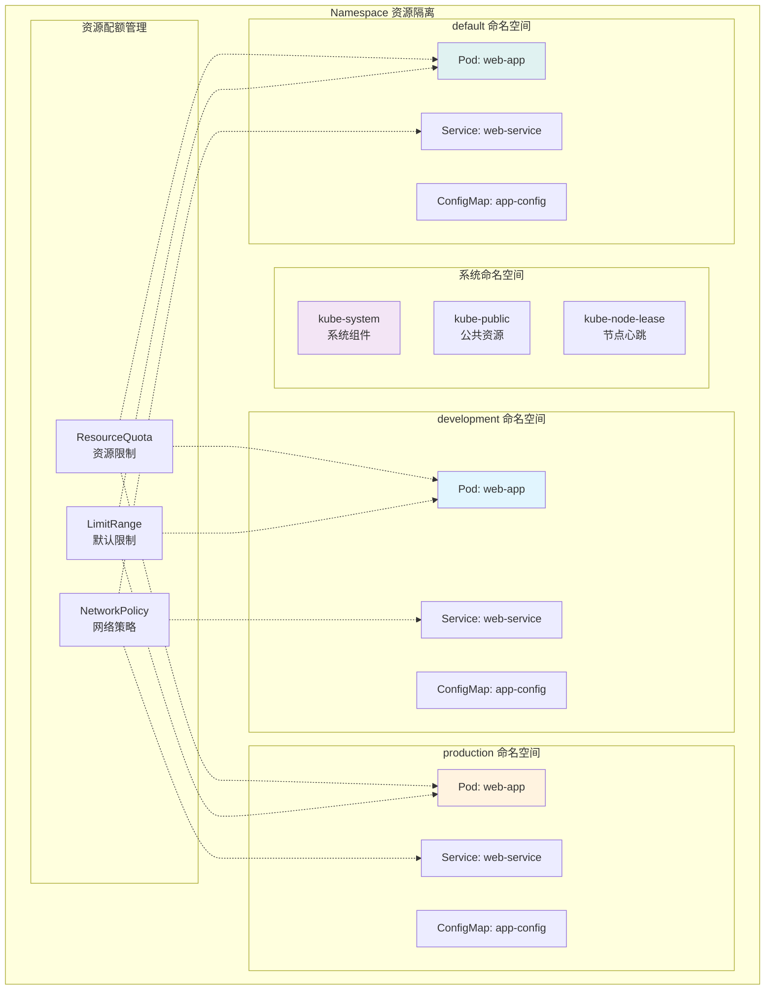

### Namespace 配置示例

**创建 Namespace**：
```yaml
apiVersion: v1
kind: Namespace
metadata:
  name: development
  labels:
    name: development
    environment: dev
    team: backend
  annotations:
    description: "Development environment for backend team"
```

**ResourceQuota（资源配额）**：
```yaml
apiVersion: v1
kind: ResourceQuota
metadata:
  name: development-quota
  namespace: development
spec:
  hard:
    # 资源限制
    requests.cpu: "4"
    requests.memory: 8Gi
    limits.cpu: "8"
    limits.memory: 16Gi

    # 存储限制
    requests.storage: 100Gi
    persistentvolumeclaims: "10"

    # 对象数量限制
    pods: "50"
    services: "20"
    secrets: "20"
    configmaps: "20"
    replicationcontrollers: "0"

    # 服务类型限制
    services.loadbalancers: "2"
    services.nodeports: "5"
```

**LimitRange（默认限制）**：
```yaml
apiVersion: v1
kind: LimitRange
metadata:
  name: development-limits
  namespace: development
spec:
  limits:
  # Container 默认值
  - type: Container
    default:
      cpu: 200m
      memory: 256Mi
    defaultRequest:
      cpu: 100m
      memory: 128Mi
    max:
      cpu: 1
      memory: 1Gi
    min:
      cpu: 50m
      memory: 64Mi

  # Pod 限制
  - type: Pod
    max:
      cpu: 2
      memory: 2Gi
    min:
      cpu: 100m
      memory: 128Mi

  # PVC 限制
  - type: PersistentVolumeClaim
    max:
      storage: 50Gi
    min:
      storage: 1Gi
```

### Namespace 操作

```bash
# 创建命名空间
kubectl create namespace development
kubectl apply -f namespace.yaml

# 查看命名空间
kubectl get namespaces
kubectl describe namespace development

# 在指定命名空间操作
kubectl get pods -n development
kubectl create deployment nginx --image=nginx -n development

# 设置默认命名空间
kubectl config set-context --current --namespace=development

# 跨命名空间访问服务
# 格式：service.namespace.svc.cluster.local
curl http://web-service.production.svc.cluster.local

# 删除命名空间（小心！会删除其中所有资源）
kubectl delete namespace development
```

## 组件最佳实践

### Pod 设计原则

1. **单一职责**：
   ```yaml
   # 好的做法 - 单一应用容器
   spec:
     containers:
     - name: app
       image: my-app:latest

   # 避免 - 多个无关应用
   # containers:
   # - name: app1
   #   image: app1:latest
   # - name: app2
   #   image: app2:latest
   ```

2. **资源限制**：
   ```yaml
   containers:
   - name: app
     resources:
       requests:
         cpu: 100m        # 预留资源
         memory: 128Mi
       limits:
         cpu: 500m        # 最大资源
         memory: 512Mi
   ```

3. **健康检查**：
   ```yaml
   livenessProbe:
     httpGet:
       path: /healthz
       port: 8080
     initialDelaySeconds: 30
     periodSeconds: 10
     failureThreshold: 3

   readinessProbe:
     httpGet:
       path: /ready
       port: 8080
     initialDelaySeconds: 5
     periodSeconds: 5
   ```

### Deployment 最佳实践

1. **滚动更新策略**：
   ```yaml
   strategy:
     type: RollingUpdate
     rollingUpdate:
       maxUnavailable: 25%    # 或具体数量如 1
       maxSurge: 25%         # 或具体数量如 1
   ```

2. **版本标签**：
   ```yaml
   metadata:
     labels:
       app: nginx
       version: v1.20.1      # 明确版本
       environment: production
   ```

3. **配置外部化**：
   ```yaml
   spec:
     template:
       spec:
         containers:
         - name: app
           envFrom:
           - configMapRef:
               name: app-config
           - secretRef:
               name: app-secrets
   ```

### Service 设计指南

1. **选择合适类型**：
   - `ClusterIP`: 集群内部通信
   - `NodePort`: 开发测试环境
   - `LoadBalancer`: 生产环境外部访问
   - `ExternalName`: 外部服务映射

2. **端口命名**：
   ```yaml
   ports:
   - name: http          # 有意义的名称
     port: 80
     targetPort: 8080
   - name: https
     port: 443
     targetPort: 8443
   ```

3. **会话亲和性**：
   ```yaml
   sessionAffinity: ClientIP  # 需要会话保持时
   sessionAffinityConfig:
     clientIP:
       timeoutSeconds: 10800  # 3小时
   ```

### 配置管理最佳实践

1. **配置分离**：
   ```yaml
   # ConfigMap - 非敏感配置
   data:
     app.properties: |
       server.port=8080
       logging.level=INFO

   # Secret - 敏感信息
   stringData:
     database.password: "secret123"
     api.key: "abc123def456"
   ```

2. **挂载方式选择**：
   ```yaml
   # 文件挂载 - 配置文件
   volumeMounts:
   - name: config
     mountPath: /etc/config
     readOnly: true

   # 环境变量 - 简单配置
   env:
   - name: LOG_LEVEL
     valueFrom:
       configMapKeyRef:
         name: app-config
         key: log.level
   ```

### 命名空间管理

1. **按环境划分**：
   ```bash
   # 环境隔离
   kubectl create namespace development
   kubectl create namespace staging
   kubectl create namespace production
   ```

2. **资源配额控制**：
   ```yaml
   # 为每个环境设置合适的资源配额
   spec:
     hard:
       requests.cpu: "2"      # 开发环境较小
       requests.memory: 4Gi
       pods: "20"
   ```

3. **网络策略**：
   ```yaml
   # 限制命名空间间通信
   apiVersion: networking.k8s.io/v1
   kind: NetworkPolicy
   metadata:
     name: deny-cross-namespace
     namespace: production
   spec:
     podSelector: {}
     policyTypes:
     - Ingress
     ingress:
     - from:
       - namespaceSelector:
           matchLabels:
             name: production
   ```

## 常见问题排查

### Pod 问题诊断

```bash
# Pod 状态检查
kubectl get pods -o wide
kubectl describe pod <pod-name>

# 日志查看
kubectl logs <pod-name>
kubectl logs <pod-name> -c <container-name>  # 多容器
kubectl logs <pod-name> --previous           # 上一个实例

# 进入容器调试
kubectl exec -it <pod-name> -- /bin/bash
kubectl exec -it <pod-name> -c <container-name> -- /bin/bash

# 端口转发测试
kubectl port-forward pod/<pod-name> 8080:80
```

**常见 Pod 问题**：

1. **ImagePullBackOff**：
   - 检查镜像名称和标签
   - 验证镜像仓库访问权限
   - 检查 imagePullSecrets

2. **CrashLoopBackOff**：
   - 查看应用日志
   - 检查健康检查配置
   - 验证资源限制

3. **Pending 状态**：
   - 检查节点资源
   - 验证调度约束
   - 查看 PV/PVC 状态

### Service 网络问题

```bash
# Service 状态检查
kubectl get svc
kubectl describe svc <service-name>

# Endpoints 检查
kubectl get endpoints <service-name>

# DNS 解析测试
kubectl run test-pod --image=busybox -it --rm -- nslookup <service-name>

# 网络连通性测试
kubectl run test-pod --image=busybox -it --rm -- wget -qO- <service-name>:<port>
```

### 配置问题排查

```bash
# ConfigMap 检查
kubectl get configmap <configmap-name> -o yaml

# Secret 检查
kubectl get secret <secret-name> -o yaml

# 挂载情况检查
kubectl exec <pod-name> -- ls -la /etc/config
kubectl exec <pod-name> -- cat /etc/config/<file-name>

# 环境变量检查
kubectl exec <pod-name> -- env | grep <var-name>
```

## 学习验证

### 理解检查

1. **Pod 概念**：
   - 解释为什么 Pod 是最小调度单元
   - 描述 Pod 内容器的共享机制
   - 说明 Pod 生命周期各阶段

2. **Deployment vs ReplicaSet**：
   - 比较两者的功能差异
   - 解释滚动更新的实现原理
   - 描述版本管理机制

3. **Service 网络**：
   - 说明不同 Service 类型的适用场景
   - 解释 kube-proxy 的实现方式
   - 描述服务发现机制

### 实践练习

在接下来的实验中，您将：
- 创建和管理不同类型的 Pod
- 配置 Deployment 的滚动更新
- 设置 Service 和负载均衡
- 使用 ConfigMap 和 Secret 管理配置
- 实现 Namespace 资源隔离

## 下一步学习

- **[应用部署实践](../03-应用部署/README.md)**: 学习 kubectl 操作和 YAML 编写
- **[实验练习](../labs/)**: 动手实践核心组件的配置和使用
- **[课程评估](../assessment/)**: 验证对核心组件的理解

---

通过本模块的学习，您现在对 Kubernetes 的核心组件有了深入理解。这些组件是构建云原生应用的基础，掌握它们的原理和用法对后续学习至关重要。在实际使用中，要注意遵循最佳实践，确保应用的可靠性和可维护性。
