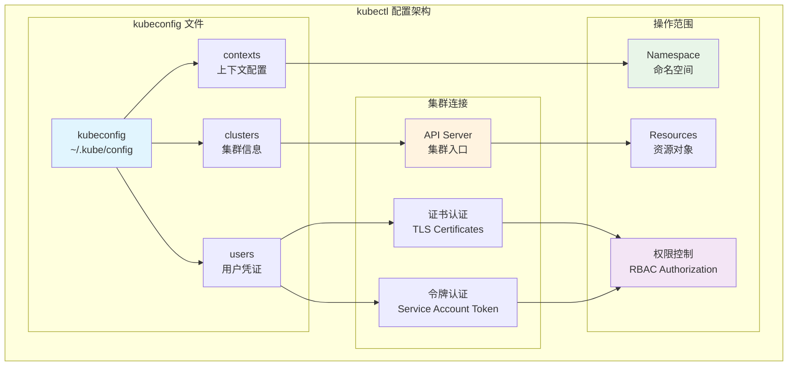
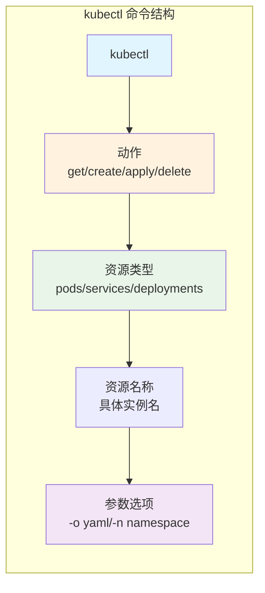
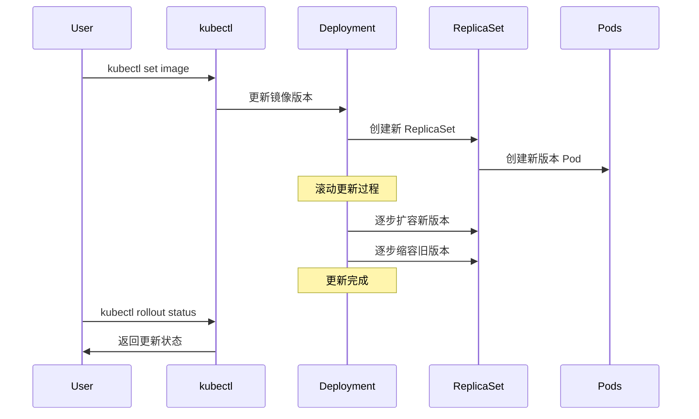
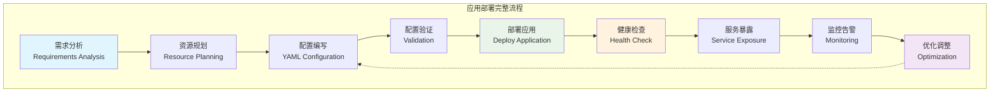
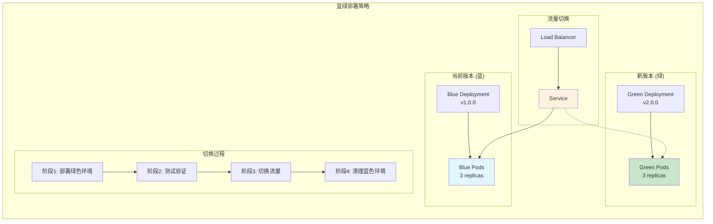
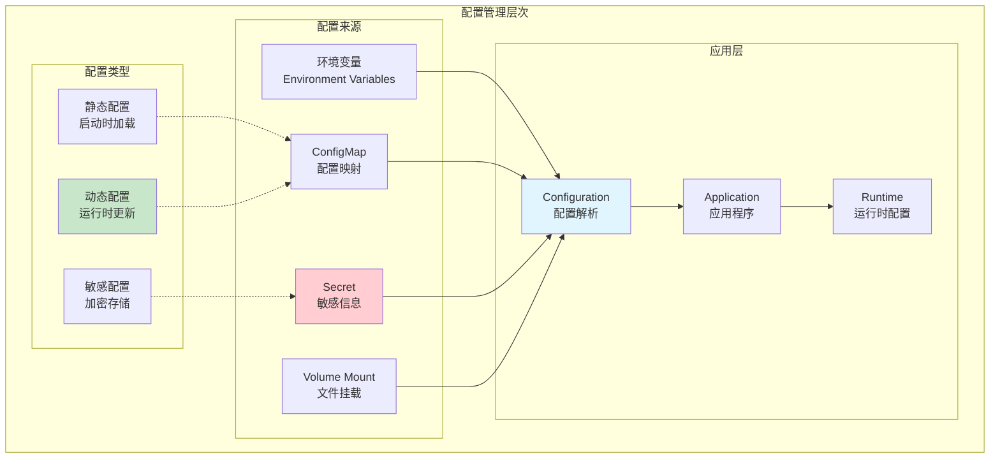

[TOC]

# Kubernetes 应用部署 (Application Deployment)

## 学习目标

完成本模块后，您将能够：
- 熟练使用 kubectl 命令行工具进行各种操作
- 掌握 YAML 资源配置文件的编写规范和最佳实践
- 理解应用部署的完整生命周期管理流程
- 实现滚动更新、扩缩容、回滚等高级部署策略
- 掌握常见部署问题的诊断和解决方法

## 概念卡速记

> 📌 **概念卡：kubectl（Kubernetes CLI）**  
> **定义**：官方命令行工具，通过 kubeconfig 与 API Server 交互，支持资源的 CRUD 和运维操作。  
> **学习提醒**：掌握子命令结构 `kubectl <resource> <verb>`，结合 `--namespace`、`-o yaml/json` 进行高效调试。  
> **关键命令**：`kubectl get pods -A`、`kubectl explain deployment.spec`

> 📌 **概念卡：kubeconfig（集群连接配置）**  
> **定义**：存储集群、用户、上下文信息的 YAML 文件，默认位置 `~/.kube/config`。  
> **学习提醒**：切换上下文与命名空间时应确保配置同步，避免误操作生产集群。  
> **关键命令**：`kubectl config use-context`、`kubectl config set-context --current --namespace=dev`

> 📌 **概念卡：Kubernetes Manifest（资源清单）**  
> **定义**：以 YAML/JSON 描述 Kubernetes 资源期望状态的文件，体现声明式管理思想。  
> **学习提醒**：通过 `apiVersion`、`kind`、`metadata`、`spec` 四大字段理解资源结构，保证缩进与类型正确。  
> **关键命令**：`kubectl apply -f deployment.yaml`、`kubectl diff -f deployment.yaml`

> 📌 **概念卡：Rolling Update（滚动更新策略）**  
> **定义**：Deployment 默认更新策略，逐个替换 Pod，保证服务不中断。  
> **学习提醒**：关注 `maxSurge` 与 `maxUnavailable`，合理配置以平衡安全与速度。  
> **关键命令**：`kubectl rollout status deployment/<name>`、`kubectl rollout history deployment/<name>`

## 前置知识

- 完成 Kubernetes 架构和核心组件学习
- 理解 Pod、Deployment、Service 等基本概念
- 熟悉 Docker 容器技术
- 掌握基本的 YAML 语法和 Linux 命令行操作

## kubectl 命令行工具

kubectl 是与 Kubernetes 集群交互的主要命令行工具，提供了完整的集群管理功能。

### kubectl 基础配置



### kubectl 配置管理

```bash
# 查看当前配置
kubectl config view
kubectl config current-context

# 查看集群信息
kubectl cluster-info
kubectl cluster-info dump

# 管理上下文 (Context)
kubectl config get-contexts
kubectl config use-context <context-name>
kubectl config set-context --current --namespace=<namespace>

# 管理集群配置
kubectl config set-cluster <cluster-name> --server=https://k8s-api.example.com
kubectl config set-credentials <user-name> --token=<token>

# 创建新上下文
kubectl config set-context <context-name> \
  --cluster=<cluster-name> \
  --user=<user-name> \
  --namespace=<namespace>

# 删除配置
kubectl config delete-context <context-name>
kubectl config delete-cluster <cluster-name>
```

### kubectl 命令结构



**命令格式**：
```bash
kubectl [command] [TYPE] [NAME] [flags]

# 示例
kubectl get pods                          # 查看所有 Pod
kubectl get pod nginx-pod                 # 查看特定 Pod
kubectl get pods -o yaml                  # YAML 格式输出
kubectl get pods -n kube-system           # 指定命名空间
kubectl get pods --selector app=nginx     # 标签选择器
kubectl get pods --field-selector status.phase=Running  # 字段选择器
```

## kubectl 核心操作

### 资源查看 (get/describe)

```bash
# 基本查看命令
kubectl get all                           # 查看所有资源
kubectl get pods                          # 查看 Pod
kubectl get services                       # 查看服务
kubectl get deployments                   # 查看部署
kubectl get nodes                         # 查看节点

# 详细信息查看
kubectl describe pod <pod-name>
kubectl describe deployment <deployment-name>
kubectl describe node <node-name>

# 输出格式控制
kubectl get pods -o wide                  # 宽格式
kubectl get pods -o yaml                  # YAML 格式
kubectl get pods -o json                  # JSON 格式
kubectl get pods -o jsonpath='{.items[*].metadata.name}'  # JSONPath

# 监听资源变化
kubectl get pods --watch                  # 监听 Pod 变化
kubectl get pods -w                       # 简写形式

# 标签和选择器
kubectl get pods --show-labels            # 显示标签
kubectl get pods -l app=nginx             # 标签选择
kubectl get pods -l 'environment in (production,staging)'  # 多值选择
```

### 资源创建和应用

```bash
# 命令式创建
kubectl create deployment nginx --image=nginx:1.20
kubectl create service clusterip nginx --tcp=80:80
kubectl create configmap app-config --from-literal=key1=value1
kubectl create secret generic app-secret --from-literal=password=secret123

# 声明式应用 (推荐)
kubectl apply -f deployment.yaml          # 应用单个文件
kubectl apply -f ./manifests/             # 应用目录下所有文件
kubectl apply -f https://example.com/manifest.yaml  # 应用远程文件

# 创建和应用的区别
kubectl create -f deployment.yaml         # 创建，资源存在则报错
kubectl apply -f deployment.yaml          # 应用，资源存在则更新

# 验证配置
kubectl apply -f deployment.yaml --dry-run=client  # 客户端验证
kubectl apply -f deployment.yaml --dry-run=server  # 服务端验证
kubectl apply -f deployment.yaml --validate=true   # 启用验证
```

### 资源编辑和更新

```bash
# 在线编辑
kubectl edit deployment nginx              # 使用默认编辑器
kubectl edit pod nginx-pod

# 替换资源
kubectl replace -f deployment.yaml        # 完全替换

# 补丁更新 (Patch)
kubectl patch deployment nginx -p '{"spec":{"replicas":3}}'  # JSON 补丁
kubectl patch deployment nginx --type merge -p '{"spec":{"replicas":3}}'

# 镜像更新
kubectl set image deployment/nginx nginx=nginx:1.21
kubectl set image deployment/nginx nginx=nginx:1.21 --record  # 记录更新原因

# 环境变量更新
kubectl set env deployment/nginx ENV_VAR=new_value
kubectl set env deployment/nginx ENV_VAR-  # 删除环境变量

# 资源限制更新
kubectl set resources deployment nginx --limits=cpu=200m,memory=512Mi
kubectl set resources deployment nginx --requests=cpu=100m,memory=256Mi
```

### 扩缩容操作

```bash
# 手动扩缩容
kubectl scale deployment nginx --replicas=5
kubectl scale replicaset nginx-rs --replicas=3

# 自动扩缩容 (HPA)
kubectl autoscale deployment nginx --min=2 --max=10 --cpu-percent=80

# 查看扩缩容状态
kubectl get hpa
kubectl describe hpa nginx

# 删除自动扩缩容
kubectl delete hpa nginx
```

### 滚动更新和回滚



```bash
# 滚动更新
kubectl set image deployment/nginx nginx=nginx:1.21
kubectl rollout status deployment/nginx    # 查看更新状态
kubectl rollout pause deployment/nginx     # 暂停更新
kubectl rollout resume deployment/nginx    # 恢复更新

# 更新历史
kubectl rollout history deployment/nginx
kubectl rollout history deployment/nginx --revision=2

# 回滚操作
kubectl rollout undo deployment/nginx                    # 回滚到上一版本
kubectl rollout undo deployment/nginx --to-revision=2    # 回滚到指定版本

# 重启部署 (重新创建 Pod)
kubectl rollout restart deployment/nginx
```

### 日志和调试

```bash
# 查看日志
kubectl logs <pod-name>                    # 单容器 Pod 日志
kubectl logs <pod-name> -c <container>     # 多容器 Pod 指定容器
kubectl logs <pod-name> --previous         # 上一个实例的日志
kubectl logs <pod-name> --since=1h         # 最近1小时的日志
kubectl logs <pod-name> --tail=100         # 最后100行日志
kubectl logs -f <pod-name>                 # 实时跟踪日志

# 标签选择器日志
kubectl logs -l app=nginx                  # 查看标签匹配的所有 Pod 日志

# 进入容器调试
kubectl exec -it <pod-name> -- /bin/bash
kubectl exec -it <pod-name> -c <container> -- /bin/sh

# 文件拷贝
kubectl cp <pod-name>:/path/to/file /local/path
kubectl cp /local/file <pod-name>:/path/to/destination

# 端口转发
kubectl port-forward pod/<pod-name> 8080:80
kubectl port-forward deployment/nginx 8080:80
kubectl port-forward service/nginx 8080:80

# 代理访问
kubectl proxy --port=8080                 # 创建代理到 API Server
# 然后可以访问: http://localhost:8080/api/v1/pods
```

## YAML 配置文件编写

### YAML 基础结构

```yaml
# Kubernetes YAML 文件基本结构
apiVersion: apps/v1           # API 版本
kind: Deployment              # 资源类型
metadata:                     # 元数据
  name: nginx-deployment      # 资源名称
  labels:                     # 标签
    app: nginx
  annotations:                # 注解
    description: "Nginx web server"
spec:                         # 规格说明
  replicas: 3                 # 副本数量
  selector:                   # 选择器
    matchLabels:
      app: nginx
  template:                   # Pod 模板
    metadata:
      labels:
        app: nginx
    spec:
      containers:
      - name: nginx
        image: nginx:1.20
        ports:
        - containerPort: 80
```

### 常用资源 YAML 模板

**Deployment 完整配置**：
```yaml
apiVersion: apps/v1
kind: Deployment
metadata:
  name: nginx-deployment
  namespace: default
  labels:
    app: nginx
    version: v1.20
    environment: production
  annotations:
    deployment.kubernetes.io/revision: "1"
    description: "Production nginx web server"
spec:
  # 副本和更新策略
  replicas: 3
  revisionHistoryLimit: 10

  strategy:
    type: RollingUpdate
    rollingUpdate:
      maxUnavailable: 1
      maxSurge: 1

  # 选择器
  selector:
    matchLabels:
      app: nginx
      version: v1.20

  # Pod 模板
  template:
    metadata:
      labels:
        app: nginx
        version: v1.20
        environment: production
    spec:
      # 容器配置
      containers:
      - name: nginx
        image: nginx:1.20
        imagePullPolicy: IfNotPresent

        ports:
        - name: http
          containerPort: 80
          protocol: TCP

        # 资源限制
        resources:
          requests:
            cpu: 100m
            memory: 128Mi
          limits:
            cpu: 200m
            memory: 256Mi

        # 健康检查
        livenessProbe:
          httpGet:
            path: /
            port: http
          initialDelaySeconds: 30
          periodSeconds: 10
          timeoutSeconds: 5
          failureThreshold: 3

        readinessProbe:
          httpGet:
            path: /
            port: http
          initialDelaySeconds: 5
          periodSeconds: 5
          timeoutSeconds: 3
          failureThreshold: 3

        # 环境变量
        env:
        - name: NGINX_PORT
          value: "80"
        - name: ENVIRONMENT
          value: "production"

        # 配置挂载
        volumeMounts:
        - name: nginx-config
          mountPath: /etc/nginx/conf.d
          readOnly: true
        - name: nginx-logs
          mountPath: /var/log/nginx

      # 数据卷
      volumes:
      - name: nginx-config
        configMap:
          name: nginx-config
      - name: nginx-logs
        emptyDir: {}

      # 节点选择和容忍
      nodeSelector:
        kubernetes.io/os: linux

      tolerations:
      - key: "node-role.kubernetes.io/master"
        operator: "Exists"
        effect: "NoSchedule"

      # 安全上下文
      securityContext:
        runAsNonRoot: true
        runAsUser: 1001
        fsGroup: 1001
```

**Service 配置示例**：
```yaml
apiVersion: v1
kind: Service
metadata:
  name: nginx-service
  labels:
    app: nginx
  annotations:
    service.beta.kubernetes.io/aws-load-balancer-type: "nlb"
spec:
  type: ClusterIP  # ClusterIP, NodePort, LoadBalancer, ExternalName
  selector:
    app: nginx
  ports:
  - name: http
    port: 80
    targetPort: http
    protocol: TCP
  sessionAffinity: None

---
# NodePort Service 示例
apiVersion: v1
kind: Service
metadata:
  name: nginx-nodeport
spec:
  type: NodePort
  selector:
    app: nginx
  ports:
  - name: http
    port: 80
    targetPort: 80
    nodePort: 30080
    protocol: TCP
```

### 多资源文件组织

```yaml
# 使用 --- 分隔多个资源
apiVersion: apps/v1
kind: Deployment
metadata:
  name: nginx-deployment
spec:
  # ... deployment 配置

---
apiVersion: v1
kind: Service
metadata:
  name: nginx-service
spec:
  # ... service 配置

---
apiVersion: v1
kind: ConfigMap
metadata:
  name: nginx-config
data:
  default.conf: |
    server {
        listen 80;
        server_name localhost;

        location / {
            root /usr/share/nginx/html;
            index index.html index.htm;
        }

        location /health {
            access_log off;
            return 200 "healthy\n";
            add_header Content-Type text/plain;
        }
    }
```

## 应用部署实战

### 完整部署流程



### 实战案例：部署 Web 应用

**步骤 1：创建命名空间**
```bash
# 创建专用命名空间
kubectl create namespace web-app
kubectl label namespace web-app environment=production
```

**步骤 2：创建配置文件**
```yaml
# web-app-configmap.yaml
apiVersion: v1
kind: ConfigMap
metadata:
  name: web-app-config
  namespace: web-app
data:
  APP_ENV: "production"
  LOG_LEVEL: "info"
  DATABASE_URL: "postgresql://postgres:5432/webapp"

  nginx.conf: |
    upstream backend {
        server localhost:8080;
    }

    server {
        listen 80;
        server_name _;

        location / {
            proxy_pass http://backend;
            proxy_set_header Host $host;
            proxy_set_header X-Real-IP $remote_addr;
        }

        location /health {
            return 200 'OK';
        }
    }

---
# web-app-secret.yaml
apiVersion: v1
kind: Secret
metadata:
  name: web-app-secret
  namespace: web-app
type: Opaque
stringData:
  DATABASE_PASSWORD: "supersecretpassword"
  JWT_SECRET: "jwt-secret-key-change-me"
  API_KEY: "your-api-key-here"
```

**步骤 3：部署应用**
```yaml
# web-app-deployment.yaml
apiVersion: apps/v1
kind: Deployment
metadata:
  name: web-app
  namespace: web-app
  labels:
    app: web-app
    version: v1.0.0
spec:
  replicas: 3
  strategy:
    type: RollingUpdate
    rollingUpdate:
      maxUnavailable: 1
      maxSurge: 1

  selector:
    matchLabels:
      app: web-app

  template:
    metadata:
      labels:
        app: web-app
        version: v1.0.0
    spec:
      containers:
      # 主应用容器
      - name: app
        image: my-web-app:v1.0.0
        ports:
        - name: http
          containerPort: 8080

        resources:
          requests:
            cpu: 200m
            memory: 256Mi
          limits:
            cpu: 500m
            memory: 512Mi

        # 环境变量注入
        envFrom:
        - configMapRef:
            name: web-app-config
        - secretRef:
            name: web-app-secret

        # 健康检查
        livenessProbe:
          httpGet:
            path: /health
            port: http
          initialDelaySeconds: 60
          periodSeconds: 10
          timeoutSeconds: 5
          failureThreshold: 3

        readinessProbe:
          httpGet:
            path: /ready
            port: http
          initialDelaySeconds: 30
          periodSeconds: 5
          timeoutSeconds: 3
          failureThreshold: 3

        # 优雅关闭
        lifecycle:
          preStop:
            exec:
              command: ["/bin/sh", "-c", "sleep 15"]

      # Nginx 反向代理容器
      - name: nginx
        image: nginx:1.20-alpine
        ports:
        - name: http
          containerPort: 80

        resources:
          requests:
            cpu: 50m
            memory: 64Mi
          limits:
            cpu: 100m
            memory: 128Mi

        volumeMounts:
        - name: nginx-config
          mountPath: /etc/nginx/conf.d
          readOnly: true

        livenessProbe:
          httpGet:
            path: /health
            port: http
          initialDelaySeconds: 10
          periodSeconds: 10

      volumes:
      - name: nginx-config
        configMap:
          name: web-app-config
          items:
          - key: nginx.conf
            path: default.conf

      # Pod 反亲和性，确保分布在不同节点
      affinity:
        podAntiAffinity:
          preferredDuringSchedulingIgnoredDuringExecution:
          - weight: 100
            podAffinityTerm:
              labelSelector:
                matchExpressions:
                - key: app
                  operator: In
                  values:
                  - web-app
              topologyKey: kubernetes.io/hostname
```

**步骤 4：创建服务**
```yaml
# web-app-service.yaml
apiVersion: v1
kind: Service
metadata:
  name: web-app-service
  namespace: web-app
  labels:
    app: web-app
spec:
  type: ClusterIP
  selector:
    app: web-app
  ports:
  - name: http
    port: 80
    targetPort: 80
    protocol: TCP

---
# 如果需要外部访问
apiVersion: v1
kind: Service
metadata:
  name: web-app-nodeport
  namespace: web-app
spec:
  type: NodePort
  selector:
    app: web-app
  ports:
  - name: http
    port: 80
    targetPort: 80
    nodePort: 30080
    protocol: TCP
```

**步骤 5：部署执行**
```bash
# 应用所有配置
kubectl apply -f web-app-configmap.yaml
kubectl apply -f web-app-secret.yaml
kubectl apply -f web-app-deployment.yaml
kubectl apply -f web-app-service.yaml

# 或者一次性应用所有文件
kubectl apply -f ./web-app-manifests/

# 验证部署状态
kubectl get all -n web-app
kubectl rollout status deployment/web-app -n web-app

# 查看 Pod 详细信息
kubectl describe pods -l app=web-app -n web-app

# 检查服务端点
kubectl get endpoints web-app-service -n web-app
```

### 部署验证和测试

```bash
# 1. 检查 Pod 状态
kubectl get pods -n web-app -o wide

# 2. 查看部署状态
kubectl get deployment web-app -n web-app

# 3. 检查服务
kubectl get service -n web-app

# 4. 测试应用连通性
kubectl port-forward service/web-app-service 8080:80 -n web-app
# 在另一个终端测试: curl http://localhost:8080

# 5. 检查应用日志
kubectl logs -f deployment/web-app -n web-app

# 6. 进入容器调试
kubectl exec -it deployment/web-app -n web-app -- /bin/bash

# 7. 检查配置挂载
kubectl exec deployment/web-app -n web-app -- cat /etc/nginx/conf.d/default.conf

# 8. 监控资源使用
kubectl top pods -n web-app
kubectl top nodes
```

## 高级部署策略

### 蓝绿部署 (Blue-Green Deployment)



**蓝绿部署实现**：
```yaml
# 蓝色环境 (当前运行)
apiVersion: apps/v1
kind: Deployment
metadata:
  name: web-app-blue
  labels:
    app: web-app
    version: blue
spec:
  replicas: 3
  selector:
    matchLabels:
      app: web-app
      version: blue
  template:
    metadata:
      labels:
        app: web-app
        version: blue
    spec:
      containers:
      - name: app
        image: web-app:v1.0.0

---
# 绿色环境 (新版本)
apiVersion: apps/v1
kind: Deployment
metadata:
  name: web-app-green
  labels:
    app: web-app
    version: green
spec:
  replicas: 3
  selector:
    matchLabels:
      app: web-app
      version: green
  template:
    metadata:
      labels:
        app: web-app
        version: green
    spec:
      containers:
      - name: app
        image: web-app:v2.0.0

---
# 服务指向当前版本
apiVersion: v1
kind: Service
metadata:
  name: web-app-service
spec:
  selector:
    app: web-app
    version: blue  # 切换时改为 green
  ports:
  - port: 80
    targetPort: 8080
```

**蓝绿部署流程**：
```bash
# 1. 部署绿色环境
kubectl apply -f web-app-green-deployment.yaml

# 2. 等待绿色环境就绪
kubectl rollout status deployment/web-app-green

# 3. 测试绿色环境
kubectl port-forward deployment/web-app-green 8081:8080

# 4. 切换流量到绿色环境
kubectl patch service web-app-service -p '{"spec":{"selector":{"version":"green"}}}'

# 5. 验证切换成功
kubectl get endpoints web-app-service

# 6. 清理蓝色环境
kubectl delete deployment web-app-blue
```

### 金丝雀部署 (Canary Deployment)

```yaml
# 金丝雀部署：10% 流量到新版本
apiVersion: apps/v1
kind: Deployment
metadata:
  name: web-app-stable
spec:
  replicas: 9  # 90% 流量
  selector:
    matchLabels:
      app: web-app
      version: stable
  template:
    metadata:
      labels:
        app: web-app
        version: stable
    spec:
      containers:
      - name: app
        image: web-app:v1.0.0

---
apiVersion: apps/v1
kind: Deployment
metadata:
  name: web-app-canary
spec:
  replicas: 1  # 10% 流量
  selector:
    matchLabels:
      app: web-app
      version: canary
  template:
    metadata:
      labels:
        app: web-app
        version: canary
    spec:
      containers:
      - name: app
        image: web-app:v2.0.0

---
# 服务选择所有版本
apiVersion: v1
kind: Service
metadata:
  name: web-app-service
spec:
  selector:
    app: web-app  # 不指定版本，流量会分配给所有 Pod
  ports:
  - port: 80
    targetPort: 8080
```

### A/B 测试部署

```yaml
# A/B 测试：使用 Ingress 根据请求头分流
apiVersion: networking.k8s.io/v1
kind: Ingress
metadata:
  name: web-app-ab-test
  annotations:
    nginx.ingress.kubernetes.io/canary: "true"
    nginx.ingress.kubernetes.io/canary-by-header: "X-Canary"
    nginx.ingress.kubernetes.io/canary-weight: "30"
spec:
  rules:
  - host: app.example.com
    http:
      paths:
      - path: /
        pathType: Prefix
        backend:
          service:
            name: web-app-service-v1
            port:
              number: 80

---
# 金丝雀版本的 Ingress
apiVersion: networking.k8s.io/v1
kind: Ingress
metadata:
  name: web-app-ab-test-canary
  annotations:
    nginx.ingress.kubernetes.io/canary: "true"
    nginx.ingress.kubernetes.io/canary-by-header: "X-Canary"
    nginx.ingress.kubernetes.io/canary-by-header-value: "always"
spec:
  rules:
  - host: app.example.com
    http:
      paths:
      - path: /
        pathType: Prefix
        backend:
          service:
            name: web-app-service-v2
            port:
              number: 80
```

## 配置管理最佳实践

### 配置外部化



### 环境隔离配置

```bash
# 目录结构
manifests/
├── base/                 # 基础配置
│   ├── deployment.yaml
│   ├── service.yaml
│   └── kustomization.yaml
├── overlays/
│   ├── development/      # 开发环境
│   │   ├── config.yaml
│   │   └── kustomization.yaml
│   ├── staging/          # 测试环境
│   │   ├── config.yaml
│   │   └── kustomization.yaml
│   └── production/       # 生产环境
│       ├── config.yaml
│       └── kustomization.yaml
```

**使用 Kustomize 管理配置**：
```yaml
# base/kustomization.yaml
apiVersion: kustomize.config.k8s.io/v1beta1
kind: Kustomization

resources:
- deployment.yaml
- service.yaml

commonLabels:
  app: web-app

---
# overlays/production/kustomization.yaml
apiVersion: kustomize.config.k8s.io/v1beta1
kind: Kustomization

bases:
- ../../base

patchesStrategicMerge:
- config.yaml

replicas:
- name: web-app
  count: 5

images:
- name: web-app
  newTag: v1.0.0
```

```bash
# 部署不同环境
kubectl apply -k overlays/development
kubectl apply -k overlays/staging
kubectl apply -k overlays/production
```

## 监控和故障排查

### 部署状态监控

```bash
# 实时监控部署状态
kubectl get pods -w
kubectl get deployments -w
kubectl get services -w

# 查看部署历史和状态
kubectl rollout history deployment/web-app
kubectl rollout status deployment/web-app

# 资源使用监控
kubectl top nodes
kubectl top pods
kubectl top pods --all-namespaces

# 事件查看
kubectl get events --sort-by=.metadata.creationTimestamp
kubectl get events --field-selector involvedObject.name=web-app
```

### 常见问题排查

**问题 1：Pod 启动失败**
```bash
# 查看 Pod 状态和事件
kubectl describe pod <pod-name>
kubectl get events --field-selector involvedObject.name=<pod-name>

# 查看日志
kubectl logs <pod-name>
kubectl logs <pod-name> --previous

# 常见原因和解决方法：
# - ImagePullBackOff: 检查镜像名称和仓库访问
# - CrashLoopBackOff: 检查应用日志和健康检查
# - Pending: 检查资源配额和节点容量
```

**问题 2：服务无法访问**
```bash
# 检查服务和端点
kubectl get service <service-name>
kubectl describe service <service-name>
kubectl get endpoints <service-name>

# 检查网络连通性
kubectl run debug-pod --image=busybox -it --rm -- /bin/sh
# 在 debug-pod 中测试连接
nslookup <service-name>
wget -qO- http://<service-name>:<port>

# 检查 kube-proxy 和 DNS
kubectl get pods -n kube-system -l k8s-app=kube-proxy
kubectl get pods -n kube-system -l k8s-app=kube-dns
```

**问题 3：配置问题**
```bash
# 检查 ConfigMap 和 Secret
kubectl get configmap <configmap-name> -o yaml
kubectl get secret <secret-name> -o yaml

# 检查挂载情况
kubectl exec <pod-name> -- ls -la /path/to/config
kubectl exec <pod-name> -- cat /path/to/config/file

# 检查环境变量
kubectl exec <pod-name> -- env
```

### 性能优化

```yaml
# 资源配置优化
resources:
  requests:
    cpu: 100m      # 预留 CPU
    memory: 128Mi   # 预留内存
  limits:
    cpu: 500m      # CPU 上限
    memory: 512Mi   # 内存上限

# 健康检查优化
livenessProbe:
  httpGet:
    path: /health
    port: 8080
  initialDelaySeconds: 30    # 给应用足够启动时间
  periodSeconds: 10          # 检查频率
  timeoutSeconds: 5          # 超时时间
  failureThreshold: 3        # 失败次数阈值

readinessProbe:
  httpGet:
    path: /ready
    port: 8080
  initialDelaySeconds: 5     # 就绪检查延迟较短
  periodSeconds: 5           # 更频繁的就绪检查

# 优雅关闭
terminationGracePeriodSeconds: 30
lifecycle:
  preStop:
    exec:
      command: ["/bin/sh", "-c", "sleep 15"]
```

## 学习验证

### 实践检查

1. **kubectl 熟练度**：
   - 能够熟练使用各种 kubectl 命令
   - 理解命令式 vs 声明式操作的区别
   - 掌握资源查看、编辑、调试技巧

2. **YAML 编写能力**：
   - 能够编写规范的 Kubernetes YAML 文件
   - 理解各字段的含义和作用
   - 掌握多资源文件的组织方法

3. **部署策略理解**：
   - 理解滚动更新、蓝绿部署、金丝雀部署的原理
   - 能够根据需求选择合适的部署策略
   - 掌握配置管理和环境隔离方法

### 动手练习

在接下来的实验中，您将：
- 使用 kubectl 进行各种集群操作
- 编写完整的应用部署配置文件
- 实践不同的部署策略
- 进行故障排查和性能优化

## 下一步学习

- **[Kind 集群实验](../labs/kind-cluster.yaml)**: 搭建本地测试集群
- **[nginx 部署实验](../labs/nginx-deployment.yaml)**: 实践应用部署
- **[配置管理实验](../labs/config-management.yaml)**: 学习配置管理
- **[课程评估](../assessment/)**: 验证部署技能掌握程度

---

通过本模块的学习，您现在具备了在 Kubernetes 集群上部署和管理应用的核心技能。kubectl 和 YAML 是 Kubernetes 操作的基础工具，掌握它们对后续的学习和实践工作至关重要。在实际使用中，要遵循最佳实践，注重配置管理、监控和故障排查，确保应用的稳定运行。
