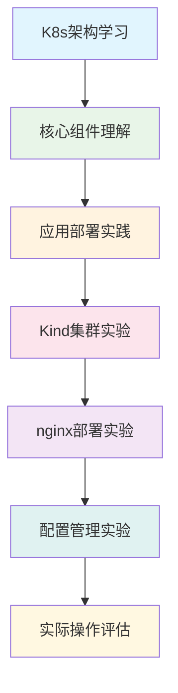

[TOC]

# 核心 Kubernetes 课程 (Core Kubernetes Course)

## 课程概述

本模块将深入学习 Kubernetes 的核心概念、架构组件和应用部署实践。完成此模块后，您将具备在 Kubernetes 集群上部署和管理容器化应用的能力。

## 前置要求

- 完成"基础课程"所有模块（Docker 基础）
- 通过基础课程评估测试（70分以上）
- 本地环境已安装 Docker Desktop 和 Kind
- 对容器概念有扎实理解

## 学习目标

完成本课程后，您将能够：

1. **架构理解**：深入理解 Kubernetes 架构和核心组件
2. **集群管理**：使用 Kind 搭建和管理本地 K8s 集群
3. **应用部署**：掌握 Pod、Deployment、Service 等核心资源
4. **配置管理**：熟练使用 ConfigMap 和 Secret 管理应用配置
5. **网络通信**：理解 K8s 网络模型和服务发现
6. **故障排查**：具备基本的 K8s 问题诊断和解决能力

## 课程结构

### 📚 理论学习

#### [01-K8s架构](./01-K8s架构/)
- Kubernetes 整体架构设计
- Master 节点组件详解
- Worker 节点组件功能
- 集群网络和存储概念

#### [02-核心组件](./02-核心组件/)
- Pod：最小部署单元
- Deployment：应用部署管理
- Service：服务发现和负载均衡
- Namespace：资源隔离

#### [03-应用部署](./03-应用部署/)
- kubectl 命令行工具使用
- YAML 资源配置文件编写
- 应用生命周期管理
- 滚动更新和回滚

### 🧪 实验练习

#### [labs/](./labs/)
- **kind-cluster.yaml**: Kind 集群搭建实验
- **nginx-deployment.yaml**: Web 应用部署实验
- **config-management.yaml**: 配置管理实验

### 📋 课程评估

#### [assessment/](./assessment/)
- 实际操作考核：部署多层应用
- 理论知识测试
- 故障排查场景题

## 学习路径



## 时间安排

| 模块 | 预计时间 | 类型 |
|-----|---------|-----|
| K8s架构 | 2小时 | 理论学习 |
| 核心组件 | 3小时 | 理论+实践 |
| 应用部署 | 2小时 | 实践操作 |
| Kind集群实验 | 1小时 | 动手实验 |
| nginx部署实验 | 1.5小时 | 动手实验 |
| 配置管理实验 | 1.5小时 | 动手实验 |
| 课程评估 | 2小时 | 综合考核 |
| **总计** | **13小时** | **理论+实践** |

## 关键概念速览

### 🏗️ 架构层次
- **集群 (Cluster)**: 多个节点组成的 K8s 环境
- **节点 (Node)**: 运行容器的物理或虚拟机
- **Pod**: 一个或多个容器的组合
- **容器 (Container)**: 应用运行的最小单位

### ⚙️ 核心组件
- **API Server**: 集群的统一入口
- **etcd**: 分布式键值存储
- **Scheduler**: Pod 调度器
- **Controller Manager**: 控制器管理
- **kubelet**: 节点代理
- **kube-proxy**: 网络代理

### 📦 工作负载
- **Pod**: 最小调度单元
- **ReplicaSet**: Pod 副本控制
- **Deployment**: 应用部署管理
- **Service**: 服务暴露和发现

## 资源要求

### 💻 本地环境
- **内存**: 最少 4GB 可用内存（推荐 8GB）
- **CPU**: 2 核心以上
- **存储**: 10GB 可用空间
- **网络**: 稳定的互联网连接

### 🐋 软件环境
- Docker Desktop 4.0+
- Kind 0.17+
- kubectl 1.25+
- 支持的操作系统：macOS、Linux、Windows

## 学习建议

### ✅ 学习方法
1. **理论先行**: 先理解概念再动手实践
2. **循序渐进**: 按模块顺序学习，不跳跃
3. **多做实验**: 理论结合实践加深理解
4. **记录笔记**: 记录重要命令和配置
5. **主动思考**: 思考为什么这样设计

### ⚠️ 注意事项
- Kind 集群资源有限，注意资源配置
- 实验过程中及时清理不用的资源
- 遇到问题先查看日志和官方文档
- 保持 Docker Desktop 正常运行状态

## 故障排查

### 🔍 常见问题
- **集群启动失败**: 检查 Docker 服务状态
- **Pod 无法启动**: 查看 Pod 日志和事件
- **网络不通**: 检查 Service 和 DNS 配置
- **资源不足**: 监控集群资源使用情况

### 🛠️ 调试工具
```bash
# 查看集群状态
kubectl cluster-info
kubectl get nodes

# 查看 Pod 状态和日志
kubectl get pods -o wide
kubectl logs <pod-name>
kubectl describe pod <pod-name>

# 查看服务状态
kubectl get svc
kubectl describe svc <service-name>
```

## 下一步学习

完成核心课程后，您可以继续学习：

1. **高级生产课程**: 生产环境最佳实践
2. **服务网格**: Istio 流量管理和安全
3. **项目实战**: 完整的微服务应用部署

---

**开始学习**: [01-K8s架构](./01-K8s架构/README.md)

**需要帮助**: 查看故障排查部分或参考官方文档