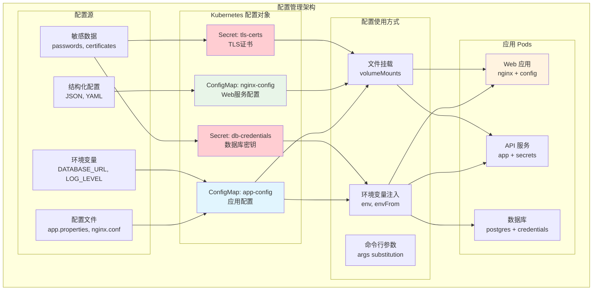

[TOC]

# ConfigMap 和 Secret 配置管理实验 (Configuration Management Lab)

## 实验概述

本实验专注于 Kubernetes 中的配置管理，深入学习 ConfigMap 和 Secret 的各种使用方式。您将掌握配置外部化、敏感信息安全存储、动态配置更新等核心技能。

## 学习目标

完成本实验后，您将能够：
- 创建和管理 ConfigMap 的各种数据类型
- 安全地存储和使用 Secret 中的敏感信息
- 掌握配置注入的多种方式（环境变量、文件挂载、命令行参数）
- 实现配置的动态更新和热重载
- 理解配置管理的最佳实践和安全考虑

## 前置条件

- ✅ Kind 集群运行正常
- ✅ 完成 Kubernetes 核心组件学习
- ✅ 理解 Pod 和 Deployment 概念
- ✅ 熟悉 YAML 语法和 Linux 命令

## 实验架构



## 实验步骤

### 步骤 1: 环境准备

创建实验环境和命名空间：

```bash
# 创建实验目录
mkdir -p ~/k8s-lab/config-management
cd ~/k8s-lab/config-management

# 创建实验命名空间
kubectl create namespace config-lab
kubectl label namespace config-lab purpose=configuration-demo

# 设置上下文
kubectl config set-context --current --namespace=config-lab

# 验证环境
kubectl get namespace config-lab --show-labels
echo "当前命名空间: $(kubectl config view --minify -o jsonpath='{..namespace}')"
```

### 步骤 2: ConfigMap 基础操作

#### 2.1 命令行创建 ConfigMap

```bash
echo "📝 ConfigMap 基础操作演示"

# 方式1: 从字面值创建
kubectl create configmap basic-config \
  --from-literal=database.host=mysql.example.com \
  --from-literal=database.port=3306 \
  --from-literal=database.name=webapp \
  --from-literal=log.level=info \
  --from-literal=feature.auth=enabled

# 方式2: 从环境变量文件创建
cat > app.env << 'EOF'
NODE_ENV=production
PORT=8080
API_TIMEOUT=30
CACHE_SIZE=100
DEBUG_MODE=false
METRICS_ENABLED=true
EOF

kubectl create configmap env-config --from-env-file=app.env

# 方式3: 从配置文件创建
cat > database.properties << 'EOF'
# Database Configuration
driver=com.mysql.cj.jdbc.Driver
url=jdbc:mysql://mysql:3306/webapp?useSSL=false&allowPublicKeyRetrieval=true
pool.initial=5
pool.max=20
pool.timeout=30000

# Connection validation
validation.query=SELECT 1
validation.timeout=5000
validation.interval=300000
EOF

kubectl create configmap db-config --from-file=database.properties

# 方式4: 从目录创建
mkdir config-files
cat > config-files/app.yaml << 'EOF'
server:
  port: 8080
  host: 0.0.0.0

logging:
  level: INFO
  format: json

features:
  authentication: true
  rate_limiting: true
  metrics: true

limits:
  max_connections: 1000
  timeout: 30s
  memory_limit: 512Mi
EOF

cat > config-files/redis.conf << 'EOF'
# Redis Configuration
port 6379
bind 127.0.0.1
timeout 0
databases 16
maxmemory 256mb
maxmemory-policy allkeys-lru
save 900 1
save 300 10
save 60 10000
EOF

kubectl create configmap multi-config --from-file=config-files/

# 验证创建的 ConfigMap
kubectl get configmap
kubectl describe configmap basic-config
```

#### 2.2 YAML 方式创建 ConfigMap

```bash
# 创建复杂的 ConfigMap
cat > complex-configmap.yaml << 'EOF'
apiVersion: v1
kind: ConfigMap
metadata:
  name: webapp-config
  namespace: config-lab
  labels:
    app: webapp
    type: configuration
  annotations:
    description: "Web application configuration"
    version: "1.0.0"
data:
  # 简单键值对
  app.name: "My Web Application"
  app.version: "1.2.3"
  app.environment: "production"

  # 数据库配置
  database.host: "postgres.default.svc.cluster.local"
  database.port: "5432"
  database.ssl: "require"

  # JSON 配置
  features.json: |
    {
      "authentication": {
        "enabled": true,
        "providers": ["oauth2", "ldap"],
        "session_timeout": 3600
      },
      "caching": {
        "enabled": true,
        "ttl": 300,
        "max_size": 1000
      },
      "monitoring": {
        "metrics": true,
        "tracing": true,
        "logging_level": "INFO"
      }
    }

  # YAML 配置
  server.yaml: |
    server:
      port: 8080
      workers: 4
      max_connections: 1000

    security:
      cors:
        enabled: true
        origins: ["https://app.example.com"]
      headers:
        x_frame_options: "SAMEORIGIN"
        x_content_type_options: "nosniff"

    performance:
      compression: gzip
      cache_control: "max-age=3600"
      keep_alive: 60

  # Nginx 配置文件
  nginx.conf: |
    user nginx;
    worker_processes auto;
    error_log /var/log/nginx/error.log warn;
    pid /var/run/nginx.pid;

    events {
        worker_connections 1024;
        use epoll;
        multi_accept on;
    }

    http {
        include /etc/nginx/mime.types;
        default_type application/octet-stream;

        log_format main '$remote_addr - $remote_user [$time_local] "$request" '
                        '$status $body_bytes_sent "$http_referer" '
                        '"$http_user_agent" "$http_x_forwarded_for"';

        access_log /var/log/nginx/access.log main;

        sendfile on;
        tcp_nopush on;
        tcp_nodelay on;
        keepalive_timeout 65;

        gzip on;
        gzip_vary on;
        gzip_proxied any;
        gzip_comp_level 6;
        gzip_types text/plain text/css application/json application/javascript;

        server {
            listen 80;
            server_name _;
            root /usr/share/nginx/html;
            index index.html;

            location /health {
                access_log off;
                return 200 'healthy\n';
                add_header Content-Type text/plain;
            }

            location / {
                try_files $uri $uri/ =404;
            }

            location /api/ {
                proxy_pass http://backend:8080/;
                proxy_set_header Host $host;
                proxy_set_header X-Real-IP $remote_addr;
            }
        }
    }

  # Shell 脚本
  init.sh: |
    #!/bin/bash
    set -e

    echo "Initializing application..."

    # 等待数据库连接
    until pg_isready -h $DATABASE_HOST -p $DATABASE_PORT -U $DATABASE_USER; do
        echo "Waiting for database..."
        sleep 2
    done

    # 运行数据库迁移
    if [ "$RUN_MIGRATIONS" = "true" ]; then
        echo "Running database migrations..."
        python manage.py migrate
    fi

    # 创建超级用户
    if [ "$CREATE_SUPERUSER" = "true" ]; then
        echo "Creating superuser..."
        python manage.py createsuperuser --noinput
    fi

    echo "Initialization complete!"

binaryData:
  # 二进制数据示例 (base64 编码)
  favicon.ico: AAABAAEAEBAAAAAAAABoBAAAFgAAACgAAAAQAAAAIAAAAAEAIAAAAAAAAAQAAAAAAAAAAAAAAAAA

# 不可变 ConfigMap (Kubernetes 1.19+)
immutable: false
EOF

kubectl apply -f complex-configmap.yaml

# 查看详细信息
kubectl get configmap webapp-config -o yaml | head -30
```

### 步骤 3: Secret 管理

#### 3.1 不同类型的 Secret

```bash
echo "🔐 Secret 管理演示"

# 1. Generic Secret (通用密钥)
kubectl create secret generic app-credentials \
  --from-literal=username=admin \
  --from-literal=password='SuperSecretPassword123!' \
  --from-literal=api-key='abc123def456ghi789' \
  --from-literal=database-url='postgresql://user:pass@db:5432/webapp'

# 2. Docker Registry Secret (镜像仓库认证)
kubectl create secret docker-registry registry-secret \
  --docker-server=private-registry.example.com \
  --docker-username=myuser \
  --docker-password=mypassword \
  --docker-email=user@example.com

# 3. TLS Secret (证书密钥)
# 首先生成自签名证书 (仅用于测试)
openssl req -x509 -nodes -days 365 -newkey rsa:2048 \
  -keyout tls.key -out tls.crt \
  -subj "/C=US/ST=CA/L=SF/O=Test/CN=app.example.com"

kubectl create secret tls tls-secret \
  --cert=tls.crt \
  --key=tls.key

# 4. Service Account Token Secret (自动创建)
kubectl create serviceaccount app-service-account

# 验证 Secret
kubectl get secrets
kubectl describe secret app-credentials
echo ""
echo "Secret 数据 (Base64 解码):"
kubectl get secret app-credentials -o jsonpath='{.data.username}' | base64 -d
echo ""
kubectl get secret app-credentials -o jsonpath='{.data.password}' | base64 -d
echo ""
```

#### 3.2 YAML 方式创建 Secret

```bash
cat > comprehensive-secrets.yaml << 'EOF'
# 应用凭据 Secret
apiVersion: v1
kind: Secret
metadata:
  name: database-secret
  namespace: config-lab
  labels:
    app: webapp
    type: credentials
type: Opaque
data:
  # Base64 编码的值
  DB_USERNAME: cG9zdGdyZXM=  # postgres
  DB_PASSWORD: c3VwZXJzZWNyZXQxMjM=  # supersecret123
  DB_DATABASE: d2ViYXBw  # webapp
stringData:
  # 明文值，系统会自动 Base64 编码
  DB_HOST: "postgres.default.svc.cluster.local"
  DB_PORT: "5432"
  CONNECTION_PARAMS: "sslmode=require&pool_max_conns=10"

---
# OAuth 配置 Secret
apiVersion: v1
kind: Secret
metadata:
  name: oauth-config
  namespace: config-lab
  labels:
    app: webapp
    component: authentication
type: Opaque
stringData:
  GOOGLE_CLIENT_ID: "123456789-abcdefghijklmnop.apps.googleusercontent.com"
  GOOGLE_CLIENT_SECRET: "GOCSPX-abcdefghijklmnopqrstuvwxyz"
  GITHUB_CLIENT_ID: "0123456789abcdef0123"
  GITHUB_CLIENT_SECRET: "0123456789abcdef0123456789abcdef01234567"
  JWT_SECRET_KEY: "super-secret-jwt-key-change-in-production"
  ENCRYPTION_KEY: "32-byte-long-encryption-key-here"

---
# Redis 连接 Secret
apiVersion: v1
kind: Secret
metadata:
  name: redis-auth
  namespace: config-lab
type: Opaque
stringData:
  REDIS_URL: "redis://:password@redis:6379/0"
  REDIS_PASSWORD: "redis-super-secret-password"

---
# 监控系统 Secret
apiVersion: v1
kind: Secret
metadata:
  name: monitoring-config
  namespace: config-lab
type: Opaque
stringData:
  PROMETHEUS_USER: "prometheus"
  PROMETHEUS_PASSWORD: "prom-secret-123"
  GRAFANA_ADMIN_PASSWORD: "grafana-admin-password"
  ALERTMANAGER_WEBHOOK: "https://hooks.slack.com/services/YOUR_WORKSPACE/YOUR_CHANNEL/YOUR_SECRET_TOKEN"

---
# TLS 证书 Secret (生产环境应使用 cert-manager)
apiVersion: v1
kind: Secret
metadata:
  name: app-tls
  namespace: config-lab
type: kubernetes.io/tls
data:
  # 这里应该是实际的证书内容 (Base64 编码)
  tls.crt: LS0tLS1CRUdJTiBDRVJUSUZJQ0FURS0tLS0tCi4uLgotLS0tLUVORCBDRVJUSUZJQ0FURS0tLS0t
  tls.key: LS0tLS1CRUdJTiBQUklWQVRFIEtFWS0tLS0tCi4uLgotLS0tLUVORCBQUklWQVRFIEtFWS0tLS0t
EOF

kubectl apply -f comprehensive-secrets.yaml

# 清理临时文件
rm -f tls.key tls.crt
```

### 步骤 4: 配置使用方式演示

#### 4.1 环境变量注入

```bash
echo "🌍 环境变量注入演示"

cat > env-demo-pod.yaml << 'EOF'
apiVersion: v1
kind: Pod
metadata:
  name: env-demo
  namespace: config-lab
  labels:
    app: config-demo
    type: environment-variables
spec:
  containers:
  - name: env-test
    image: busybox:1.35
    command: ['sh', '-c']
    args:
    - |
      echo "=== 环境变量演示 ==="
      echo "应用名称: $APP_NAME"
      echo "数据库主机: $DATABASE_HOST"
      echo "日志级别: $LOG_LEVEL"
      echo "特性开关: $FEATURE_AUTH"
      echo ""
      echo "=== 敏感信息 ==="
      echo "用户名: $DB_USERNAME"
      echo "密码长度: ${#DB_PASSWORD}"
      echo "API Key 前缀: ${API_KEY:0:6}..."
      echo ""
      echo "=== 完整环境变量列表 ==="
      env | sort
      echo ""
      echo "程序将保持运行 30 秒..."
      sleep 30

    env:
    # 从 ConfigMap 获取单个值
    - name: APP_NAME
      valueFrom:
        configMapKeyRef:
          name: webapp-config
          key: app.name
    - name: DATABASE_HOST
      valueFrom:
        configMapKeyRef:
          name: webapp-config
          key: database.host
    - name: LOG_LEVEL
      valueFrom:
        configMapKeyRef:
          name: basic-config
          key: log.level
    - name: FEATURE_AUTH
      valueFrom:
        configMapKeyRef:
          name: basic-config
          key: feature.auth

    # 从 Secret 获取单个值
    - name: DB_USERNAME
      valueFrom:
        secretKeyRef:
          name: database-secret
          key: DB_USERNAME
    - name: DB_PASSWORD
      valueFrom:
        secretKeyRef:
          name: database-secret
          key: DB_PASSWORD
    - name: API_KEY
      valueFrom:
        secretKeyRef:
          name: app-credentials
          key: api-key

    # 批量导入环境变量
    envFrom:
    - configMapRef:
        name: env-config
    - secretRef:
        name: oauth-config
        optional: true

    resources:
      requests:
        memory: "64Mi"
        cpu: "100m"
      limits:
        memory: "128Mi"
        cpu: "200m"

  restartPolicy: Never
EOF

kubectl apply -f env-demo-pod.yaml

# 等待 Pod 完成并查看日志
kubectl wait --for=condition=Ready pod/env-demo --timeout=60s
kubectl logs env-demo | head -30
```

#### 4.2 文件挂载方式

```bash
echo "📂 文件挂载演示"

cat > volume-mount-demo.yaml << 'EOF'
apiVersion: v1
kind: Pod
metadata:
  name: volume-demo
  namespace: config-lab
  labels:
    app: config-demo
    type: volume-mount
spec:
  containers:
  - name: config-consumer
    image: nginx:1.20-alpine
    command: ['sh', '-c']
    args:
    - |
      echo "=== 文件挂载演示 ==="
      echo ""

      echo "1. 检查 nginx 配置文件:"
      ls -la /etc/nginx/
      echo ""

      echo "2. 显示 nginx.conf 内容 (前20行):"
      head -20 /etc/nginx/nginx.conf
      echo ""

      echo "3. 检查应用配置目录:"
      ls -la /app/config/
      echo ""

      echo "4. 显示 YAML 配置:"
      cat /app/config/server.yaml
      echo ""

      echo "5. 显示 JSON 配置:"
      cat /app/config/features.json | head -10
      echo ""

      echo "6. 检查初始化脚本:"
      ls -la /scripts/
      head -10 /scripts/init.sh
      echo ""

      echo "7. 检查数据库配置:"
      ls -la /config/database/
      cat /config/database/database.properties | head -10
      echo ""

      echo "8. 测试 nginx 配置有效性:"
      nginx -t
      echo ""

      echo "启动 nginx 服务..."
      nginx -g 'daemon off;' &

      echo "等待30秒后退出..."
      sleep 30

    ports:
    - containerPort: 80

    volumeMounts:
    # 完整配置文件替换
    - name: nginx-config
      mountPath: /etc/nginx/nginx.conf
      subPath: nginx.conf
      readOnly: true

    # 多个配置文件挂载到目录
    - name: app-configs
      mountPath: /app/config
      readOnly: true

    # 脚本文件挂载
    - name: scripts
      mountPath: /scripts
      readOnly: true

    # 数据库配置挂载
    - name: db-config
      mountPath: /config/database
      readOnly: true

    # Secret 作为文件挂载
    - name: db-credentials
      mountPath: /secrets/database
      readOnly: true

    # TLS 证书挂载
    - name: tls-certs
      mountPath: /etc/ssl/certs/app
      readOnly: true

    resources:
      requests:
        memory: "128Mi"
        cpu: "100m"
      limits:
        memory: "256Mi"
        cpu: "200m"

  volumes:
  # ConfigMap 卷
  - name: nginx-config
    configMap:
      name: webapp-config
      items:
      - key: nginx.conf
        path: nginx.conf
        mode: 0644

  - name: app-configs
    configMap:
      name: webapp-config
      items:
      - key: server.yaml
        path: server.yaml
      - key: features.json
        path: features.json
      defaultMode: 0644

  - name: scripts
    configMap:
      name: webapp-config
      items:
      - key: init.sh
        path: init.sh
        mode: 0755  # 可执行权限

  - name: db-config
    configMap:
      name: db-config

  # Secret 卷
  - name: db-credentials
    secret:
      secretName: database-secret
      defaultMode: 0400  # 只读权限
      items:
      - key: DB_USERNAME
        path: username
      - key: DB_PASSWORD
        path: password
      - key: DB_HOST
        path: host

  - name: tls-certs
    secret:
      secretName: app-tls
      defaultMode: 0400

  restartPolicy: Never

  # 安全上下文
  securityContext:
    runAsNonRoot: true
    runAsUser: 101
    runAsGroup: 101
    fsGroup: 101
EOF

kubectl apply -f volume-mount-demo.yaml

# 等待并查看演示结果
kubectl wait --for=condition=Ready pod/volume-demo --timeout=60s
kubectl logs volume-demo | head -50

# 验证文件权限和内容
echo ""
echo "验证挂载的文件权限:"
kubectl exec volume-demo -- ls -la /secrets/database/
echo ""
echo "验证 TLS 证书文件:"
kubectl exec volume-demo -- ls -la /etc/ssl/certs/app/
```

#### 4.3 命令行参数替换

```bash
echo "⚙️  命令行参数替换演示"

cat > args-demo-pod.yaml << 'EOF'
apiVersion: v1
kind: Pod
metadata:
  name: args-demo
  namespace: config-lab
  labels:
    app: config-demo
    type: command-args
spec:
  containers:
  - name: args-test
    image: alpine:3.16
    command: ['sh', '-c']
    args:
    - |
      echo "=== 命令行参数演示 ==="
      echo "应用启动参数:"
      echo "  服务器端口: $1"
      echo "  数据库主机: $2"
      echo "  日志级别: $3"
      echo "  工作进程数: $4"
      echo ""
      echo "模拟应用启动..."
      echo "监听端口 $1..."
      echo "连接数据库 $2..."
      echo "设置日志级别为 $3..."
      echo "启动 $4 个工作进程..."
      echo ""
      echo "应用启动完成，保持运行 30 秒"
      sleep 30
    - "$(SERVER_PORT)"
    - "$(DATABASE_HOST)"
    - "$(LOG_LEVEL)"
    - "$(WORKER_PROCESSES)"

    env:
    - name: SERVER_PORT
      valueFrom:
        configMapKeyRef:
          name: env-config
          key: PORT
    - name: DATABASE_HOST
      valueFrom:
        configMapKeyRef:
          name: webapp-config
          key: database.host
    - name: LOG_LEVEL
      valueFrom:
        configMapKeyRef:
          name: basic-config
          key: log.level
    - name: WORKER_PROCESSES
      value: "4"

    resources:
      requests:
        memory: "32Mi"
        cpu: "50m"
      limits:
        memory: "64Mi"
        cpu: "100m"

  restartPolicy: Never
EOF

kubectl apply -f args-demo-pod.yaml

# 查看结果
kubectl wait --for=condition=Ready pod/args-demo --timeout=60s
kubectl logs args-demo
```

### 步骤 5: 配置更新和热重载

#### 5.1 ConfigMap 更新演示

```bash
echo "🔄 配置更新演示"

# 创建可以监听配置变化的应用
cat > config-watcher-deployment.yaml << 'EOF'
apiVersion: v1
kind: ConfigMap
metadata:
  name: dynamic-config
  namespace: config-lab
data:
  message: "Hello from ConfigMap v1"
  refresh_interval: "10"
  feature_enabled: "true"
  config.json: |
    {
      "version": "1.0",
      "environment": "production",
      "features": {
        "feature_a": true,
        "feature_b": false
      }
    }

---
apiVersion: apps/v1
kind: Deployment
metadata:
  name: config-watcher
  namespace: config-lab
  labels:
    app: config-watcher
spec:
  replicas: 2
  selector:
    matchLabels:
      app: config-watcher
  template:
    metadata:
      labels:
        app: config-watcher
    spec:
      containers:
      - name: watcher
        image: busybox:1.35
        command: ['sh', '-c']
        args:
        - |
          echo "配置监听服务启动..."
          while true; do
            echo "=== $(date) ==="
            echo "当前消息: $(cat /config/message 2>/dev/null || echo 'N/A')"
            echo "刷新间隔: $(cat /config/refresh_interval 2>/dev/null || echo 'N/A')"
            echo "特性状态: $(cat /config/feature_enabled 2>/dev/null || echo 'N/A')"
            echo "配置版本: $(cat /config/config.json 2>/dev/null | grep version || echo 'N/A')"
            echo "文件修改时间: $(stat -c %Y /config/message 2>/dev/null || echo 'N/A')"
            echo ""

            # 使用配置的刷新间隔
            INTERVAL=$(cat /config/refresh_interval 2>/dev/null || echo "30")
            sleep $INTERVAL
          done

        env:
        - name: POD_NAME
          valueFrom:
            fieldRef:
              fieldPath: metadata.name

        # 环境变量方式 (不会自动更新)
        - name: STATIC_MESSAGE
          valueFrom:
            configMapKeyRef:
              name: dynamic-config
              key: message

        volumeMounts:
        - name: config-volume
          mountPath: /config
          readOnly: true

        resources:
          requests:
            memory: "32Mi"
            cpu: "50m"
          limits:
            memory: "64Mi"
            cpu: "100m"

      volumes:
      - name: config-volume
        configMap:
          name: dynamic-config

      restartPolicy: Always
EOF

kubectl apply -f config-watcher-deployment.yaml

# 等待部署就绪
kubectl rollout status deployment/config-watcher

# 查看初始日志
POD_NAME=$(kubectl get pods -l app=config-watcher -o jsonpath='{.items[0].metadata.name}')
echo "监听 Pod: $POD_NAME"
kubectl logs $POD_NAME --tail=10

echo ""
echo "等待 15 秒后更新配置..."
sleep 15

# 更新 ConfigMap
echo "🔄 更新 ConfigMap..."
kubectl patch configmap dynamic-config --patch='
data:
  message: "Hello from ConfigMap v2 - Updated!"
  refresh_interval: "5"
  feature_enabled: "false"
  config.json: |
    {
      "version": "2.0",
      "environment": "production",
      "features": {
        "feature_a": false,
        "feature_b": true,
        "feature_c": true
      },
      "updated_at": "'$(date -Iseconds)'"
    }'

echo "ConfigMap 已更新，观察日志变化..."
echo "注意：文件挂载会自动更新，但环境变量不会"

# 观察变化 (Kubernetes 可能需要几分钟同步)
sleep 30
kubectl logs $POD_NAME --tail=20
```

#### 5.2 Secret 轮换演示

```bash
echo "🔐 Secret 轮换演示"

# 创建使用 Secret 的应用
cat > secret-consumer.yaml << 'EOF'
apiVersion: v1
kind: Pod
metadata:
  name: secret-consumer
  namespace: config-lab
  labels:
    app: secret-demo
spec:
  containers:
  - name: consumer
    image: alpine:3.16
    command: ['sh', '-c']
    args:
    - |
      echo "Secret 消费者启动..."
      while true; do
        echo "=== $(date) ==="
        echo "数据库用户: $(cat /secrets/username 2>/dev/null || echo 'N/A')"
        echo "密码长度: $(cat /secrets/password 2>/dev/null | wc -c || echo 'N/A')"
        echo "文件修改时间: $(stat -c %Y /secrets/password 2>/dev/null || echo 'N/A')"
        echo ""
        sleep 20
      done

    volumeMounts:
    - name: secret-volume
      mountPath: /secrets
      readOnly: true

    resources:
      requests:
        memory: "32Mi"
        cpu: "50m"
      limits:
        memory: "64Mi"
        cpu: "100m"

  volumes:
  - name: secret-volume
    secret:
      secretName: database-secret
      items:
      - key: DB_USERNAME
        path: username
      - key: DB_PASSWORD
        path: password

  restartPolicy: Always
EOF

kubectl apply -f secret-consumer.yaml

# 等待 Pod 启动
kubectl wait --for=condition=Ready pod/secret-consumer --timeout=60s

echo "查看初始状态:"
kubectl logs secret-consumer --tail=5

echo ""
echo "等待 10 秒后轮换密钥..."
sleep 10

# 轮换 Secret
echo "🔄 轮换数据库密钥..."
kubectl patch secret database-secret --patch='
stringData:
  DB_USERNAME: "postgres_new"
  DB_PASSWORD: "new-super-secret-password-456"
  DB_HOST: "postgres-new.default.svc.cluster.local"
'

echo "Secret 已轮换，观察文件变化..."
sleep 30
kubectl logs secret-consumer --tail=10
```

### 步骤 6: 配置验证和安全

#### 6.1 配置验证

```bash
echo "✅ 配置验证演示"

# 创建配置验证脚本
cat > validate-config.sh << 'EOF'
#!/bin/bash

echo "🔍 配置验证报告"
echo "================"
echo "生成时间: $(date)"
echo ""

# 检查 ConfigMap
echo "📄 ConfigMap 状态:"
kubectl get configmap -n config-lab --no-headers | while read name age; do
    echo "  ✓ $name"
    # 检查大小 (K8s ConfigMap 限制 1MB)
    SIZE=$(kubectl get configmap $name -n config-lab -o json | jq -r '.data | to_entries | map(.value | length) | add // 0')
    if [ "$SIZE" -gt 1000000 ]; then
        echo "    ⚠️  警告: 配置过大 ($SIZE bytes)"
    else
        echo "    📊 大小: $SIZE bytes"
    fi
done
echo ""

# 检查 Secret
echo "🔐 Secret 状态:"
kubectl get secret -n config-lab --no-headers | grep -v default-token | while read name type age; do
    echo "  ✓ $name ($type)"
    # 检查 Secret 是否被使用
    USAGE=$(kubectl get pods -n config-lab -o json | jq -r --arg secret "$name" '.items[] | select(.spec.volumes[]?.secret.secretName == $secret or .spec.containers[].env[]?.valueFrom.secretKeyRef.name == $secret or .spec.containers[].envFrom[]?.secretRef.name == $secret) | .metadata.name' | wc -l)
    if [ "$USAGE" -eq 0 ]; then
        echo "    ⚠️  警告: Secret 未被使用"
    else
        echo "    📊 使用中: $USAGE 个 Pod"
    fi
done
echo ""

# 检查配置使用情况
echo "🎯 配置使用分析:"
kubectl get pods -n config-lab -o json | jq -r '
  .items[] |
  {
    pod: .metadata.name,
    configMaps: [.spec.volumes[]?.configMap.name // empty] | unique,
    secrets: [.spec.volumes[]?.secret.secretName // empty] | unique,
    envConfigMaps: [.spec.containers[].env[]?.valueFrom.configMapKeyRef.name // empty] | unique,
    envSecrets: [.spec.containers[].env[]?.valueFrom.secretKeyRef.name // empty] | unique
  } |
  "Pod: \(.pod)",
  "  ConfigMap 卷: \(.configMaps | join(\", \"))",
  "  Secret 卷: \(.secrets | join(\", \"))",
  "  ConfigMap 环境变量: \(.envConfigMaps | join(\", \"))",
  "  Secret 环境变量: \(.envSecrets | join(\", \"))",
  ""
'

echo "🛡️  安全检查:"
echo "  检查 Secret 权限..."
kubectl get secret -n config-lab -o json | jq -r '
  .items[] |
  select(.metadata.name | startswith("default-token") | not) |
  .metadata.name as $name |
  if .data then
    "  ✓ " + $name + ": 数据已加密"
  else
    "  ⚠️  " + $name + ": 无数据或未加密"
  end
'

echo ""
echo "📋 建议:"
echo "  1. 定期轮换敏感凭据"
echo "  2. 使用最小权限原则"
echo "  3. 启用静态数据加密"
echo "  4. 监控配置访问日志"
echo "  5. 使用外部密钥管理系统"
EOF

chmod +x validate-config.sh
./validate-config.sh
```

#### 6.2 安全最佳实践演示

```bash
echo "🛡️  安全最佳实践演示"

# 创建安全的配置示例
cat > secure-config-example.yaml << 'EOF'
# 1. 使用 immutable ConfigMap (防止意外修改)
apiVersion: v1
kind: ConfigMap
metadata:
  name: immutable-config
  namespace: config-lab
  labels:
    app: secure-app
    config-type: immutable
immutable: true
data:
  app.name: "Secure Application"
  version: "1.0.0"
  environment: "production"

---
# 2. 带有严格权限的 Secret
apiVersion: v1
kind: Secret
metadata:
  name: secure-credentials
  namespace: config-lab
  labels:
    app: secure-app
    security-level: high
  annotations:
    kubernetes.io/description: "High security credentials"
type: Opaque
stringData:
  admin-password: "ComplexPassword123!@#"
  api-secret: "super-secret-api-key-with-256-bits"
  encryption-key: "32-byte-encryption-key-for-aes-256"

---
# 3. 使用安全上下文的 Pod
apiVersion: v1
kind: Pod
metadata:
  name: secure-app
  namespace: config-lab
  labels:
    app: secure-app
    security-profile: restricted
spec:
  # Pod 安全上下文
  securityContext:
    runAsNonRoot: true
    runAsUser: 1001
    runAsGroup: 1001
    fsGroup: 1001
    seccompProfile:
      type: RuntimeDefault

  containers:
  - name: secure-container
    image: alpine:3.16
    command: ['sh', '-c']
    args:
    - |
      echo "=== 安全应用启动 ==="
      echo "用户: $(whoami)"
      echo "用户 ID: $(id -u)"
      echo "组 ID: $(id -g)"
      echo ""

      echo "检查文件权限:"
      ls -la /config/
      ls -la /secrets/
      echo ""

      echo "检查 Secret 文件内容 (不显示敏感信息):"
      echo "管理员密码长度: $(cat /secrets/admin-password | wc -c)"
      echo "API 密钥长度: $(cat /secrets/api-secret | wc -c)"
      echo ""

      echo "应用运行中，30秒后退出..."
      sleep 30

    # 容器安全上下文
    securityContext:
      allowPrivilegeEscalation: false
      readOnlyRootFilesystem: true
      runAsNonRoot: true
      runAsUser: 1001
      runAsGroup: 1001
      capabilities:
        drop:
        - ALL

    # 只读配置挂载
    volumeMounts:
    - name: config-volume
      mountPath: /config
      readOnly: true
    - name: secret-volume
      mountPath: /secrets
      readOnly: true
    - name: tmp-volume
      mountPath: /tmp

    # 环境变量 (非敏感)
    env:
    - name: APP_NAME
      valueFrom:
        configMapKeyRef:
          name: immutable-config
          key: app.name
    - name: APP_VERSION
      valueFrom:
        configMapKeyRef:
          name: immutable-config
          key: version

    resources:
      requests:
        memory: "64Mi"
        cpu: "100m"
      limits:
        memory: "128Mi"
        cpu: "200m"

  volumes:
  - name: config-volume
    configMap:
      name: immutable-config
      defaultMode: 0444  # 只读
  - name: secret-volume
    secret:
      secretName: secure-credentials
      defaultMode: 0400  # 只读，仅所有者
  - name: tmp-volume
    emptyDir:
      sizeLimit: 100Mi

  # Pod 服务账户
  serviceAccountName: app-service-account
  automountServiceAccountToken: false  # 不自动挂载 SA token

  restartPolicy: Never

  # 节点选择器
  nodeSelector:
    security-profile: "standard"

  # 污点容忍
  tolerations: []

---
# 4. 网络策略 (限制网络访问)
apiVersion: networking.k8s.io/v1
kind: NetworkPolicy
metadata:
  name: secure-app-netpol
  namespace: config-lab
spec:
  podSelector:
    matchLabels:
      app: secure-app
  policyTypes:
  - Ingress
  - Egress
  ingress:
  - from:
    - namespaceSelector:
        matchLabels:
          name: config-lab
    ports:
    - protocol: TCP
      port: 8080
  egress:
  - to: []
    ports:
    - protocol: TCP
      port: 53  # DNS
    - protocol: UDP
      port: 53  # DNS
  - to:
    - namespaceSelector:
        matchLabels:
          name: default
    ports:
    - protocol: TCP
      port: 5432  # PostgreSQL
EOF

kubectl apply -f secure-config-example.yaml

# 等待并查看结果
kubectl wait --for=condition=Ready pod/secure-app --timeout=60s
kubectl logs secure-app

echo ""
echo "验证安全配置:"
kubectl describe pod secure-app | grep -A 10 "Security Context:"
```

### 步骤 7: 性能优化和监控

#### 7.1 配置性能测试

```bash
echo "⚡ 配置性能测试"

# 创建大量配置的性能测试
cat > performance-test.sh << 'EOF'
#!/bin/bash

echo "📊 配置性能测试"
echo "================"

# 测试1: 大量 ConfigMap 创建性能
echo "测试1: 创建100个小型 ConfigMap"
start_time=$(date +%s)

for i in {1..100}; do
    kubectl create configmap "perf-config-$i" \
      --from-literal="key1=value1" \
      --from-literal="key2=value2" \
      --from-literal="key3=value3" \
      -n config-lab >/dev/null 2>&1
done

end_time=$(date +%s)
echo "  ⏱️  创建时间: $((end_time - start_time)) 秒"
echo "  📊 平均每个: $(echo "scale=2; $((end_time - start_time))/100" | bc) 秒"

# 测试2: 大型 ConfigMap 性能
echo ""
echo "测试2: 创建大型 ConfigMap (接近1MB限制)"
start_time=$(date +%s)

# 生成大量数据
LARGE_DATA=""
for i in {1..1000}; do
    LARGE_DATA="${LARGE_DATA}line${i}=$(head -c 800 /dev/urandom | base64 | tr -d '\n')\n"
done

kubectl create configmap large-config \
  --from-literal="large-data=$(echo -e "$LARGE_DATA")" \
  -n config-lab >/dev/null 2>&1

end_time=$(date +%s)
echo "  ⏱️  创建时间: $((end_time - start_time)) 秒"

SIZE=$(kubectl get configmap large-config -n config-lab -o json | jq -r '.data["large-data"]' | wc -c)
echo "  📊 数据大小: $SIZE bytes"

# 测试3: 配置读取性能
echo ""
echo "测试3: 配置读取性能测试"
start_time=$(date +%s)

for i in {1..50}; do
    kubectl get configmap "perf-config-$i" -n config-lab >/dev/null 2>&1
done

end_time=$(date +%s)
echo "  ⏱️  读取50个ConfigMap: $((end_time - start_time)) 秒"

# 测试4: Pod 启动时间 (带配置挂载)
echo ""
echo "测试4: Pod 启动时间测试"

cat > /tmp/pod-with-configs.yaml << 'EOFPOD'
apiVersion: v1
kind: Pod
metadata:
  name: startup-test
  namespace: config-lab
spec:
  containers:
  - name: test
    image: busybox:1.35
    command: ['sh', '-c', 'echo "Pod started at $(date)"; sleep 10']
    volumeMounts:
    - name: config1
      mountPath: /config1
    - name: config2
      mountPath: /config2
    - name: large-config
      mountPath: /config-large
  volumes:
  - name: config1
    configMap:
      name: perf-config-1
  - name: config2
    configMap:
      name: perf-config-50
  - name: large-config
    configMap:
      name: large-config
  restartPolicy: Never
EOFPOD

start_time=$(date +%s)
kubectl apply -f /tmp/pod-with-configs.yaml >/dev/null 2>&1
kubectl wait --for=condition=Ready pod/startup-test -n config-lab --timeout=60s >/dev/null 2>&1
end_time=$(date +%s)

echo "  ⏱️  Pod启动时间: $((end_time - start_time)) 秒"

# 清理测试数据
echo ""
echo "清理性能测试数据..."
kubectl delete pod startup-test -n config-lab >/dev/null 2>&1
kubectl delete configmap large-config -n config-lab >/dev/null 2>&1
for i in {1..100}; do
    kubectl delete configmap "perf-config-$i" -n config-lab >/dev/null 2>&1
done

echo "✅ 性能测试完成"
EOF

chmod +x performance-test.sh
./performance-test.sh
```

#### 7.2 配置监控

```bash
echo "📊 配置监控演示"

# 创建配置监控 DaemonSet
cat > config-monitor.yaml << 'EOF'
apiVersion: apps/v1
kind: DaemonSet
metadata:
  name: config-monitor
  namespace: config-lab
  labels:
    app: config-monitor
spec:
  selector:
    matchLabels:
      app: config-monitor
  template:
    metadata:
      labels:
        app: config-monitor
    spec:
      containers:
      - name: monitor
        image: busybox:1.35
        command: ['sh', '-c']
        args:
        - |
          echo "配置监控服务启动..."
          while true; do
            echo "=== 配置监控报告 $(date) ==="

            echo "ConfigMap 数量: $(ls /config-data/ 2>/dev/null | wc -l)"
            echo "Secret 数量: $(ls /secret-data/ 2>/dev/null | wc -l)"

            echo "最近修改的配置:"
            find /config-data/ -type f -mmin -5 2>/dev/null | head -5 | while read file; do
              echo "  $(basename $file): $(stat -c %Y $file)"
            done

            echo "磁盘使用:"
            du -sh /config-data/ /secret-data/ 2>/dev/null | head -10

            echo "内存使用: $(free -m | grep Mem | awk '{print $3"/"$2" MB"}')"

            echo ""
            sleep 60
          done

        volumeMounts:
        - name: config-data
          mountPath: /config-data
          readOnly: true
        - name: secret-data
          mountPath: /secret-data
          readOnly: true

        resources:
          requests:
            memory: "32Mi"
            cpu: "50m"
          limits:
            memory: "64Mi"
            cpu: "100m"

      volumes:
      - name: config-data
        configMap:
          name: webapp-config
      - name: secret-data
        secret:
          secretName: database-secret

      restartPolicy: Always

      # 节点选择器 - 只在特定节点运行
      nodeSelector:
        kubernetes.io/os: linux

      # 容忍所有污点
      tolerations:
      - operator: Exists
EOF

kubectl apply -f config-monitor.yaml

# 等待并查看监控日志
sleep 10
MONITOR_POD=$(kubectl get pods -l app=config-monitor -o jsonpath='{.items[0].metadata.name}')
echo "监控 Pod: $MONITOR_POD"
kubectl logs $MONITOR_POD --tail=20
```

## 故障排查指南

### 常见配置问题诊断

```bash
# 创建故障排查脚本
cat > troubleshoot-config.sh << 'EOF'
#!/bin/bash

echo "🔧 配置故障排查指南"
echo "==================="

# 问题1: ConfigMap 不存在
echo "1. 检查 ConfigMap 是否存在:"
if kubectl get configmap nonexistent-config -n config-lab >/dev/null 2>&1; then
    echo "  ✅ ConfigMap 存在"
else
    echo "  ❌ ConfigMap 不存在 - 检查名称和命名空间"
    echo "  🔧 修复: kubectl create configmap <name> --from-literal=key=value"
fi

# 问题2: Secret 权限问题
echo ""
echo "2. 检查 Secret 访问权限:"
if kubectl get secret app-credentials -n config-lab >/dev/null 2>&1; then
    echo "  ✅ 可以访问 Secret"
else
    echo "  ❌ 无法访问 Secret - 检查权限和名称"
    echo "  🔧 修复: 检查 RBAC 权限或 Secret 是否存在"
fi

# 问题3: 挂载点冲突
echo ""
echo "3. 检查常见挂载问题:"
kubectl get pods -n config-lab -o json | jq -r '
  .items[] |
  select(.spec.volumes != null) |
  {
    pod: .metadata.name,
    mounts: [.spec.containers[].volumeMounts[]? | .mountPath]
  } |
  .pod as $pod |
  .mounts |
  group_by(.) |
  map(select(length > 1)) |
  if length > 0 then
    "  ⚠️  Pod " + $pod + " 有重复挂载点: " + (.[0][0])
  else
    "  ✅ Pod " + $pod + " 挂载点正常"
  end
' 2>/dev/null || echo "  ℹ️  无 Pod 需要检查"

# 问题4: 配置大小限制
echo ""
echo "4. 检查配置大小限制:"
kubectl get configmap -n config-lab -o json | jq -r '
  .items[] |
  {
    name: .metadata.name,
    size: (.data // {} | to_entries | map(.value | length) | add // 0)
  } |
  if .size > 1000000 then
    "  ⚠️  " + .name + ": 配置过大 (" + (.size|tostring) + " bytes)"
  elif .size > 500000 then
    "  ⚠️  " + .name + ": 配置较大 (" + (.size|tostring) + " bytes)"
  else
    "  ✅ " + .name + ": 大小正常 (" + (.size|tostring) + " bytes)"
  end
'

# 问题5: 环境变量冲突
echo ""
echo "5. 检查环境变量命名冲突:"
kubectl get pods -n config-lab -o json | jq -r '
  .items[] |
  .metadata.name as $pod |
  [.spec.containers[].env[]? | .name] |
  group_by(.) |
  map(select(length > 1)) |
  if length > 0 then
    "  ⚠️  Pod " + $pod + " 有重复环境变量: " + (.[0][0])
  else
    "  ✅ Pod " + $pod + " 环境变量无冲突"
  end
' 2>/dev/null || echo "  ℹ️  无环境变量冲突检查"

echo ""
echo "📋 常见解决方案:"
echo "1. ConfigMap/Secret 不存在: 检查名称拼写和命名空间"
echo "2. 挂载失败: 检查卷定义和挂载路径"
echo "3. 权限错误: 检查 RBAC 和 ServiceAccount"
echo "4. 配置不更新: 重启 Pod 或等待自动同步"
echo "5. 大小限制: 拆分大配置或使用外部存储"
EOF

chmod +x troubleshoot-config.sh
./troubleshoot-config.sh
```

## 实验清理

```bash
echo "🧹 开始清理配置管理实验"

# 停止监控服务
kubectl delete daemonset config-monitor -n config-lab 2>/dev/null || echo "DaemonSet 已清理"

# 删除所有部署
kubectl delete deployment config-watcher -n config-lab 2>/dev/null || echo "Deployment 已清理"

# 删除所有 Pod
kubectl delete pods --all -n config-lab --force --grace-period=0

# 删除所有 ConfigMap
kubectl delete configmap --all -n config-lab

# 删除所有 Secret (除了系统自动创建的)
kubectl get secret -n config-lab --no-headers | grep -v default-token | cut -d' ' -f1 | xargs kubectl delete secret -n config-lab

# 删除 ServiceAccount
kubectl delete serviceaccount app-service-account -n config-lab 2>/dev/null || echo "ServiceAccount 已清理"

# 删除 NetworkPolicy
kubectl delete networkpolicy secure-app-netpol -n config-lab 2>/dev/null || echo "NetworkPolicy 已清理"

# 删除命名空间 (可选)
read -p "是否删除整个命名空间? (y/n): " -n 1 -r
echo
if [[ $REPLY =~ ^[Yy]$ ]]; then
    kubectl delete namespace config-lab
    echo "✅ 命名空间已删除"
else
    echo "✅ 保留命名空间"
fi

# 清理本地文件
cd ..
rm -rf config-management/

echo "🎉 配置管理实验清理完成！"
```

## 实验总结

### 学到的技能

通过本实验，您全面掌握了：

1. **ConfigMap 管理**:
   - ✅ 多种创建方式（命令行、文件、YAML）
   - ✅ 不同数据类型存储（键值对、JSON、YAML、脚本）
   - ✅ 配置使用方式（环境变量、文件挂载、命令参数）

2. **Secret 安全管理**:
   - ✅ 不同类型的 Secret（Generic、TLS、Docker Registry）
   - ✅ 安全存储和访问敏感信息
   - ✅ 密钥轮换和生命周期管理

3. **配置注入方式**:
   - ✅ 环境变量注入（单个和批量）
   - ✅ 文件系统挂载（完整目录和特定文件）
   - ✅ 命令行参数替换

4. **动态配置管理**:
   - ✅ 配置热更新和监听
   - ✅ 不可变配置策略
   - ✅ 配置版本管理

5. **安全最佳实践**:
   - ✅ 最小权限原则
   - ✅ 安全上下文配置
   - ✅ 网络策略控制
   - ✅ 配置验证和监控

### 最佳实践要点

1. **配置分离**: 将配置从代码中分离，使用 ConfigMap 和 Secret
2. **敏感数据**: 使用 Secret 存储密码、密钥等敏感信息
3. **权限控制**: 设置适当的文件权限和访问控制
4. **版本管理**: 使用标签和注解管理配置版本
5. **监控**: 实施配置变更监控和审计
6. **备份**: 定期备份重要的配置信息
7. **测试**: 在非生产环境中测试配置更改

### 下一步学习

- **[核心评估](../assessment/practical.md)**: 综合实践多层应用部署
- **[高级功能](../../02-advanced/)**: 学习 Helm 包管理和 Operator
- **[监控运维](../../02-advanced/02-监控运维/)**: 配置监控和告警系统

---

**实验完成标记**: 当您能成功创建、更新和安全管理 ConfigMap 和 Secret，并理解各种注入方式时，本实验即为完成。

### 扩展练习

1. 尝试集成外部密钥管理系统 (如 HashiCorp Vault)
2. 实现配置的 GitOps 工作流
3. 使用 Kustomize 管理多环境配置
4. 探索 ConfigMap 和 Secret 的 CSI 驱动程序