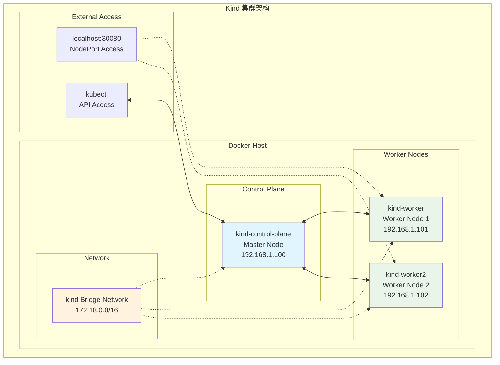

[TOC]

# Kind 集群搭建实验 (Kind Cluster Setup Lab)

## 实验概述

本实验将指导您使用 Kind (Kubernetes in Docker) 搭建一个多节点的本地 Kubernetes 集群。通过本实验，您将学会集群搭建、节点管理和基本运维操作。

## 学习目标

完成本实验后，您将能够：
- 使用 Kind 配置和创建多节点 K8s 集群
- 理解集群网络和端口映射配置
- 掌握集群的基本管理和监控操作
- 进行节点状态检查和故障排查

## 前置条件

- ✅ Docker Desktop 已安装并运行
- ✅ Kind 工具已安装 (`kind version` 验证)
- ✅ kubectl 工具已配置 (`kubectl version --client` 验证)
- ✅ 至少 4GB 可用内存和 10GB 存储空间

## 实验架构



## 实验步骤

### 步骤 1: 创建集群配置文件

创建 Kind 配置文件，定义多节点集群结构：

```bash
# 创建实验目录
mkdir -p ~/k8s-lab/kind-cluster
cd ~/k8s-lab/kind-cluster
```

**kind-config.yaml**:
```yaml
# Kind 集群配置 - 2 Worker 节点设置
kind: Cluster
apiVersion: kind.x-k8s.io/v1alpha4

# 集群名称
name: k8s-learning-cluster

# 网络配置
networking:
  # 禁用默认 CNI，我们将手动安装
  disableDefaultCNI: false
  # Pod 子网
  podSubnet: "10.244.0.0/16"
  # Service 子网
  serviceSubnet: "10.96.0.0/16"
  # API Server 端口
  apiServerAddress: "127.0.0.1"
  apiServerPort: 6443

# 节点配置
nodes:
# Control Plane 节点
- role: control-plane
  image: kindest/node:v1.28.0
  # 端口映射 - 允许外部访问
  extraPortMappings:
  - containerPort: 30080
    hostPort: 30080
    protocol: TCP
  - containerPort: 30443
    hostPort: 30443
    protocol: TCP
  # 资源配置
  kubeadmConfigPatches:
  - |
    kind: InitConfiguration
    nodeRegistration:
      kubeletExtraArgs:
        node-labels: "node-type=control-plane,environment=lab"
  - |
    kind: ClusterConfiguration
    apiServer:
      extraArgs:
        enable-admission-plugins: "NodeRestriction,ResourceQuota"
    controllerManager:
      extraArgs:
        bind-address: "0.0.0.0"
    scheduler:
      extraArgs:
        bind-address: "0.0.0.0"
    etcd:
      local:
        extraArgs:
          listen-metrics-urls: "http://0.0.0.0:2381"

# Worker 节点 1
- role: worker
  image: kindest/node:v1.28.0
  # 标签配置
  kubeadmConfigPatches:
  - |
    kind: JoinConfiguration
    nodeRegistration:
      kubeletExtraArgs:
        node-labels: "node-type=worker,worker-id=1,environment=lab"
        max-pods: "110"

# Worker 节点 2
- role: worker
  image: kindest/node:v1.28.0
  kubeadmConfigPatches:
  - |
    kind: JoinConfiguration
    nodeRegistration:
      kubeletExtraArgs:
        node-labels: "node-type=worker,worker-id=2,environment=lab"
        max-pods: "110"
```

### 步骤 2: 创建集群

使用配置文件创建 Kind 集群：

```bash
# 创建集群 (需要3-5分钟)
kind create cluster --config=kind-config.yaml

# 验证集群创建成功
echo "等待集群就绪..."
kubectl cluster-info --context kind-k8s-learning-cluster

# 检查节点状态
kubectl get nodes -o wide

# 预期输出：
# NAME                           STATUS   ROLES           AGE   VERSION   INTERNAL-IP
# k8s-learning-cluster-control-plane   Ready    control-plane   2m    v1.28.0   172.18.0.2
# k8s-learning-cluster-worker          Ready    <none>          90s   v1.28.0   172.18.0.3
# k8s-learning-cluster-worker2         Ready    <none>          90s   v1.28.0   172.18.0.4
```

### 步骤 3: 验证集群组件

检查集群核心组件的运行状态：

```bash
# 检查系统 Pod
kubectl get pods -n kube-system

# 检查 API Server 健康状态
kubectl get componentstatuses

# 查看集群信息
kubectl cluster-info dump | head -20

# 检查节点详细信息
kubectl describe nodes | grep -E "Name:|Roles:|Taints:|Conditions:" -A 5
```

**预期结果验证**:
```bash
# 验证脚本 - 保存为 verify-cluster.sh
#!/bin/bash

echo "🔍 Kind 集群验证检查"
echo "=================="

# 检查集群是否存在
if kind get clusters | grep -q "k8s-learning-cluster"; then
    echo "✅ Kind 集群存在"
else
    echo "❌ Kind 集群不存在"
    exit 1
fi

# 检查节点数量
NODE_COUNT=$(kubectl get nodes --no-headers | wc -l)
if [ "$NODE_COUNT" -eq 3 ]; then
    echo "✅ 节点数量正确 ($NODE_COUNT)"
else
    echo "❌ 节点数量错误，预期3个，实际${NODE_COUNT}个"
fi

# 检查节点状态
NOT_READY=$(kubectl get nodes --no-headers | grep -v Ready | wc -l)
if [ "$NOT_READY" -eq 0 ]; then
    echo "✅ 所有节点已就绪"
else
    echo "❌ 有 $NOT_READY 个节点未就绪"
fi

# 检查系统 Pod
SYSTEM_PODS=$(kubectl get pods -n kube-system --no-headers | wc -l)
RUNNING_PODS=$(kubectl get pods -n kube-system --field-selector=status.phase=Running --no-headers | wc -l)
echo "✅ 系统 Pod 状态: $RUNNING_PODS/$SYSTEM_PODS 运行中"

# 检查网络连通性
echo "🌐 测试网络连通性..."
kubectl run test-pod --image=busybox --rm -it --restart=Never -- nslookup kubernetes.default

echo "🎉 集群验证完成！"
```

```bash
# 运行验证脚本
chmod +x verify-cluster.sh
./verify-cluster.sh
```

### 步骤 4: 网络和存储测试

测试集群的网络和存储功能：

```bash
# 创建测试命名空间
kubectl create namespace lab-test

# 部署网络测试 Pod
cat <<EOF | kubectl apply -f -
apiVersion: v1
kind: Pod
metadata:
  name: network-test
  namespace: lab-test
  labels:
    app: network-test
spec:
  containers:
  - name: busybox
    image: busybox:1.35
    command: ['sh', '-c', 'sleep 3600']
    resources:
      requests:
        memory: "64Mi"
        cpu: "100m"
      limits:
        memory: "128Mi"
        cpu: "200m"
  restartPolicy: Always
EOF

# 等待 Pod 运行
kubectl wait --for=condition=Ready pod/network-test -n lab-test --timeout=60s

# 测试 DNS 解析
echo "🧪 测试 DNS 解析:"
kubectl exec -n lab-test network-test -- nslookup kubernetes.default.svc.cluster.local

# 测试集群内网络连通性
echo "🧪 测试网络连通性:"
kubectl exec -n lab-test network-test -- ping -c 3 kubernetes.default.svc.cluster.local
```

**存储测试**:
```bash
# 创建 PV 和 PVC 测试
cat <<EOF | kubectl apply -f -
apiVersion: v1
kind: PersistentVolume
metadata:
  name: test-pv
spec:
  capacity:
    storage: 1Gi
  volumeMode: Filesystem
  accessModes:
  - ReadWriteOnce
  persistentVolumeReclaimPolicy: Delete
  storageClassName: manual
  hostPath:
    path: /tmp/test-data
---
apiVersion: v1
kind: PersistentVolumeClaim
metadata:
  name: test-pvc
  namespace: lab-test
spec:
  storageClassName: manual
  accessModes:
  - ReadWriteOnce
  resources:
    requests:
      storage: 1Gi
---
apiVersion: v1
kind: Pod
metadata:
  name: storage-test
  namespace: lab-test
spec:
  containers:
  - name: storage-test
    image: busybox:1.35
    command: ['sh', '-c']
    args:
    - |
      echo "测试存储写入..." > /data/test.txt
      cat /data/test.txt
      sleep 3600
    volumeMounts:
    - name: test-volume
      mountPath: /data
  volumes:
  - name: test-volume
    persistentVolumeClaim:
      claimName: test-pvc
  restartPolicy: Always
EOF

# 验证存储功能
kubectl wait --for=condition=Ready pod/storage-test -n lab-test --timeout=60s
kubectl exec -n lab-test storage-test -- ls -la /data/
kubectl exec -n lab-test storage-test -- cat /data/test.txt
```

### 步骤 5: 负载均衡测试

部署简单应用测试 Service 负载均衡：

```bash
# 部署测试应用
cat <<EOF | kubectl apply -f -
apiVersion: apps/v1
kind: Deployment
metadata:
  name: echo-server
  namespace: lab-test
  labels:
    app: echo-server
spec:
  replicas: 3
  selector:
    matchLabels:
      app: echo-server
  template:
    metadata:
      labels:
        app: echo-server
    spec:
      containers:
      - name: echo-server
        image: hashicorp/http-echo:0.2.3
        args:
        - "-text=Hello from $(hostname)! Node: $(uname -n)"
        ports:
        - containerPort: 5678
        env:
        - name: NODE_NAME
          valueFrom:
            fieldRef:
              fieldPath: spec.nodeName
        - name: POD_NAME
          valueFrom:
            fieldRef:
              fieldPath: metadata.name
        resources:
          requests:
            memory: "32Mi"
            cpu: "50m"
          limits:
            memory: "64Mi"
            cpu: "100m"
---
apiVersion: v1
kind: Service
metadata:
  name: echo-service
  namespace: lab-test
spec:
  type: NodePort
  selector:
    app: echo-server
  ports:
  - port: 80
    targetPort: 5678
    nodePort: 30080
    protocol: TCP
EOF

# 等待部署完成
kubectl rollout status deployment/echo-server -n lab-test

# 查看服务状态
kubectl get pods,svc -n lab-test -o wide

# 测试负载均衡
echo "🧪 测试负载均衡 (多次请求应显示不同 Pod):"
for i in {1..5}; do
  echo "请求 $i:"
  curl -s http://localhost:30080 || echo "连接失败"
  sleep 1
done
```

### 步骤 6: 集群监控和信息收集

收集集群运行信息和性能指标：

```bash
# 创建监控脚本
cat > monitor-cluster.sh << 'EOF'
#!/bin/bash

echo "📊 Kind 集群监控报告"
echo "======================"
echo "生成时间: $(date)"
echo ""

echo "🖥️  集群基本信息:"
echo "-------------------"
kubectl version --short
echo ""
kind version
echo ""

echo "🎯 节点状态:"
echo "-------------"
kubectl get nodes -o custom-columns="NAME:.metadata.name,STATUS:.status.conditions[-1].type,ROLES:.metadata.labels.kubernetes\.io/role,VERSION:.status.nodeInfo.kubeletVersion,INTERNAL-IP:.status.addresses[?(@.type=='InternalIP')].address,OS:.status.nodeInfo.osImage"
echo ""

echo "📊 资源使用情况:"
echo "-----------------"
kubectl top nodes 2>/dev/null || echo "Metrics Server 未安装"
echo ""

echo "🐳 Docker 容器状态:"
echo "-------------------"
docker ps --filter "label=io.x-k8s.kind.cluster=k8s-learning-cluster" --format "table {{.Names}}\t{{.Status}}\t{{.Ports}}"
echo ""

echo "🌐 网络信息:"
echo "-------------"
kubectl get svc -A | head -10
echo ""

echo "💾 存储信息:"
echo "-------------"
kubectl get pv,pvc -A
echo ""

echo "🔍 系统 Pod 状态:"
echo "------------------"
kubectl get pods -n kube-system --sort-by=.metadata.name
echo ""

echo "⚡ 集群事件 (最近5条):"
echo "----------------------"
kubectl get events --all-namespaces --sort-by='.lastTimestamp' | tail -5
echo ""

echo "💡 有用的命令:"
echo "---------------"
echo "查看集群信息: kubectl cluster-info"
echo "查看所有资源: kubectl get all -A"
echo "进入节点调试: docker exec -it k8s-learning-cluster-control-plane bash"
echo "删除集群: kind delete cluster --name k8s-learning-cluster"
echo ""

echo "✅ 监控报告生成完成"
EOF

chmod +x monitor-cluster.sh
./monitor-cluster.sh
```

### 步骤 7: 故障排查练习

模拟和解决常见问题：

```bash
# 练习1: Pod 调度问题
echo "🧪 练习1: 资源不足调度失败"
cat <<EOF | kubectl apply -f -
apiVersion: v1
kind: Pod
metadata:
  name: resource-test
  namespace: lab-test
spec:
  containers:
  - name: resource-hungry
    image: busybox:1.35
    command: ['sleep', '3600']
    resources:
      requests:
        memory: "10Gi"  # 故意设置过大的资源请求
        cpu: "8"
      limits:
        memory: "10Gi"
        cpu: "8"
EOF

# 观察调度失败
echo "查看 Pod 状态 (应该是 Pending):"
kubectl get pod resource-test -n lab-test
echo ""
echo "查看调度失败原因:"
kubectl describe pod resource-test -n lab-test | grep -A 10 "Events:"

# 清理
kubectl delete pod resource-test -n lab-test
echo "✅ 已清理资源不足的测试 Pod"
echo ""

# 练习2: 镜像拉取问题
echo "🧪 练习2: 镜像拉取失败"
cat <<EOF | kubectl apply -f -
apiVersion: v1
kind: Pod
metadata:
  name: image-test
  namespace: lab-test
spec:
  containers:
  - name: non-existent
    image: non-existent-image:latest
    command: ['sleep', '3600']
EOF

sleep 10
echo "查看镜像拉取失败状态:"
kubectl get pod image-test -n lab-test
kubectl describe pod image-test -n lab-test | grep -A 5 "Events:"

# 清理
kubectl delete pod image-test -n lab-test
echo "✅ 已清理镜像测试 Pod"
echo ""

# 练习3: 服务发现问题
echo "🧪 练习3: 服务发现测试"
kubectl run debug-pod --image=busybox:1.35 -n lab-test --rm -it --restart=Never -- sh -c "
echo '测试 DNS 解析:'
nslookup kubernetes.default.svc.cluster.local
echo ''
echo '测试不存在的服务:'
nslookup non-existent-service.lab-test.svc.cluster.local || echo '解析失败 - 这是正常的'
echo ''
echo '测试完成'
"
```

## 实验清理

实验完成后，清理资源：

```bash
# 清理测试命名空间
kubectl delete namespace lab-test

# 查看集群状态
kubectl get all --all-namespaces

# 如需完全删除集群
# kind delete cluster --name k8s-learning-cluster

echo "🧹 实验清理完成"
```

## 故障排查指南

### 常见问题解决

**问题1**: 集群创建失败
```bash
# 检查 Docker 服务
docker version
docker info

# 检查 Kind 版本兼容性
kind version
kubectl version --client

# 清理并重试
kind delete cluster --name k8s-learning-cluster
docker system prune -f
kind create cluster --config=kind-config.yaml
```

**问题2**: 节点 NotReady 状态
```bash
# 检查节点详细状态
kubectl describe nodes

# 检查 kubelet 日志
docker exec k8s-learning-cluster-control-plane journalctl -u kubelet --no-pager -l

# 检查容器运行状态
docker ps -a --filter "label=io.x-k8s.kind.cluster=k8s-learning-cluster"
```

**问题3**: 网络连通性问题
```bash
# 检查 CNI 插件
kubectl get pods -n kube-system | grep -E "(flannel|calico|weave)"

# 检查 CoreDNS
kubectl get pods -n kube-system | grep coredns
kubectl logs -n kube-system deployment/coredns

# 测试 Pod 间网络
kubectl run test1 --image=busybox --rm -it --restart=Never -- ping <pod-ip>
```

## 总结和下一步

### 实验总结

通过本实验，您学会了：
- ✅ 使用 Kind 配置文件创建多节点集群
- ✅ 验证集群组件和网络功能
- ✅ 进行基本的故障排查和问题解决
- ✅ 监控集群状态和收集诊断信息

### 知识要点

1. **Kind 优势**:
   - 快速搭建本地测试环境
   - 支持多节点配置
   - 与生产环境高度相似

2. **集群组件**:
   - Control Plane: API Server, etcd, Scheduler, Controller Manager
   - Worker Node: kubelet, kube-proxy, Container Runtime
   - 网络: CNI 插件, CoreDNS, Service 代理

3. **运维技能**:
   - 使用 kubectl 管理集群
   - 读懂 Pod 状态和事件
   - 排查网络和存储问题

### 下一步学习

- **[nginx 部署实验](./nginx-deployment.yaml)**: 部署实际应用
- **[配置管理实验](./config-management.yaml)**: ConfigMap 和 Secret
- **[高级功能](../02-advanced/)**: 监控、安全、故障排查

---

**实验完成标记**: 当您能成功创建集群并通过所有验证测试时，本实验即为完成。保留集群用于后续实验，或根据需要删除集群释放资源。