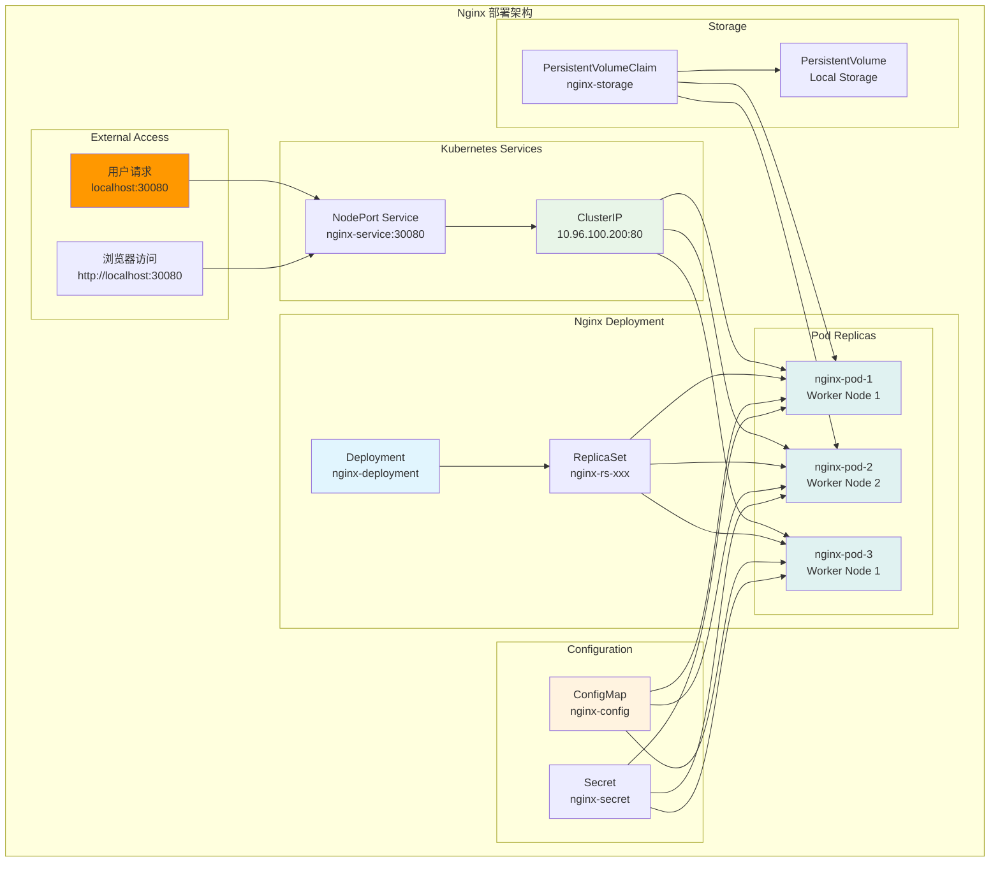

[TOC]

# Nginx 部署实验 (Nginx Deployment Lab)

## 实验概述

本实验将指导您在 Kubernetes 集群中部署 Nginx Web 服务器，涵盖完整的应用生命周期管理。通过本实验，您将掌握 Deployment、Service、ConfigMap 等核心资源的实际使用。

## 学习目标

完成本实验后，您将能够：
- 使用 Deployment 部署和管理 Web 应用
- 配置资源限制和健康检查
- 通过 Service 暴露应用并实现负载均衡
- 使用 ConfigMap 管理应用配置
- 执行滚动更新和版本回滚
- 进行扩缩容和应用监控

## 前置条件

- ✅ Kind 集群已创建并运行（参考 kind-cluster.yaml）
- ✅ kubectl 已配置并能访问集群
- ✅ 完成 Kubernetes 核心组件学习
- ✅ 理解 YAML 配置文件格式

## 实验架构



## 实验步骤

### 步骤 1: 创建实验环境

设置实验目录和命名空间：

```bash
# 创建实验目录
mkdir -p ~/k8s-lab/nginx-deployment
cd ~/k8s-lab/nginx-deployment

# 创建专用命名空间
kubectl create namespace nginx-lab
kubectl label namespace nginx-lab environment=lab app=nginx

# 设置默认命名空间 (可选)
kubectl config set-context --current --namespace=nginx-lab

# 验证命名空间
kubectl get namespace nginx-lab --show-labels
```

### 步骤 2: 创建 ConfigMap 配置

创建 Nginx 自定义配置：

```bash
# 创建 nginx.conf 配置文件
cat > nginx.conf << 'EOF'
worker_processes auto;
error_log /var/log/nginx/error.log warn;
pid /var/run/nginx.pid;

events {
    worker_connections 1024;
    use epoll;
    multi_accept on;
}

http {
    include /etc/nginx/mime.types;
    default_type application/octet-stream;

    # 日志格式
    log_format main '$remote_addr - $remote_user [$time_local] "$request" '
                    '$status $body_bytes_sent "$http_referer" '
                    '"$http_user_agent" "$http_x_forwarded_for" '
                    'rt=$request_time uct="$upstream_connect_time" '
                    'uht="$upstream_header_time" urt="$upstream_response_time"';

    access_log /var/log/nginx/access.log main;

    # 性能优化
    sendfile on;
    tcp_nopush on;
    tcp_nodelay on;
    keepalive_timeout 65;
    types_hash_max_size 2048;

    # Gzip 压缩
    gzip on;
    gzip_vary on;
    gzip_proxied any;
    gzip_comp_level 6;
    gzip_types
        text/plain
        text/css
        text/xml
        text/javascript
        application/json
        application/javascript
        application/xml+rss
        application/atom+xml
        image/svg+xml;

    # 服务器配置
    server {
        listen 80;
        server_name localhost;
        root /usr/share/nginx/html;
        index index.html index.htm;

        # 健康检查端点
        location /health {
            access_log off;
            return 200 'healthy\n';
            add_header Content-Type text/plain;
        }

        # 主页面
        location / {
            try_files $uri $uri/ =404;
        }

        # API 路由 (示例)
        location /api/ {
            proxy_pass http://backend:8080/;
            proxy_set_header Host $host;
            proxy_set_header X-Real-IP $remote_addr;
            proxy_set_header X-Forwarded-For $proxy_add_x_forwarded_for;
            proxy_set_header X-Forwarded-Proto $scheme;
        }

        # 静态资源缓存
        location ~* \.(jpg|jpeg|png|gif|ico|css|js)$ {
            expires 1y;
            add_header Cache-Control "public, immutable";
        }

        # 安全头
        add_header X-Frame-Options "SAMEORIGIN" always;
        add_header X-XSS-Protection "1; mode=block" always;
        add_header X-Content-Type-Options "nosniff" always;
        add_header Referrer-Policy "no-referrer-when-downgrade" always;
        add_header Content-Security-Policy "default-src 'self' http: https: data: blob: 'unsafe-inline'" always;
    }
}
EOF

# 创建自定义 HTML 首页
cat > index.html << 'EOF'
<!DOCTYPE html>
<html lang="zh-CN">
<head>
    <meta charset="UTF-8">
    <meta name="viewport" content="width=device-width, initial-scale=1.0">
    <title>Kubernetes Nginx 部署实验</title>
    <style>
        * {
            margin: 0;
            padding: 0;
            box-sizing: border-box;
        }
        body {
            font-family: 'Arial', sans-serif;
            background: linear-gradient(135deg, #667eea 0%, #764ba2 100%);
            min-height: 100vh;
            display: flex;
            align-items: center;
            justify-content: center;
            color: white;
        }
        .container {
            text-align: center;
            background: rgba(255, 255, 255, 0.1);
            padding: 3rem;
            border-radius: 15px;
            backdrop-filter: blur(10px);
            box-shadow: 0 8px 32px 0 rgba(31, 38, 135, 0.37);
            border: 1px solid rgba(255, 255, 255, 0.18);
        }
        h1 {
            font-size: 2.5rem;
            margin-bottom: 1rem;
        }
        .info {
            background: rgba(255, 255, 255, 0.1);
            padding: 1.5rem;
            border-radius: 10px;
            margin: 1rem 0;
        }
        .info h3 {
            color: #4CAF50;
            margin-bottom: 0.5rem;
        }
        .status {
            display: inline-block;
            padding: 0.3rem 1rem;
            background: #4CAF50;
            border-radius: 20px;
            margin: 0.5rem;
        }
        .timestamp {
            font-size: 0.9rem;
            opacity: 0.8;
            margin-top: 1rem;
        }
    </style>
</head>
<body>
    <div class="container">
        <h1>🎉 Nginx 部署成功！</h1>
        <div class="info">
            <h3>部署信息</h3>
            <p><strong>Pod 名称:</strong> <span id="hostname">加载中...</span></p>
            <p><strong>Nginx 版本:</strong> <span id="nginx-version">1.20+</span></p>
            <p><strong>部署环境:</strong> <span class="status">Kubernetes Lab</span></p>
        </div>

        <div class="info">
            <h3>功能测试</h3>
            <p>✅ HTTP 服务正常</p>
            <p>✅ 健康检查端点: <a href="/health" style="color: #4CAF50;">/health</a></p>
            <p>✅ 负载均衡已配置</p>
            <p>✅ 配置文件已挂载</p>
        </div>

        <div class="timestamp">
            部署时间: <span id="timestamp"></span>
        </div>
    </div>

    <script>
        // 获取主机名 (Pod 名称)
        fetch('/api/hostname').catch(() => {
            document.getElementById('hostname').textContent = window.location.hostname;
        });

        // 设置时间戳
        document.getElementById('timestamp').textContent = new Date().toLocaleString('zh-CN');

        // 模拟获取 Nginx 版本
        setTimeout(() => {
            document.getElementById('nginx-version').textContent = 'nginx/1.20.2';
        }, 1000);
    </script>
</body>
</html>
EOF

# 创建 ConfigMap
kubectl create configmap nginx-config \
  --from-file=nginx.conf=nginx.conf \
  --from-file=index.html=index.html \
  -n nginx-lab

# 验证 ConfigMap
kubectl get configmap nginx-config -n nginx-lab -o yaml | head -20
```

### 步骤 3: 创建 Secret

创建存储敏感信息的 Secret：

```bash
# 创建 Secret (模拟 TLS 证书和密钥)
kubectl create secret generic nginx-secret \
  --from-literal=admin-password='SecurePassword123!' \
  --from-literal=db-connection='mysql://user:pass@db:3306/webapp' \
  --from-literal=api-key='abc123def456ghi789' \
  -n nginx-lab

# 验证 Secret
kubectl get secret nginx-secret -n nginx-lab
kubectl describe secret nginx-secret -n nginx-lab
```

### 步骤 4: 创建持久卷存储

设置持久化存储用于日志和数据：

```bash
# 创建 PV 和 PVC 配置
cat > nginx-storage.yaml << 'EOF'
# PersistentVolume 定义
apiVersion: v1
kind: PersistentVolume
metadata:
  name: nginx-pv
  labels:
    app: nginx
    type: local
spec:
  storageClassName: manual
  capacity:
    storage: 2Gi
  accessModes:
    - ReadWriteMany
  persistentVolumeReclaimPolicy: Retain
  hostPath:
    path: /tmp/nginx-data

---
# PersistentVolumeClaim 定义
apiVersion: v1
kind: PersistentVolumeClaim
metadata:
  name: nginx-pvc
  namespace: nginx-lab
  labels:
    app: nginx
spec:
  storageClassName: manual
  accessModes:
    - ReadWriteMany
  resources:
    requests:
      storage: 2Gi
EOF

# 应用存储配置
kubectl apply -f nginx-storage.yaml

# 验证存储
kubectl get pv,pvc -n nginx-lab
```

### 步骤 5: 部署 Nginx Deployment

创建完整的 Nginx 部署配置：

```bash
cat > nginx-deployment.yaml << 'EOF'
apiVersion: apps/v1
kind: Deployment
metadata:
  name: nginx-deployment
  namespace: nginx-lab
  labels:
    app: nginx
    version: v1.20.2
    environment: lab
  annotations:
    deployment.kubernetes.io/revision: "1"
    description: "Nginx web server deployment for lab"
spec:
  # 副本数量
  replicas: 3

  # 更新策略
  strategy:
    type: RollingUpdate
    rollingUpdate:
      maxUnavailable: 1
      maxSurge: 1

  # 版本历史保留
  revisionHistoryLimit: 5

  # 选择器
  selector:
    matchLabels:
      app: nginx
      version: v1.20.2

  template:
    metadata:
      labels:
        app: nginx
        version: v1.20.2
        environment: lab
      annotations:
        prometheus.io/scrape: "true"
        prometheus.io/port: "80"
        prometheus.io/path: "/metrics"
    spec:
      # Pod 反亲和性 - 尽量分散到不同节点
      affinity:
        podAntiAffinity:
          preferredDuringSchedulingIgnoredDuringExecution:
          - weight: 100
            podAffinityTerm:
              labelSelector:
                matchExpressions:
                - key: app
                  operator: In
                  values:
                  - nginx
              topologyKey: kubernetes.io/hostname

      # 容器定义
      containers:
      - name: nginx
        image: nginx:1.20.2-alpine
        imagePullPolicy: IfNotPresent

        # 端口配置
        ports:
        - name: http
          containerPort: 80
          protocol: TCP

        # 资源限制
        resources:
          requests:
            cpu: 100m
            memory: 128Mi
          limits:
            cpu: 500m
            memory: 512Mi

        # 环境变量
        env:
        - name: NGINX_PORT
          value: "80"
        - name: ENVIRONMENT
          value: "laboratory"
        - name: POD_NAME
          valueFrom:
            fieldRef:
              fieldPath: metadata.name
        - name: POD_IP
          valueFrom:
            fieldRef:
              fieldPath: status.podIP
        - name: NODE_NAME
          valueFrom:
            fieldRef:
              fieldPath: spec.nodeName

        # Secret 环境变量
        envFrom:
        - secretRef:
            name: nginx-secret
            optional: true

        # 存活探针
        livenessProbe:
          httpGet:
            path: /health
            port: http
            httpHeaders:
            - name: Host
              value: localhost
          initialDelaySeconds: 30
          periodSeconds: 10
          timeoutSeconds: 5
          failureThreshold: 3
          successThreshold: 1

        # 就绪探针
        readinessProbe:
          httpGet:
            path: /health
            port: http
            httpHeaders:
            - name: Host
              value: localhost
          initialDelaySeconds: 5
          periodSeconds: 5
          timeoutSeconds: 3
          failureThreshold: 3
          successThreshold: 1

        # 启动探针
        startupProbe:
          httpGet:
            path: /health
            port: http
          initialDelaySeconds: 10
          periodSeconds: 10
          timeoutSeconds: 5
          failureThreshold: 10

        # 生命周期钩子
        lifecycle:
          preStop:
            exec:
              command:
              - /bin/sh
              - -c
              - "nginx -s quit; while killall -0 nginx; do sleep 1; done"

        # 卷挂载
        volumeMounts:
        - name: nginx-config
          mountPath: /etc/nginx/nginx.conf
          subPath: nginx.conf
          readOnly: true
        - name: html-content
          mountPath: /usr/share/nginx/html/index.html
          subPath: index.html
          readOnly: true
        - name: nginx-logs
          mountPath: /var/log/nginx
        - name: nginx-cache
          mountPath: /var/cache/nginx
        - name: nginx-run
          mountPath: /var/run

      # 卷定义
      volumes:
      - name: nginx-config
        configMap:
          name: nginx-config
          items:
          - key: nginx.conf
            path: nginx.conf
            mode: 0644
      - name: html-content
        configMap:
          name: nginx-config
          items:
          - key: index.html
            path: index.html
            mode: 0644
      - name: nginx-logs
        persistentVolumeClaim:
          claimName: nginx-pvc
      - name: nginx-cache
        emptyDir:
          sizeLimit: 1Gi
      - name: nginx-run
        emptyDir:
          medium: Memory
          sizeLimit: 100Mi

      # 安全上下文
      securityContext:
        runAsNonRoot: true
        runAsUser: 101
        runAsGroup: 101
        fsGroup: 101
        fsGroupChangePolicy: "OnRootMismatch"

      # DNS 配置
      dnsPolicy: ClusterFirst
      dnsConfig:
        options:
        - name: ndots
          value: "2"
        - name: edns0

      # 重启策略
      restartPolicy: Always

      # 终止宽限期
      terminationGracePeriodSeconds: 30

      # 节点选择器
      nodeSelector:
        kubernetes.io/os: linux

      # 污点容忍
      tolerations:
      - key: "node-role.kubernetes.io/master"
        operator: "Exists"
        effect: "NoSchedule"
EOF

# 部署 Nginx
kubectl apply -f nginx-deployment.yaml

# 查看部署状态
kubectl rollout status deployment/nginx-deployment -n nginx-lab --timeout=300s

# 验证部署
kubectl get deployment,replicaset,pods -n nginx-lab -o wide
```

### 步骤 6: 创建 Service

配置服务暴露和负载均衡：

```bash
cat > nginx-service.yaml << 'EOF'
# ClusterIP Service (集群内访问)
apiVersion: v1
kind: Service
metadata:
  name: nginx-clusterip
  namespace: nginx-lab
  labels:
    app: nginx
    service-type: clusterip
  annotations:
    service.beta.kubernetes.io/aws-load-balancer-type: "nlb"
spec:
  type: ClusterIP
  selector:
    app: nginx
    version: v1.20.2
  ports:
  - name: http
    port: 80
    targetPort: http
    protocol: TCP
  sessionAffinity: None

---
# NodePort Service (外部访问)
apiVersion: v1
kind: Service
metadata:
  name: nginx-nodeport
  namespace: nginx-lab
  labels:
    app: nginx
    service-type: nodeport
  annotations:
    description: "NodePort service for external access"
spec:
  type: NodePort
  selector:
    app: nginx
    version: v1.20.2
  ports:
  - name: http
    port: 80
    targetPort: http
    nodePort: 30080
    protocol: TCP
  externalTrafficPolicy: Cluster

---
# Headless Service (无头服务，用于服务发现)
apiVersion: v1
kind: Service
metadata:
  name: nginx-headless
  namespace: nginx-lab
  labels:
    app: nginx
    service-type: headless
spec:
  clusterIP: None
  selector:
    app: nginx
    version: v1.20.2
  ports:
  - name: http
    port: 80
    targetPort: http
    protocol: TCP

---
# Endpoints (检查服务发现)
apiVersion: v1
kind: Endpoints
metadata:
  name: nginx-manual
  namespace: nginx-lab
  labels:
    app: nginx
subsets:
- addresses:
  - ip: 8.8.8.8  # 示例外部服务
  ports:
  - name: dns
    port: 53
    protocol: UDP
EOF

# 创建服务
kubectl apply -f nginx-service.yaml

# 验证服务
kubectl get svc -n nginx-lab -o wide
kubectl get endpoints -n nginx-lab
```

### 步骤 7: 功能验证测试

全面测试部署的功能：

```bash
echo "🧪 开始 Nginx 部署功能测试"
echo "================================"

# 测试1: 基本连接测试
echo "📡 测试1: 基本 HTTP 连接"
curl -s -o /dev/null -w "HTTP状态码: %{http_code}, 响应时间: %{time_total}s\n" http://localhost:30080

# 测试2: 健康检查端点
echo "🏥 测试2: 健康检查端点"
curl -s http://localhost:30080/health

# 测试3: 负载均衡测试
echo "⚖️  测试3: 负载均衡 (检查不同 Pod 响应)"
for i in {1..6}; do
    echo "请求 $i: $(curl -s http://localhost:30080 | grep -o 'Pod 名称:.*' | head -1)"
done

# 测试4: 集群内服务发现
echo "🔍 测试4: 集群内 DNS 解析"
kubectl run test-dns --image=busybox:1.35 --rm -it --restart=Never -n nginx-lab -- sh -c "
echo 'ClusterIP 服务解析:'
nslookup nginx-clusterip.nginx-lab.svc.cluster.local
echo ''
echo 'Headless 服务解析:'
nslookup nginx-headless.nginx-lab.svc.cluster.local
echo ''
echo '连接测试:'
wget -qO- nginx-clusterip/health
"

# 测试5: 配置文件验证
echo "📄 测试5: 配置文件挂载验证"
FIRST_POD=$(kubectl get pods -n nginx-lab -l app=nginx -o jsonpath='{.items[0].metadata.name}')
echo "检查 Pod: $FIRST_POD"
kubectl exec -n nginx-lab $FIRST_POD -- nginx -t
kubectl exec -n nginx-lab $FIRST_POD -- cat /etc/nginx/nginx.conf | head -10

# 测试6: 日志检查
echo "📊 测试6: 应用日志检查"
kubectl logs -n nginx-lab deployment/nginx-deployment --tail=10

# 测试7: 资源使用情况
echo "💾 测试7: 资源使用情况"
kubectl top pods -n nginx-lab 2>/dev/null || echo "Metrics server 未安装"

echo "✅ 功能测试完成"
```

### 步骤 8: 滚动更新和回滚

演示应用更新和版本管理：

```bash
echo "🔄 开始滚动更新测试"

# 查看当前部署状态
kubectl get deployment nginx-deployment -n nginx-lab -o wide

# 执行滚动更新 - 更新镜像版本
kubectl set image deployment/nginx-deployment nginx=nginx:1.21.6-alpine -n nginx-lab --record

# 监控更新过程
kubectl rollout status deployment/nginx-deployment -n nginx-lab

# 查看更新历史
kubectl rollout history deployment/nginx-deployment -n nginx-lab

# 验证新版本
kubectl get pods -n nginx-lab -o custom-columns="NAME:.metadata.name,IMAGE:.spec.containers[0].image,STATUS:.status.phase"

# 测试新版本功能
curl -s http://localhost:30080/health

# 演示回滚操作
echo "⏪ 演示回滚到上一版本"
kubectl rollout undo deployment/nginx-deployment -n nginx-lab

# 监控回滚过程
kubectl rollout status deployment/nginx-deployment -n nginx-lab

# 验证回滚结果
kubectl get pods -n nginx-lab -o custom-columns="NAME:.metadata.name,IMAGE:.spec.containers[0].image,STATUS:.status.phase"

echo "✅ 滚动更新和回滚测试完成"
```

### 步骤 9: 扩缩容测试

测试应用的水平扩展：

```bash
echo "📈 开始扩缩容测试"

# 查看当前副本数
kubectl get deployment nginx-deployment -n nginx-lab

# 手动扩容到 5 个副本
kubectl scale deployment nginx-deployment --replicas=5 -n nginx-lab

# 监控扩容过程
kubectl get pods -n nginx-lab -w &
WATCH_PID=$!
sleep 30
kill $WATCH_PID

# 验证扩容结果
kubectl get deployment nginx-deployment -n nginx-lab
kubectl get pods -n nginx-lab -o wide

# 测试负载分布
echo "🔍 测试扩容后的负载分布:"
for i in {1..10}; do
    POD_NAME=$(curl -s http://localhost:30080 2>/dev/null | grep -o 'nginx-deployment-[^<]*' || echo "连接失败")
    echo "请求 $i: $POD_NAME"
done

# 缩容到 2 个副本
kubectl scale deployment nginx-deployment --replicas=2 -n nginx-lab

# 验证缩容
kubectl get pods -n nginx-lab

# 配置自动扩容 (HPA)
kubectl autoscale deployment nginx-deployment --min=2 --max=8 --cpu-percent=70 -n nginx-lab

# 查看 HPA 状态
kubectl get hpa -n nginx-lab

echo "✅ 扩缩容测试完成"
```

### 步骤 10: 监控和观察

设置监控和日志观察：

```bash
# 创建监控脚本
cat > monitor-nginx.sh << 'EOF'
#!/bin/bash

echo "📊 Nginx 部署监控报告"
echo "======================"
echo "生成时间: $(date)"
echo ""

# 部署状态
echo "🚀 部署状态:"
kubectl get deployment nginx-deployment -n nginx-lab

echo ""
echo "🎯 Pod 详细状态:"
kubectl get pods -n nginx-lab -o custom-columns="NAME:.metadata.name,STATUS:.status.phase,NODE:.spec.nodeName,IP:.status.podIP,RESTARTS:.status.containerStatuses[0].restartCount"

echo ""
echo "🌐 服务状态:"
kubectl get svc -n nginx-lab

echo ""
echo "🔗 Endpoints:"
kubectl get endpoints -n nginx-lab

echo ""
echo "💾 存储状态:"
kubectl get pvc -n nginx-lab

echo ""
echo "⚙️  HPA 状态:"
kubectl get hpa -n nginx-lab 2>/dev/null || echo "未配置 HPA"

echo ""
echo "📈 资源使用:"
kubectl top pods -n nginx-lab 2>/dev/null || echo "Metrics Server 未安装"

echo ""
echo "🔍 最近事件:"
kubectl get events -n nginx-lab --sort-by='.lastTimestamp' | tail -5

echo ""
echo "🌍 外部访问测试:"
HTTP_CODE=$(curl -s -o /dev/null -w "%{http_code}" http://localhost:30080)
if [ "$HTTP_CODE" = "200" ]; then
    echo "✅ HTTP 访问正常 ($HTTP_CODE)"
else
    echo "❌ HTTP 访问异常 ($HTTP_CODE)"
fi

echo ""
echo "📄 配置完整性:"
FIRST_POD=$(kubectl get pods -n nginx-lab -l app=nginx -o jsonpath='{.items[0].metadata.name}' 2>/dev/null)
if [ -n "$FIRST_POD" ]; then
    kubectl exec -n nginx-lab $FIRST_POD -- nginx -t 2>&1 | head -2
else
    echo "无可用 Pod 进行检查"
fi

echo ""
echo "✅ 监控报告完成"
EOF

chmod +x monitor-nginx.sh
./monitor-nginx.sh
```

### 步骤 11: 性能测试

进行简单的性能和负载测试：

```bash
echo "🚀 开始性能测试"

# 安装测试工具 (如果需要)
kubectl run load-test --image=busybox:1.35 --rm -it --restart=Never -n nginx-lab -- sh -c "
echo '🧪 集群内性能测试'
echo '=================='

echo '单个请求延迟测试:'
time wget -qO- nginx-clusterip/health

echo ''
echo '并发请求测试 (10个并发):'
for i in {1..10}; do
    wget -qO- nginx-clusterip/ &
done
wait

echo ''
echo '服务发现性能:'
time nslookup nginx-clusterip.nginx-lab.svc.cluster.local
"

# 外部压力测试
echo "🌍 外部负载测试 (使用 curl)"
echo "并发10个请求，每个发送100次:"

for i in {1..10}; do
    (
        for j in {1..10}; do
            curl -s http://localhost:30080/health > /dev/null
        done
    ) &
done
wait

echo "✅ 负载测试完成"

# 检查测试后的 Pod 状态
kubectl get pods -n nginx-lab
kubectl top pods -n nginx-lab 2>/dev/null || echo "无法获取资源使用数据"
```

## 故障排查指南

### 常见问题诊断

**问题1**: Pod 启动失败或 CrashLoopBackOff
```bash
# 详细诊断步骤
kubectl get pods -n nginx-lab
kubectl describe pod <pod-name> -n nginx-lab
kubectl logs <pod-name> -n nginx-lab
kubectl logs <pod-name> -n nginx-lab --previous

# 检查配置挂载
kubectl exec -n nginx-lab <pod-name> -- ls -la /etc/nginx/
kubectl exec -n nginx-lab <pod-name> -- nginx -t
```

**问题2**: 服务无法访问
```bash
# 服务诊断
kubectl get svc -n nginx-lab
kubectl describe svc nginx-nodeport -n nginx-lab
kubectl get endpoints -n nginx-lab

# 网络测试
kubectl run debug --image=busybox --rm -it --restart=Never -n nginx-lab -- sh
# 在容器内执行:
# wget -qO- nginx-clusterip/health
# nslookup nginx-clusterip.nginx-lab.svc.cluster.local
```

**问题3**: 存储挂载问题
```bash
# 存储诊断
kubectl get pv,pvc -n nginx-lab
kubectl describe pvc nginx-pvc -n nginx-lab

# 检查挂载点
kubectl exec -n nginx-lab <pod-name> -- df -h
kubectl exec -n nginx-lab <pod-name> -- ls -la /var/log/nginx/
```

**问题4**: 配置更新不生效
```bash
# 配置诊断
kubectl get configmap nginx-config -n nginx-lab -o yaml
kubectl describe configmap nginx-config -n nginx-lab

# 强制重启 Pod 应用新配置
kubectl rollout restart deployment/nginx-deployment -n nginx-lab
```

## 实验清理

完成实验后的清理步骤：

```bash
echo "🧹 开始清理实验资源"

# 删除 HPA
kubectl delete hpa nginx-deployment -n nginx-lab 2>/dev/null || echo "无 HPA 需要删除"

# 删除部署和服务
kubectl delete deployment nginx-deployment -n nginx-lab
kubectl delete service nginx-clusterip nginx-nodeport nginx-headless -n nginx-lab

# 删除配置和密钥
kubectl delete configmap nginx-config -n nginx-lab
kubectl delete secret nginx-secret -n nginx-lab

# 删除存储
kubectl delete pvc nginx-pvc -n nginx-lab
kubectl delete pv nginx-pv

# 删除命名空间 (可选 - 这将删除所有相关资源)
# kubectl delete namespace nginx-lab

# 清理本地文件
cd ..
rm -rf nginx-deployment/

echo "✅ 实验清理完成"
```

## 实验总结

### 学到的技能

通过本实验，您掌握了：

1. **应用部署**:
   - ✅ 使用 Deployment 管理应用生命周期
   - ✅ 配置资源限制和健康检查
   - ✅ 实现 Pod 反亲和性和节点选择

2. **服务暴露**:
   - ✅ 创建不同类型的 Service (ClusterIP, NodePort, Headless)
   - ✅ 理解服务发现和负载均衡机制
   - ✅ 配置端口映射和会话亲和性

3. **配置管理**:
   - ✅ 使用 ConfigMap 管理应用配置
   - ✅ 使用 Secret 存储敏感信息
   - ✅ 实现配置和代码分离

4. **存储管理**:
   - ✅ 创建和使用 PV/PVC
   - ✅ 配置不同类型的 Volume 挂载
   - ✅ 理解存储生命周期

5. **运维操作**:
   - ✅ 执行滚动更新和版本回滚
   - ✅ 进行手动和自动扩缩容
   - ✅ 监控应用状态和性能

### 最佳实践要点

1. **资源配置**: 合理设置 CPU/内存请求和限制
2. **健康检查**: 配置存活、就绪和启动探针
3. **安全性**: 使用非 root 用户运行容器
4. **高可用**: 配置多副本和反亲和性
5. **监控**: 实施全面的监控和日志记录

### 下一步学习

- **[配置管理实验](./config-management.yaml)**: 深入学习 ConfigMap 和 Secret
- **[高级部署策略](../02-advanced/)**: 蓝绿部署、金丝雀发布
- **[监控和日志](../02-advanced/02-监控运维/)**: 使用 Prometheus 和 Grafana

---

**实验完成标记**: 当您能成功部署 Nginx，通过外部访问，并完成滚动更新时，本实验即为完成。