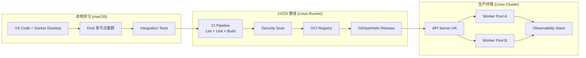

[TOC]

# 生产实践指南 (Production Operations Excellence)

## 学习目标

完成本模块后，您将能够：
- 设计从 macOS 学习环境到 Linux 生产环境的端到端交付流程
- 对比 macOS 与 Linux 在 Kubernetes 部署中的关键差异并制定适配策略
- 规划符合 20GB 资源约束的集群容量、节点规格与弹性策略
- 建立覆盖发布、监控、回滚的运维 Runbook，并与后续安全/监控模块协同

## 前置知识

- 熟悉 `kubectl`, `helm`, `kustomize` 等部署工具的基础用法
- 理解 Kubernetes 核心对象（Pod、Deployment、Service、Ingress）
- 完成核心课程关于 ConfigMap、Secret 以及资源限制的学习
- 具备 Linux 基础命令行操作能力（shell、systemd、网络工具）

## 模块结构概览

| 单元 | 目标 | 关联课程 |
| --- | --- | --- |
| 平台差异速览 | 快速定位 macOS 与 Linux 的运行时差异 | `specs/001-k8s/research.md` 平台章节 |
| 生产架构设计 | 规划多节点集群与 CI/CD 流程 | `courses/03-service-mesh/` 作为后续集成 |
| 资源容量规划 | 在 20GB 内存限制下制定资源配额 | `tools/setup/kind-config.yaml` |
| 运维 Runbook | 发布、回滚、应急响应流程 | `courses/02-advanced/02-监控运维/` (并行协作) |

## 平台差异速览：macOS vs Linux

macOS 作为学习环境提供便捷体验，但生产工作负载最终运行在 Linux。以下表格总结了关键差异与迁移建议：

| 维度 | macOS (Learning) | Linux (Production) | 迁移策略 |
| --- | --- | --- | --- |
| 内核特性 | 无 `cgroups v2`、`/proc`、`iptables` 原生支持 | 完整 `cgroups`、`/sys/fs/cgroup`、`iptables`/`nftables` | 在 macOS 上使用 Kind/Colima 启动 Linux VM，提前验证 `resourceQuota`、`limitRange` |
| 容器运行时 | Docker Desktop (moby 虚拟机) | containerd / CRI-O / Docker Engine | 在 CI/CD 中执行 `nerdctl` 或 `ctr` 验证镜像兼容性 |
| 网络栈 | `pfctl`/`ipfw`，端口转发依赖虚拟机 | `iptables`/`ipvs`，可运行 CNI 插件 | 在 macOS 测试 `NodePort`/`LoadBalancer` 场景时借助 `kubefwd` 或 `Ingress + port-forward` |
| 文件系统 | APFS, 不支持原生 inotify、SELinux | ext4/xfs, 支持 inotify、SELinux/AppArmor | 将持久化卷测试迁移到 Linux VM，使用 `fsGroup`、`securityContext` 参数 |
| 自动化工具 | `launchd`, Homebrew 服务 | `systemd`, `apt/yum` repo | 部署脚本使用 `ansible`/`terraform`，通过变量区分包管理器 |

> 📌 **提示**：所有生产脚本必须在 Linux Runner（如 GitHub Actions Ubuntu 或自建 CI 节点）上做一次验证，再发布到集群。

## 生产架构蓝图

下图展示了从本地开发到生产集群的标准交付路径：



关键实践要点：
- **环境一致性**：在 macOS 使用 Kind/Minikube 时启用 `--config tools/setup/kind-config.yaml`，确保与生产节点规格一致（3 节点、限制 12GB）。
- **CI 镜像构建**：统一使用 Linux 基础镜像，例如 `ghcr.io/...:ubuntu20.04`，避免 macOS 特有依赖。
- **GitOps 交付**：推荐使用 Argo CD 或 Flux，将生产改动透过 Pull Request 审核。

## 资源与容量规划

1. **基础配额 (Baseline Quota)**：
   - `cpu`: 6 cores 分配给系统与工作负载；预留 1 core 给控制平面组件
   - `memory`: 针对 12GB 集群限制，设置 `resourceQuota`，确保单命名空间不超过 4GB
2. **请求/上限 (Requests/Limits)**：
   - 强制 `limitRange`：`requests.memory` ≥ 256Mi，`limits.memory` ≤ 1Gi（学习环境）
   - 生产环境依业务类别划分：`Gold`（低延迟）、`Silver`（标准）、`Bronze`（批处理）
3. **HPA & VPA 策略**：
   - 本地启用 `metrics-server` 模拟自动扩缩容
   - 生产启用 `VerticalPodAutoscaler` 观察建议值，再由平台团队审批
4. **存储规划**：
   - 学习环境使用 `hostPath` 或 `local-path` Provisioner
   - 生产使用 CSI：如 `ebs.csi.aws.com`、`cinder.csi.openstack.org`

## 运维 Runbook

### 发布流程 (Release)
```bash
# 1. 合并 PR 后 GitOps repo 自动触发
flux reconcile kustomization prod-gateway

# 2. 观察滚动更新状态
kubectl rollout status deploy/nginx-gateway -n prod

# 3. 验证入口与核心指标
kubectl -n prod exec deploy/traffic-prober -- curl -sf http://nginx-gateway
kubectl -n istio-system top pod | head -5
```

### 回滚流程 (Rollback)
```bash
# GitOps 方式：回滚到稳定 tag
git revert <problematic-commit>
flux reconcile kustomization prod-gateway

# 手动快速回滚
kubectl rollout undo deploy/nginx-gateway -n prod
kubectl get events -n prod --sort-by=.lastTimestamp | tail -10
```

### 应急响应 (Incident Response)

- **SLO 触发**：与监控模块协作，SLO/SLA 指标触发告警后 15 分钟内启动 Incident Call
- **Runbook 执行顺序**：稳定流量 → 收集诊断 → 实施缓解 → 事后复盘 (`postmortem`)
- **诊断工具**：`kubectl top`, `kubectl describe`, `stern`, `kubectl-debug`, `sysdig`

## macOS 到 Linux 的迁移路径

1. **本地验证**：在 macOS 上完成 Kind 集群实验，确保应用清单可在 `linux/amd64` 架构运行
2. **CI 构建**：切换到 Linux Runner 构建容器镜像，启用 `buildx` 生成多架构镜像
3. **灰度发布**：在生产集群建立 `staging` 命名空间，使用 `canary` 或 `blue-green` 策略观察指标
4. **生产验证**：结合 Istio/LB 做流量镜像，确认 Linux 环境的网络策略、sysctl 参数无异常
5. **知识转移**：将 macOS 实验记录沉淀为 Linux 操作手册，更新到 `resources/guides/`

## 与其他高级模块的协同

- **监控运维**：本模块给出资源和流程框架，`02-监控运维` 将补充 Prometheus/Grafana 指标与告警模板
- **安全加固**：在回滚与 Runbook 中嵌入 RBAC 审计、NetworkPolicy 验证；相关策略将在 `03-安全加固` 深入
- **服务网格**：生产流量治理与金丝雀策略将在 `courses/03-service-mesh/` 完整演练

## 学习检验

### 自查问题

1. 列出在 macOS 上无法直接验证的 Linux 内核特性，并说明迁移策略
2. 描述标准 GitOps 发布流程的 5 个步骤及涉及的 Kubernetes 对象
3. 说明如何在 12GB 内存限制下确保核心服务的 `requests/limits` 合理

### 实践任务

1. 在 macOS 上使用 Kind 复现三节点配置，并导出 `kubectl describe node` 用于 Linux 对比
2. 编写一份发布 Runbook，包含回滚与指标校验步骤，提交到 `courses/02-advanced/labs/prometheus-stack.yaml` 前置说明
3. 在 Linux 云主机上验证容器镜像启动，记录遇到的 SELinux/AppArmor 差异

## 下一步学习

- **[监控运维指南](../02-监控运维/README.md)**：建立 Prometheus/Grafana 监控栈与告警
- **[安全加固指南](../03-安全加固/README.md)**：强化 RBAC、NetworkPolicy 与镜像安全
- **[Service Mesh 模块](../../03-service-mesh/)**：深入流量管理、零信任策略

---

通过本指南，您已经掌握了将 macOS 学习成果迁移到 Linux 生产集群的关键步骤。接下来请在监控和安全模块中补全可观测性与防护能力，构建真正可上线的 Kubernetes 平台。
