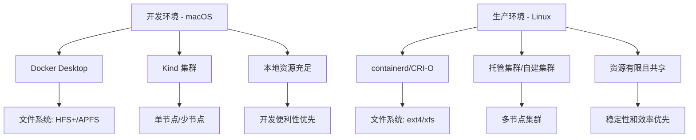
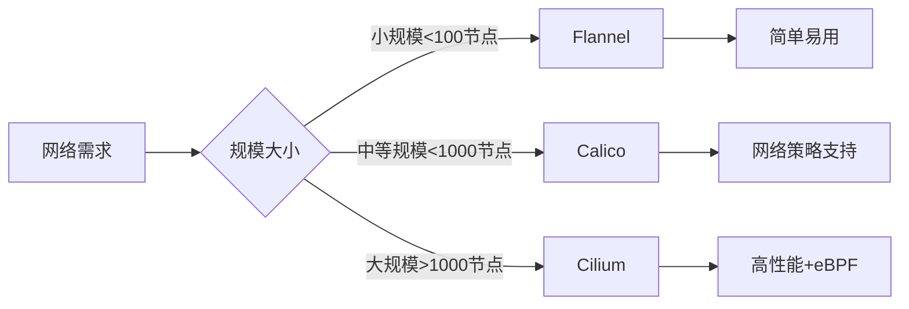
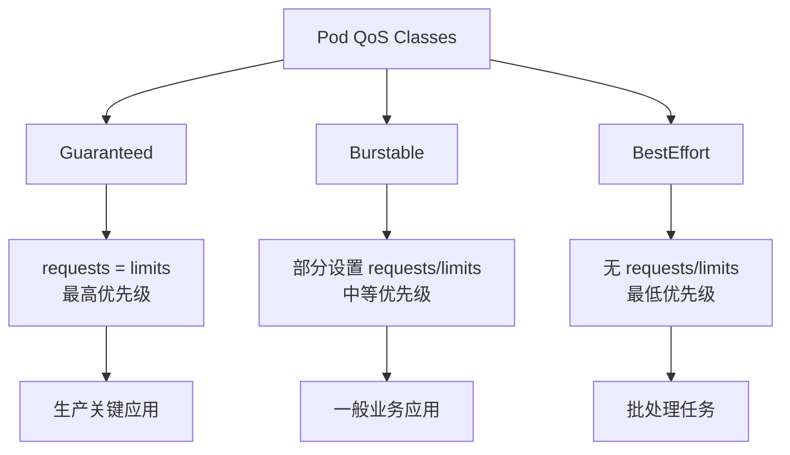
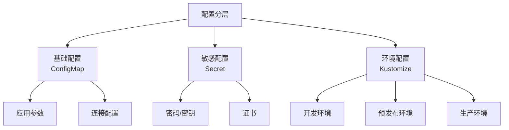

[TOC]

# Kubernetes 生产环境实践指南

## 课程目标

掌握 Kubernetes 在生产环境中的部署和运维最佳实践，了解 macOS 开发环境与 Linux 生产环境的差异，确保应用能够稳定、安全、高效地运行在生产集群中。

## 学习成果

完成本课程后，您将能够：
- 理解 macOS 开发环境与 Linux 生产环境的关键差异
- 掌握生产级 Kubernetes 集群的配置和管理
- 实施资源限制、健康检查和故障恢复策略
- 配置高可用性和负载均衡
- 实现持续部署和滚动更新
- 处理生产环境中的常见问题

## 概念卡速记

> 📌 **概念卡：Environment Parity（环境一致性）**  
> **定义**：开发、测试、生产环境在依赖、配置、版本上的一致性程度。  
> **课程作用**：通过比较 macOS 与 Linux 差异，制定配置收敛策略，确保容器在不同环境稳定运行。  
> **实践提示**：维护环境差异表，列出文件系统、运行时、权限管理差异。

> 📌 **概念卡：Container Runtime Interface（CRI）**  
> **定义**：Kubernetes 与容器运行时之间的标准接口，常见实现包含 containerd 与 CRI-O。  
> **课程作用**：理解 Docker Desktop 与 containerd 的差异，决定生产环境采用何种运行时与安全配置。  
> **关键命令**：`crictl info`、`systemctl status containerd`

> 📌 **概念卡：Node Taint / Toleration（节点污点与容忍）**  
> **定义**：通过污点阻止 Pod 被调度到特定节点，可配合 Toleration 允许特定工作负载运行。  
> **课程作用**：保证控制平面节点不运行业务工作负载，实现资源隔离。  
> **关键命令**：`kubectl taint nodes master-node node-role.kubernetes.io/master=:NoSchedule`

> 📌 **概念卡：Disaster Recovery Playbook（灾难恢复手册）**  
> **定义**：针对关键组件故障的预案，包含备份、切换、回滚步骤。  
> **课程作用**：结合备份策略、etcd 快照、节点恢复流程，形成可执行的 SRE 手册。  
> **实践提示**：定期演练恢复流程，核对恢复时间目标（RTO）与恢复点目标（RPO）。

> 📌 **概念卡：Container Network Interface（CNI 网络插件）**  
> **定义**：规范 Kubernetes 如何为 Pod 分配网络和实现网络策略的插件接口，常见实现包含 Flannel、Calico、Cilium。  
> **课程作用**：在生产环境选择合适 CNI 关系到网络性能与安全策略支持，需要根据规模与需求进行评估。  
> **快速检查**：`kubectl get pods -n kube-system -l k8s-app=calico-node`

> 📌 **概念卡：Pod QoS Classes（服务质量类别）**  
> **定义**：Kubernetes 根据 `requests/limits` 设置将 Pod 划分为 Guaranteed、Burstable、BestEffort 三类，影响资源争用下的调度与驱逐优先级。  
> **课程作用**：制定资源规划时需确保核心业务位于 Guaranteed，以避免节点压力下被驱逐。  
> **调试命令**：`kubectl get pod <name> -o jsonpath='{.status.qosClass}'`

> 📌 **概念卡：PodDisruptionBudget（PDB 中断预算）**  
> **定义**：定义自愿性中断时仍需保持的最小可用副本数或最大允许中断数，保证服务连续性。  
> **课程作用**：滚动升级、节点维护前必须配置 PDB，防止一次性驱逐过多副本。  
> **关键命令**：`kubectl get pdb -n production`

> 📌 **概念卡：StorageClass（存储类）**  
> **定义**：抽象底层存储能力与参数的资源对象，控制动态供给卷的类型、性能与回收策略。  
> **课程作用**：为 StatefulSet、数据库提供差异化存储配置，支持扩容与数据保留策略。  
> **关键命令**：`kubectl get storageclass`

> 📌 **概念卡：StatefulSet（有状态副本控制器）**  
> **定义**：管理有状态应用的工作负载资源，确保稳定网络标识、持久化卷绑定与有序滚动更新。  
> **课程作用**：用于数据库、队列等需要稳定身份的组件，是生产环境持久化架构的核心。  
> **关键命令**：`kubectl get sts`、`kubectl describe sts <name>`

> 📌 **概念卡：Blue-Green Deployment（蓝绿部署）**  
> **定义**：同时维护旧版本（Blue）与新版本（Green）环境，通过流量切换实现零停机发布。  
> **课程作用**：结合 Argo Rollouts 等工具，在生产环境快速回滚与验证新版本。  
> **实践提示**：切换前执行 `prePromotion` 验证，切换后设定观察期。

> 📌 **概念卡：Canary Release（金丝雀发布）**  
> **定义**：逐步增加新版本流量占比，实时监控指标再决定是否继续推广。  
> **课程作用**：降低发布风险，与自动化流量管理和指标告警结合，保障大规模上线安全。  
> **关键命令**：`kubectl get rollout web-app-canary -n <namespace>`

> 📌 **概念卡：Pod Security Standards（PSS 安全标准）**  
> **定义**：官方定义的 Pod 安全等级（Privileged/Baseline/Restricted），通过命名空间标签强制执行安全约束。  
> **课程作用**：生产环境需为命名空间设置 PSS 标签，确保默认权限收紧并与 CI/CD 检查集成。  
> **快速命令**：`kubectl label namespace production pod-security.kubernetes.io/enforce=restricted`

## 先决条件

- 完成 [核心 Kubernetes 课程](../../01-core/)
- 具备基础的 Linux 系统管理知识
- 理解容器化应用的基本概念
- 熟悉 kubectl 命令行工具

---

## 1. 开发环境 vs 生产环境差异

### 1.1 平台差异对比



### 1.2 关键差异点

#### 文件系统差异
| 特性 | macOS (开发) | Linux (生产) |
|------|-------------|-------------|
| 文件系统 | HFS+/APFS | ext4/xfs/btrfs |
| 路径分隔符 | / (同 Linux) | / |
| 文件权限 | 相对宽松 | 严格权限控制 |
| 符号链接 | 支持 | 支持 |
| 大小写敏感 | 默认不敏感 | 敏感 |

#### 容器运行时差异
```yaml
# 开发环境 - Docker Desktop
apiVersion: v1
kind: Pod
spec:
  containers:
  - name: app
    image: nginx
    # Docker Desktop 自动处理很多配置
```

```yaml
# 生产环境 - containerd
apiVersion: v1
kind: Pod
spec:
  containers:
  - name: app
    image: nginx
    # 需要显式配置安全上下文
    securityContext:
      runAsNonRoot: true
      runAsUser: 101
      allowPrivilegeEscalation: false
      capabilities:
        drop:
        - ALL
```

---

## 2. 生产级集群配置

### 2.1 节点配置最佳实践

#### Master 节点配置
```yaml
# 生产环境 master 节点标签和污点
apiVersion: v1
kind: Node
metadata:
  name: master-node-1
  labels:
    node-role.kubernetes.io/master: ""
    node-role.kubernetes.io/control-plane: ""
spec:
  taints:
  - key: node-role.kubernetes.io/master
    effect: NoSchedule
  - key: node-role.kubernetes.io/control-plane
    effect: NoSchedule
```

#### Worker 节点配置
```yaml
# 生产环境 worker 节点资源配置
apiVersion: v1
kind: Node
metadata:
  name: worker-node-1
  labels:
    node-role.kubernetes.io/worker: ""
    environment: production
    zone: az-1
spec:
  # 节点容量配置
  capacity:
    cpu: "4"
    memory: "16Gi"
    storage: "100Gi"
```

### 2.2 集群网络配置

#### CNI 网络选择


#### Calico 网络配置示例
```yaml
# 生产环境 Calico 配置
apiVersion: operator.tigera.io/v1
kind: Installation
metadata:
  name: default
spec:
  calicoNetwork:
    ipPools:
    - blockSize: 26
      cidr: 10.244.0.0/16
      encapsulation: VXLANCrossSubnet
      natOutgoing: Enabled
      nodeSelector: all()
  nodeAddressAutodetectionV4:
    kubernetes: NodeInternalIP
```

---

## 3. 资源管理和限制

### 3.1 资源请求和限制

#### 生产环境资源配置
```yaml
apiVersion: apps/v1
kind: Deployment
metadata:
  name: web-app
spec:
  replicas: 3
  selector:
    matchLabels:
      app: web-app
  template:
    metadata:
      labels:
        app: web-app
    spec:
      containers:
      - name: web
        image: nginx:1.21-alpine
        resources:
          requests:
            # 保证资源，用于调度决策
            cpu: 100m
            memory: 128Mi
          limits:
            # 最大资源，防止资源耗尽
            cpu: 500m
            memory: 512Mi
        # 生产环境必需的健康检查
        livenessProbe:
          httpGet:
            path: /health
            port: 80
          initialDelaySeconds: 30
          periodSeconds: 10
          timeoutSeconds: 5
          failureThreshold: 3
        readinessProbe:
          httpGet:
            path: /ready
            port: 80
          initialDelaySeconds: 5
          periodSeconds: 5
          timeoutSeconds: 3
          successThreshold: 1
          failureThreshold: 3
```

### 3.2 QoS 类别管理



### 3.3 Namespace 资源配额

```yaml
# 生产环境命名空间资源配额
apiVersion: v1
kind: ResourceQuota
metadata:
  name: production-quota
  namespace: production
spec:
  hard:
    # 计算资源限制
    requests.cpu: "10"
    requests.memory: 20Gi
    limits.cpu: "20"
    limits.memory: 40Gi

    # 对象数量限制
    pods: "50"
    persistentvolumeclaims: "10"
    services: "20"
    secrets: "30"
    configmaps: "30"

    # 存储限制
    requests.storage: 100Gi
---
apiVersion: v1
kind: LimitRange
metadata:
  name: production-limits
  namespace: production
spec:
  limits:
  - default:
      cpu: 500m
      memory: 512Mi
    defaultRequest:
      cpu: 100m
      memory: 128Mi
    type: Container
```

---

## 4. 高可用性配置

### 4.1 多副本部署策略

```yaml
apiVersion: apps/v1
kind: Deployment
metadata:
  name: web-app-ha
spec:
  # 生产环境多副本
  replicas: 5
  strategy:
    type: RollingUpdate
    rollingUpdate:
      # 滚动更新策略
      maxUnavailable: 1
      maxSurge: 1
  selector:
    matchLabels:
      app: web-app
  template:
    metadata:
      labels:
        app: web-app
    spec:
      # 反亲和性确保分布到不同节点
      affinity:
        podAntiAffinity:
          preferredDuringSchedulingIgnoredDuringExecution:
          - weight: 100
            podAffinityTerm:
              labelSelector:
                matchExpressions:
                - key: app
                  operator: In
                  values:
                  - web-app
              topologyKey: kubernetes.io/hostname
      containers:
      - name: web
        image: nginx:1.21-alpine
        ports:
        - containerPort: 80
        # 优雅关闭
        lifecycle:
          preStop:
            exec:
              command: ["/bin/sh", "-c", "nginx -s quit; while killall -0 nginx; do sleep 1; done"]
```

### 4.2 服务发现和负载均衡

```yaml
# 生产环境服务配置
apiVersion: v1
kind: Service
metadata:
  name: web-app-service
spec:
  selector:
    app: web-app
  ports:
  - port: 80
    targetPort: 80
    protocol: TCP
  type: ClusterIP
  # 会话亲和性（如需要）
  sessionAffinity: ClientIP
  sessionAffinityConfig:
    clientIP:
      timeoutSeconds: 3600
---
# Ingress 配置
apiVersion: networking.k8s.io/v1
kind: Ingress
metadata:
  name: web-app-ingress
  annotations:
    nginx.ingress.kubernetes.io/rewrite-target: /
    # 生产环境 SSL/TLS
    cert-manager.io/cluster-issuer: letsencrypt-prod
    # 限流配置
    nginx.ingress.kubernetes.io/rate-limit: "100"
    nginx.ingress.kubernetes.io/rate-limit-window: "1m"
spec:
  tls:
  - hosts:
    - app.example.com
    secretName: web-app-tls
  rules:
  - host: app.example.com
    http:
      paths:
      - path: /
        pathType: Prefix
        backend:
          service:
            name: web-app-service
            port:
              number: 80
```

---

## 5. 健康检查和故障恢复

### 5.1 全面健康检查配置

```yaml
apiVersion: v1
kind: Pod
spec:
  containers:
  - name: app
    image: myapp:latest
    ports:
    - containerPort: 8080

    # 启动探针 - 用于慢启动应用
    startupProbe:
      httpGet:
        path: /startup
        port: 8080
      initialDelaySeconds: 10
      periodSeconds: 5
      timeoutSeconds: 3
      failureThreshold: 30  # 允许最多 150 秒启动时间
      successThreshold: 1

    # 存活探针 - 检测应用是否运行
    livenessProbe:
      httpGet:
        path: /health
        port: 8080
        httpHeaders:
        - name: Custom-Header
          value: liveness
      initialDelaySeconds: 30
      periodSeconds: 10
      timeoutSeconds: 5
      failureThreshold: 3
      successThreshold: 1

    # 就绪探针 - 检测应用是否可以接受流量
    readinessProbe:
      httpGet:
        path: /ready
        port: 8080
      initialDelaySeconds: 5
      periodSeconds: 5
      timeoutSeconds: 3
      failureThreshold: 3
      successThreshold: 1

    # 优雅关闭
    lifecycle:
      preStop:
        exec:
          command:
          - /bin/sh
          - -c
          - |
            # 通知应用准备关闭
            kill -TERM 1
            # 等待应用完成当前请求
            sleep 15

    # 终止宽限期
    terminationGracePeriodSeconds: 30
```

### 5.2 Pod 中断预算 (PDB)

```yaml
# 确保服务可用性的 PDB 配置
apiVersion: policy/v1
kind: PodDisruptionBudget
metadata:
  name: web-app-pdb
spec:
  minAvailable: 2  # 或者使用 maxUnavailable: 1
  selector:
    matchLabels:
      app: web-app
```

---

## 6. 持久化存储管理

### 6.1 StorageClass 配置

```yaml
# 生产环境存储类配置
apiVersion: storage.k8s.io/v1
kind: StorageClass
metadata:
  name: fast-ssd
  annotations:
    storageclass.kubernetes.io/is-default-class: "false"
provisioner: kubernetes.io/aws-ebs  # 根据云提供商调整
parameters:
  type: gp3
  iopsPerGB: "10"
  encrypted: "true"
volumeBindingMode: WaitForFirstConsumer
allowVolumeExpansion: true
reclaimPolicy: Retain  # 生产环境建议 Retain
```

### 6.2 数据库持久化实践

```yaml
# 生产环境数据库部署
apiVersion: apps/v1
kind: StatefulSet
metadata:
  name: mysql
spec:
  serviceName: mysql
  replicas: 1
  selector:
    matchLabels:
      app: mysql
  template:
    metadata:
      labels:
        app: mysql
    spec:
      containers:
      - name: mysql
        image: mysql:8.0
        env:
        - name: MYSQL_ROOT_PASSWORD
          valueFrom:
            secretKeyRef:
              name: mysql-secret
              key: root-password
        ports:
        - containerPort: 3306
        volumeMounts:
        - name: mysql-data
          mountPath: /var/lib/mysql
        resources:
          requests:
            cpu: 500m
            memory: 1Gi
          limits:
            cpu: 1
            memory: 2Gi
        # 数据库健康检查
        livenessProbe:
          exec:
            command:
            - mysqladmin
            - ping
            - -h
            - localhost
          initialDelaySeconds: 30
          periodSeconds: 10
        readinessProbe:
          exec:
            command:
            - mysql
            - -h
            - localhost
            - -e
            - "SELECT 1"
          initialDelaySeconds: 5
          periodSeconds: 5
  volumeClaimTemplates:
  - metadata:
      name: mysql-data
    spec:
      accessModes: ["ReadWriteOnce"]
      storageClassName: fast-ssd
      resources:
        requests:
          storage: 20Gi
```

---

## 7. 安全性最佳实践

### 7.1 Pod Security Standards

```yaml
# Pod 安全标准配置
apiVersion: v1
kind: Namespace
metadata:
  name: production
  labels:
    pod-security.kubernetes.io/enforce: restricted
    pod-security.kubernetes.io/audit: restricted
    pod-security.kubernetes.io/warn: restricted
---
apiVersion: apps/v1
kind: Deployment
metadata:
  name: secure-app
  namespace: production
spec:
  replicas: 3
  selector:
    matchLabels:
      app: secure-app
  template:
    metadata:
      labels:
        app: secure-app
    spec:
      serviceAccountName: secure-app-sa
      securityContext:
        # Pod 级别安全设置
        runAsNonRoot: true
        runAsUser: 65534
        runAsGroup: 65534
        fsGroup: 65534
        seccompProfile:
          type: RuntimeDefault
      containers:
      - name: app
        image: nginx:1.21-alpine
        securityContext:
          # 容器级别安全设置
          allowPrivilegeEscalation: false
          readOnlyRootFilesystem: true
          capabilities:
            drop:
            - ALL
            add:
            - NET_BIND_SERVICE
        volumeMounts:
        - name: tmp
          mountPath: /tmp
        - name: cache
          mountPath: /var/cache/nginx
        - name: run
          mountPath: /var/run
      volumes:
      - name: tmp
        emptyDir: {}
      - name: cache
        emptyDir: {}
      - name: run
        emptyDir: {}
```

### 7.2 网络策略

```yaml
# 生产环境网络策略
apiVersion: networking.k8s.io/v1
kind: NetworkPolicy
metadata:
  name: web-app-netpol
  namespace: production
spec:
  podSelector:
    matchLabels:
      app: web-app
  policyTypes:
  - Ingress
  - Egress
  ingress:
  - from:
    # 只允许来自 Ingress Controller 的流量
    - namespaceSelector:
        matchLabels:
          name: ingress-nginx
    ports:
    - protocol: TCP
      port: 80
  egress:
  - to:
    # 允许访问数据库
    - podSelector:
        matchLabels:
          app: mysql
    ports:
    - protocol: TCP
      port: 3306
  - to: []
    # 允许 DNS 查询
    ports:
    - protocol: UDP
      port: 53
```

---

## 8. 监控和日志集成

### 8.1 应用监控配置

```yaml
# Prometheus 监控注解
apiVersion: apps/v1
kind: Deployment
metadata:
  name: web-app-monitored
spec:
  replicas: 3
  selector:
    matchLabels:
      app: web-app
  template:
    metadata:
      labels:
        app: web-app
      annotations:
        # Prometheus 采集配置
        prometheus.io/scrape: "true"
        prometheus.io/port: "8080"
        prometheus.io/path: "/metrics"
    spec:
      containers:
      - name: app
        image: myapp:latest
        ports:
        - containerPort: 8080
          name: http
        - containerPort: 9090
          name: metrics
        env:
        - name: METRICS_ENABLED
          value: "true"
        - name: LOG_LEVEL
          value: "info"
```

### 8.2 日志配置

```yaml
# 结构化日志输出配置
apiVersion: v1
kind: ConfigMap
metadata:
  name: app-config
data:
  log-config.json: |
    {
      "level": "info",
      "format": "json",
      "output": "stdout",
      "fields": {
        "service": "web-app",
        "environment": "production",
        "version": "1.0.0"
      }
    }
---
apiVersion: apps/v1
kind: Deployment
spec:
  template:
    spec:
      containers:
      - name: app
        volumeMounts:
        - name: log-config
          mountPath: /etc/app/log-config.json
          subPath: log-config.json
      volumes:
      - name: log-config
        configMap:
          name: app-config
```

---

## 9. 配置管理最佳实践

### 9.1 分层配置管理



### 9.2 配置更新策略

```yaml
# 配置热更新支持
apiVersion: v1
kind: ConfigMap
metadata:
  name: app-config
  annotations:
    # 配置版本管理
    config.version: "v1.2.0"
    config.checksum: "abc123def456"
data:
  database.url: "mysql://prod-db:3306/myapp"
  cache.ttl: "3600"
  feature.flags: |
    {
      "new_feature": true,
      "beta_feature": false
    }
---
apiVersion: apps/v1
kind: Deployment
spec:
  template:
    metadata:
      annotations:
        # 配置变更触发重启
        config.checksum: "abc123def456"
    spec:
      containers:
      - name: app
        envFrom:
        - configMapRef:
            name: app-config
        # 配置文件挂载
        volumeMounts:
        - name: feature-flags
          mountPath: /etc/app/features.json
          subPath: feature.flags
      volumes:
      - name: feature-flags
        configMap:
          name: app-config
```

---

## 10. 生产环境部署流程

### 10.1 蓝绿部署

```yaml
# 蓝绿部署配置
apiVersion: argoproj.io/v1alpha1
kind: Rollout
metadata:
  name: web-app-rollout
spec:
  replicas: 5
  strategy:
    blueGreen:
      activeService: web-app-active
      previewService: web-app-preview
      # 自动切换前的验证
      prePromotionAnalysis:
        templates:
        - templateName: success-rate
        args:
        - name: service-name
          value: web-app-preview
      # 切换后观察期
      postPromotionAnalysis:
        templates:
        - templateName: success-rate
        args:
        - name: service-name
          value: web-app-active
      scaleDownDelaySeconds: 30
      previewReplicaCount: 1
  selector:
    matchLabels:
      app: web-app
  template:
    metadata:
      labels:
        app: web-app
    spec:
      containers:
      - name: web
        image: web-app:latest
```

### 10.2 Canary 部署

```yaml
# 金丝雀部署配置
apiVersion: argoproj.io/v1alpha1
kind: Rollout
metadata:
  name: web-app-canary
spec:
  replicas: 10
  strategy:
    canary:
      steps:
      # 第一步：10% 流量
      - setWeight: 10
      - pause: {duration: 5m}
      # 第二步：25% 流量
      - setWeight: 25
      - pause: {duration: 10m}
      # 第三步：50% 流量
      - setWeight: 50
      - pause: {duration: 15m}
      # 第四步：75% 流量
      - setWeight: 75
      - pause: {duration: 10m}
      # 最终：100% 流量
      trafficRouting:
        nginx:
          stableIngress: web-app-stable
          annotationPrefix: nginx.ingress.kubernetes.io
  selector:
    matchLabels:
      app: web-app
  template:
    metadata:
      labels:
        app: web-app
    spec:
      containers:
      - name: web
        image: web-app:latest
```

---

## 11. 故障排除和运维

### 11.1 常见问题诊断

#### Pod 启动失败排查
```bash
# 1. 检查 Pod 状态
kubectl get pods -o wide

# 2. 查看详细事件
kubectl describe pod <pod-name>

# 3. 检查日志
kubectl logs <pod-name> --previous

# 4. 进入容器调试
kubectl exec -it <pod-name> -- /bin/sh

# 5. 检查资源使用
kubectl top pod <pod-name>

# 6. 检查网络连接
kubectl exec <pod-name> -- nslookup kubernetes.default
```

#### 服务不可访问排查
```bash
# 1. 检查 Service 配置
kubectl get svc -o wide

# 2. 验证 Endpoint
kubectl get endpoints

# 3. 测试服务连通性
kubectl run debug --image=busybox --rm -it --restart=Never -- \
  wget -qO- http://<service-name>:80

# 4. 检查网络策略
kubectl get networkpolicy

# 5. 检查 DNS 解析
kubectl exec <pod-name> -- nslookup <service-name>
```

### 11.2 性能调优

```yaml
# 生产环境性能优化配置
apiVersion: apps/v1
kind: Deployment
metadata:
  name: optimized-app
spec:
  replicas: 5
  selector:
    matchLabels:
      app: optimized-app
  template:
    metadata:
      labels:
        app: optimized-app
    spec:
      # 节点调度优化
      nodeSelector:
        node-type: compute-optimized
      tolerations:
      - key: high-cpu
        operator: Equal
        value: "true"
        effect: NoSchedule

      # 拓扑分布约束
      topologySpreadConstraints:
      - maxSkew: 1
        topologyKey: kubernetes.io/hostname
        whenUnsatisfiable: DoNotSchedule
        labelSelector:
          matchLabels:
            app: optimized-app

      containers:
      - name: app
        image: myapp:optimized
        resources:
          requests:
            cpu: 200m
            memory: 256Mi
          limits:
            cpu: 1
            memory: 1Gi
        # JVM 优化配置
        env:
        - name: JAVA_OPTS
          value: "-Xmx768m -Xms768m -XX:+UseG1GC -XX:MaxGCPauseMillis=200"
        # 连接池优化
        - name: DB_POOL_SIZE
          value: "20"
        - name: DB_POOL_MAX_IDLE
          value: "10"
```

---

## 12. 备份和灾难恢复

### 12.1 ETCD 备份

```bash
#!/bin/bash
# ETCD 备份脚本
ETCDCTL_API=3 etcdctl snapshot save backup.db \
  --endpoints=https://127.0.0.1:2379 \
  --cacert=/etc/kubernetes/pki/etcd/ca.crt \
  --cert=/etc/kubernetes/pki/etcd/server.crt \
  --key=/etc/kubernetes/pki/etcd/server.key

# 验证备份
ETCDCTL_API=3 etcdctl --write-out=table snapshot status backup.db
```

### 12.2 应用数据备份

```yaml
# 应用数据备份 CronJob
apiVersion: batch/v1
kind: CronJob
metadata:
  name: mysql-backup
spec:
  schedule: "0 2 * * *"  # 每天凌晨 2 点
  jobTemplate:
    spec:
      template:
        spec:
          restartPolicy: OnFailure
          containers:
          - name: backup
            image: mysql:8.0
            command:
            - /bin/bash
            - -c
            - |
              mysqldump -h mysql-service -u root -p$MYSQL_ROOT_PASSWORD \
                --single-transaction --routines --triggers \
                myapp > /backup/myapp-$(date +%Y%m%d-%H%M%S).sql

              # 保留最近 7 天的备份
              find /backup -name "myapp-*.sql" -mtime +7 -delete
            env:
            - name: MYSQL_ROOT_PASSWORD
              valueFrom:
                secretKeyRef:
                  name: mysql-secret
                  key: root-password
            volumeMounts:
            - name: backup-storage
              mountPath: /backup
          volumes:
          - name: backup-storage
            persistentVolumeClaim:
              claimName: backup-pvc
```

---

---

## 总结

本课程涵盖了 Kubernetes 生产环境部署和运维的核心实践：

### 关键要点
1. **环境差异**：理解开发环境与生产环境的关键差异
2. **资源管理**：合理配置资源请求和限制，实施 QoS 管理
3. **高可用性**：通过多副本、反亲和性和 PDB 确保服务可用性
4. **安全加固**：实施 Pod 安全标准和网络策略
5. **监控集成**：配置全面的健康检查和监控指标
6. **部署策略**：掌握蓝绿部署和金丝雀部署
7. **故障处理**：具备生产环境问题诊断和解决能力

### 下一步
- 学习 [监控运维](../02-监控运维/) 课程
- 深入 [安全加固](../03-安全加固/) 最佳实践
- 完成 [生产实践实验](../labs/)

### 实践建议
1. 在开发环境中模拟生产配置
2. 建立配置管理和版本控制流程
3. 定期进行故障演练和性能测试
4. 持续优化资源使用和成本控制

---

*本指南基于 Kubernetes 1.28+ 版本编写，适用于生产环境部署实践。*
