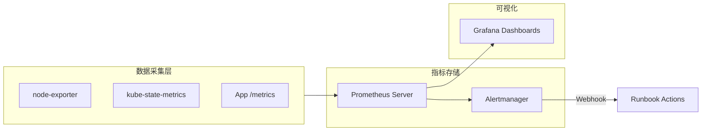

[TOC]

# 监控与运维观测 (Observability & Operations)

## 学习目标

完成本模块后，您将能够：
- 为 Kubernetes 集群设计覆盖 macOS 学习环境与 Linux 生产环境的一致观测方案
- 部署并调优 Prometheus + Grafana + Alertmanager 栈，结合 20GB 内存限制进行采集优化
- 建立 SLI/SLO 指标体系，并与生产实践模块中的 Runbook 流程联动
- 制定多环境告警路由与测试方法，确保服务降级时可快速响应

## 前置知识

- 熟悉 `kubectl`, `helm`, `kustomize` 等基础工具
- 了解 Kubernetes 核心对象和资源配额（参考 `courses/02-advanced/01-生产实践/README.md`）
- 掌握基础容器网络与服务暴露方式（ClusterIP、NodePort、Ingress）
- 理解指标、日志、追踪三大观测支柱（Metrics / Logs / Traces）

## 模块结构概览

| 单元 | 目标 | 关联文档 |
| --- | --- | --- |
| 观测体系设计 | 定义指标层级、组件职责 | `specs/001-k8s/research.md` 观测章节 |
| Prometheus Stack 部署 | 在 Kind (macOS) 与 Linux 集群落地 | `tools/setup/kind-config.yaml`, `courses/02-advanced/labs/prometheus-stack.yaml` |
| 告警与 SLO 管理 | 设计通用告警策略与值班流程 | `courses/02-advanced/01-生产实践/README.md` Runbook |
| 可视化与容量优化 | Grafana Dashboard、Retention 策略 | `resources/diagrams/` (待补充) |

## 观测体系设计

### 指标分层
- **平台层 (Platform)**：API Server 延迟、etcd 同步、Node 资源利用率
- **服务层 (Service)**：Deployment 副本数、Pod 重启次数、HPA 调整频率
- **业务层 (Application)**：HTTP 请求延迟/错误率、队列积压、关键业务指标

> 🎯 **建议**：在 macOS 学习环境中至少模拟平台层与服务层指标，业务层可通过示例应用（nginx + golang + frontend）补充。

### 指标来源
- **kube-state-metrics**：提供资源对象状态，适合服务层监控
- **node-exporter**：暴露节点 CPU/Mem/磁盘，macOS 需通过 Kind 节点容器访问
- **custom metrics**：在示例应用中通过 `/metrics` 暴露业务指标

## Prometheus Stack 部署



### macOS (Kind) 部署步骤
1. **准备命名空间**：`kubectl create ns monitoring`
2. **Helm 安装**：
   ```bash
   helm repo add prometheus-community https://prometheus-community.github.io/helm-charts
   helm repo update
   helm upgrade --install kube-monitor prometheus-community/kube-prometheus-stack \
     --namespace monitoring \
     --values courses/02-advanced/labs/prometheus-stack.yaml \
     --set prometheus.prometheusSpec.retention="12h" \
     --set prometheus.prometheusSpec.resources.limits.memory="2Gi"
   ```
3. **端口转发**：`kubectl port-forward svc/kube-monitor-grafana -n monitoring 3000:80`

### Linux 生产部署差异
- **资源配额**：根据 12GB 集群限制，建议 Prometheus `requests: {cpu: 500m, memory: 2Gi}`，Alertmanager `requests: {cpu: 200m, memory: 512Mi}`
- **存储后端**：使用 `PersistentVolumeClaim` + SSD (ext4/xfs)，Retention 可设为 `7d-14d`
- **高可用**：启用 Prometheus Federation 或 Thanos Sidecar，将告警合并到集中化 Alertmanager
- **安全**：配置 RBAC ServiceAccount，并通过 `networkPolicy` 限制外部访问

## 告警与 SLO 管理

### SLI/SLO 模板
- **平台可用性**：`apiserver_request_duration_seconds_bucket{verb="GET",resource="pods"}` -> SLI，为 SLO 99.9%
- **业务延迟**：`http_server_requests_seconds_count{app="golang-backend"}` 组合计算 95 分位
- **资源压力**：`node_memory_MemAvailable_bytes / node_memory_MemTotal_bytes < 20%` 触发容量告警

### 告警流程对接 Runbook
1. Alertmanager 通过 webhook 推送至 Incident Bot
2. 根据标签 `severity=critical` 自动创建 PagerDuty/钉钉告警
3. 值班工程师参考 `courses/02-advanced/01-生产实践/README.md` 中的回滚步骤
4. 事件关闭后生成 Postmortem，更新 Grafana Dashboard 与告警阈值

### 告警路由示例
```yaml
route:
  receiver: team-oncall
  group_by: [namespace, alertname]
  routes:
    - matchers:
        - severity="warning"
      receiver: team-slack
      continue: true
receivers:
  - name: team-oncall
    pagerduty_configs:
      - service_key: ${PAGERDUTY_KEY}
  - name: team-slack
    slack_configs:
      - channel: "#k8s-alerts"
        send_resolved: true
```

## Grafana 可视化与容量优化

- **Dashboard 模板**：建议导入 `kube-prometheus-stack` 默认仪表，并新增业务指标面板
- **多环境变量**：使用 `datasource` + `environment` 变量切换 macOS/Stage/Prod 指标
- **Retention 调优**：根据环境设置 `--storage.tsdb.retention.time`，macOS 可降至 6-12 小时以节省磁盘
- **Recording Rules**：将关键 SLI 聚合成 `job:request_duration_seconds:95p` 等指标，提高告警实时性

## 与相邻模块的协同

- **生产实践 (T021)**：共享指标定义与 Runbook，确保告警触发后可执行回滚流程
- **安全加固 (T023)**：在 Grafana 中加入安全仪表，如 `audit_log_count`、`networkpolicy_denied_connections`
- **Service Mesh 模块**：后续会在 Istio 章节加入 Kiali、Jaeger 指标，与 Prometheus Federation 集成

## 学习检验

### 自查问题
1. 描述在 12GB 内存限制下如何配置 Prometheus 资源请求与保留策略
2. 如何在 Kind 环境中暴露 Grafana 给本地浏览器访问？
3. SLO 设为 99.5%，当请求失败率 ≥0.5% 时应如何调整告警？

### 实践任务
1. 使用本模块 YAML 在 Kind 集群部署 Prometheus Stack，并截图 Grafana 面板
2. 创建一个模拟告警（例如故意调整 HPA CPU 阈值），验证 Alertmanager 路由是否触发
3. 在 Linux 云主机部署相同 Stack，对比磁盘 IO 与内存利用率差异，记录优化建议

## 下一步学习

- **[安全加固指南](../03-安全加固/README.md)**：补齐 RBAC、NetworkPolicy 与审计指标
- **[生产实践指南](../01-生产实践/README.md)**：复盘告警联动的 Runbook 流程
- **[Service Mesh 模块](../../03-service-mesh/)**：接入 Istio Telemetry v2，扩展指标覆盖

---

完成本模块后，您已具备为 Kubernetes 集群打造端到端监控体系的能力。请将指标定义、告警策略与 Runbook 共同纳入团队知识库，确保从 macOS 学习环境过渡到 Linux 生产环境时仍然保持可观测性与响应效率。
