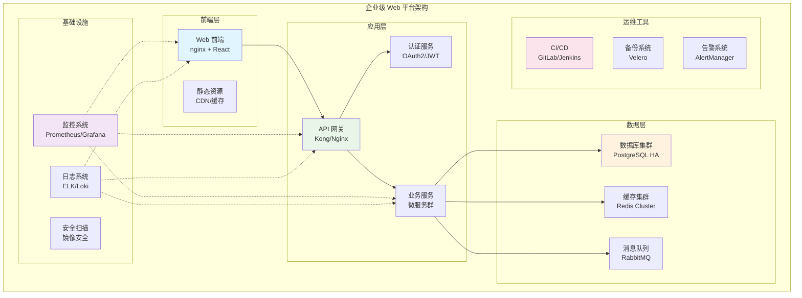

[TOC]

# 高级生产实践课程 (Advanced Production Course)

## 课程概述

本模块将带您深入学习 Kubernetes 在生产环境中的高级应用和最佳实践。从核心概念过渡到企业级部署，掌握监控运维、安全加固、性能优化等关键技能，为在真实生产环境中运维 Kubernetes 集群做好准备。

## 前置要求

### ✅ 必须完成
- **核心 Kubernetes 课程**（courses/01-core/）全部模块
- **核心技能评估**通过（80分以上）
- 熟练使用 kubectl 和 YAML 配置
- 理解 Pod、Service、Deployment 等核心概念

### 🛠️ 环境要求
- Kind 集群运行稳定（推荐 3 节点）
- 本地可用内存 8GB+（生产模拟需要更多资源）
- Docker Desktop 4.0+ 正常运行
- 网络连接稳定（需要拉取监控组件镜像）

## 学习目标

完成本课程后，您将能够：

### 🎯 生产实践能力
- 在不同操作系统（Linux、macOS）上部署和管理 K8s 集群
- 理解生产环境与开发环境的差异和挑战
- 掌握高可用集群配置和故障恢复
- 实施资源管理和成本优化策略

### 📊 监控运维技能
- 构建完整的监控体系（Prometheus + Grafana）
- 实现应用和集群的可观测性
- 配置告警规则和通知机制
- 进行性能分析和容量规划

### 🛡️ 安全加固专长
- 实施 RBAC 权限控制
- 配置 Network Policy 网络安全策略
- 管理 Pod Security Standards
- 处理镜像安全和漏洞扫描

### 🚀 高级部署策略
- 蓝绿部署和金丝雀发布
- 多环境管理和 GitOps 工作流
- 服务网格（Istio）集成
- 自动化 CI/CD 流水线

## 课程结构

### 📚 理论与实践模块

#### [01-生产实践](./01-生产实践/)
**重点内容**:
- 生产环境 vs 开发环境差异分析
- Linux 系统上的 K8s 集群管理
- 高可用架构设计和实现
- 备份恢复和灾难恢复策略
- 资源管理和性能调优

**学习时长**: 4小时

#### [02-监控运维](./02-监控运维/)
**重点内容**:
- Prometheus 监控体系搭建
- Grafana 仪表板配置
- 日志聚合和分析（ELK/EFK）
- 告警规则和事件响应
- 可观测性最佳实践

**学习时长**: 4小时

#### [03-安全加固](./03-安全加固/)
**重点内容**:
- RBAC 权限模型设计
- Network Policy 网络隔离
- Pod Security Standards
- 镜像安全扫描和策略
- 密钥管理和轮换

**学习时长**: 3小时

### 🧪 实验练习

#### [labs/](./labs/)
- **prometheus-stack.yaml**: 完整监控栈部署
- **security-rbac.yaml**: 安全加固和权限控制
- **troubleshooting/**: 生产问题排查场景
- **performance-tuning.yaml**: 性能调优实验
- **ha-cluster.yaml**: 高可用集群配置

### 📋 综合评估

#### [assessment/](./assessment/)
- **生产环境模拟**: 完整的生产级部署
- **故障处理**: 真实问题排查和解决
- **安全审计**: 集群安全配置评估
- **性能优化**: 资源使用和性能提升

## 学习路径

```mermaid
graph TB
    subgraph "高级生产实践学习路径"
        subgraph "阶段1: 生产环境理解"
            A1[生产 vs 开发环境]
            A2[Linux 集群管理]
            A3[高可用架构]
            A4[备份恢复策略]
        end

        subgraph "阶段2: 监控运维体系"
            B1[Prometheus 部署]
            B2[Grafana 仪表板]
            B3[日志管理]
            B4[告警配置]
        end

        subgraph "阶段3: 安全加固实践"
            C1[RBAC 权限控制]
            C2[网络安全策略]
            C3[Pod 安全标准]
            C4[镜像安全管理]
        end

        subgraph "阶段4: 综合实验"
            D1[监控栈实验]
            D2[安全加固实验]
            D3[故障排查实验]
            D4[性能调优实验]
        end

        subgraph "阶段5: 生产评估"
            E1[生产模拟部署]
            E2[安全审计评估]
            E3[性能优化评估]
        end
    end

    A1 --> A2 --> A3 --> A4
    A4 --> B1
    B1 --> B2 --> B3 --> B4
    B4 --> C1
    C1 --> C2 --> C3 --> C4
    C4 --> D1
    D1 --> D2 --> D3 --> D4
    D4 --> E1 --> E2 --> E3

    style A1 fill:#e1f5fe
    style B1 fill:#e8f5e8
    style C1 fill:#fff3e0
    style D1 fill:#f3e5f5
    style E1 fill:#fce4ec
```



## 时间安排

| 模块 | 理论学习 | 实验练习 | 总时长 | 类型 |
|-----|---------|---------|-------|------|
| 生产实践 | 2小时 | 2小时 | 4小时 | 理论+实践 |
| 监控运维 | 2小时 | 2小时 | 4小时 | 实践为主 |
| 安全加固 | 1.5小时 | 1.5小时 | 3小时 | 理论+实践 |
| 综合实验 | 0.5小时 | 3.5小时 | 4小时 | 实践操作 |
| 生产评估 | 0.5小时 | 2.5小时 | 3小时 | 综合考核 |
| **总计** | **6.5小时** | **11.5小时** | **18小时** | **高级实践** |

## 核心技能对比

### 🆚 核心课程 vs 高级课程

| 维度 | 核心课程 | 高级课程 |
|-----|---------|----------|
| **环境** | Kind 本地集群 | 生产级集群配置 |
| **规模** | 单应用部署 | 多应用、多环境管理 |
| **监控** | 基本健康检查 | 完整监控体系 |
| **安全** | 基本配置管理 | 全面安全加固 |
| **网络** | 服务发现基础 | 网络策略和隔离 |
| **存储** | 简单 PV/PVC | 高可用存储方案 |
| **运维** | 基本 kubectl 操作 | 自动化运维流程 |
| **故障** | 单点问题排查 | 系统性故障处理 |

## 资源要求升级

### 💻 硬件配置
- **内存**: 8GB+ （推荐 16GB）
- **CPU**: 4核+ （推荐 8核）
- **存储**: 50GB+ 可用空间
- **网络**: 稳定的高速连接

### 🐋 软件环境
- Docker Desktop 4.0+
- Kind 0.17+ 或 Kubernetes 1.25+
- kubectl 1.25+
- Helm 3.10+（监控组件安装）
- Git 2.30+（GitOps 实践）

### 🌐 网络访问
- Docker Hub 和 Quay.io （镜像拉取）
- Grafana Labs 仓库（监控组件）
- Prometheus 社区仓库
- GitHub/GitLab（代码仓库访问）

## 学习成果

### 🏆 技能认证

完成本课程后，您将获得以下核心能力：

1. **生产级 K8s 管理员**
   - 独立管理生产 K8s 集群
   - 处理高可用和灾难恢复
   - 实施最佳安全实践

2. **DevOps 工程师**
   - 构建完整的监控运维体系
   - 实现自动化部署和运维
   - 优化系统性能和成本

3. **安全专家**
   - 设计和实施 K8s 安全策略
   - 进行安全审计和合规检查
   - 管理密钥和访问控制

### 📊 能力对标

| 岗位级别 | 能力要求 | 课程覆盖 |
|---------|----------|----------|
| **初级工程师** | 基本 K8s 操作 | ✅ 核心课程 |
| **中级工程师** | 生产环境管理 | ✅ 本课程 |
| **高级工程师** | 架构设计优化 | 🔄 进阶内容 |
| **专家级** | 大规模集群运维 | 🔄 专业认证 |

## 实践项目

### 🎯 课程项目：企业级 Web 平台

在本课程中，您将构建一个完整的企业级 Web 平台：



### 📈 项目里程碑

1. **第1周**: 高可用集群搭建
2. **第2周**: 监控体系构建
3. **第3周**: 安全策略实施
4. **第4周**: 性能优化和发布

## 学习建议

### ✅ 成功策略

1. **循序渐进**: 确保核心概念扎实后再学习高级内容
2. **动手实践**: 每个概念都要通过实验验证理解
3. **问题导向**: 思考生产环境中的真实挑战
4. **社区参与**: 关注 K8s 社区的最佳实践分享
5. **持续学习**: K8s 生态快速发展，保持知识更新

### ⚠️ 常见陷阱

1. **跳跃学习**: 基础不牢导致高级概念难以理解
2. **重理论轻实践**: 缺乏动手操作经验
3. **忽视安全**: 只关注功能不重视安全配置
4. **资源配置不当**: 开发环境配置无法适用生产环境
5. **监控盲点**: 缺乏全面的可观测性

## 课前准备

### 📚 预习材料

1. 复习核心课程重要概念
2. 了解 Linux 系统管理基础
3. 学习 Prometheus 监控基础
4. 理解 RBAC 权限模型
5. 熟悉 YAML 和 JSON 格式

### 🛠️ 环境检查

```bash
# 检查 Kind 集群
kind get clusters
kubectl cluster-info

# 检查资源情况
kubectl top nodes
kubectl get nodes -o wide

# 检查存储空间
df -h
docker system df

# 检查网络连接
curl -I https://quay.io/health
curl -I https://registry.k8s.io/
```

### 📖 参考资源

- [Kubernetes 生产最佳实践](https://kubernetes.io/docs/setup/best-practices/)
- [Prometheus 官方文档](https://prometheus.io/docs/)
- [Grafana 文档](https://grafana.com/docs/)
- [Kubernetes 安全指南](https://kubernetes.io/docs/concepts/security/)

---

**准备好挑战了吗？** 让我们开始深入的生产级 Kubernetes 学习之旅！

**开始学习**: [01-生产实践](./01-生产实践/README.md)

**需要帮助**: 查看各模块的故障排查指南或参考官方文档