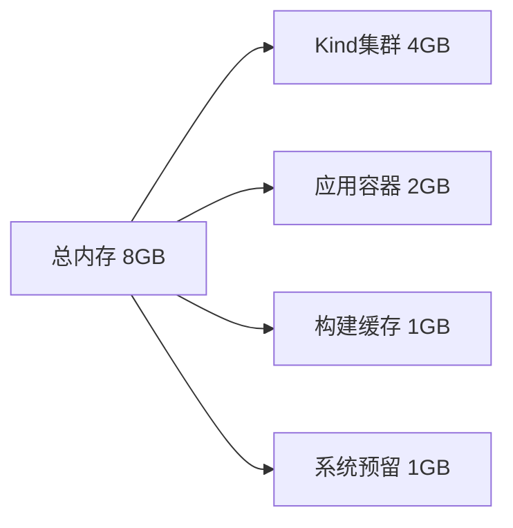

[TOC]

# Docker Desktop 配置指南

本指南将帮助你正确配置 Docker Desktop，为 Kubernetes 学习环境提供充足的资源。

## 概念卡速记

> 📌 **概念卡：Docker Desktop Resource Profile（资源配置档案）**  
> **定义**：Docker Desktop 通过图形化界面分配 CPU、内存、磁盘等资源，影响容器运行上限。  
> **学习提醒**：与课程中的 Kind 配置联动，需保证内存 ≥8GB、CPU ≥4 核，避免集群启动失败。  
> **快捷路径**：`Docker Desktop → Settings → Resources → Advanced`

> 📌 **概念卡：Docker Engine JSON 配置**  
> **定义**：位于 `~/.docker/daemon.json` 的引擎级配置文件，可开启 BuildKit、垃圾回收、镜像加速等特性。  
> **学习提醒**：修改后需重新启动 Docker；建议使用版本控制保存调整前后差异。  
> **关键字段**：`"builder.gc.enabled"`、`"registry-mirrors"`

> 📌 **概念卡：BuildKit（新一代构建引擎）**  
> **定义**：Docker 的改进型构建架构，提供更快的构建速度与并行能力，支持前端缓存。  
> **学习提醒**：开启 BuildKit 后需关注构建日志格式变化，可通过环境变量 `DOCKER_BUILDKIT=1` 临时启用。  
> **关键命令**：`docker buildx build`

> 📌 **概念卡：Registry Mirror（镜像加速器）**  
> **定义**：Docker Engine 在拉取镜像时的代理与缓存，减少网络延迟。  
> **学习提醒**：国内网络建议配置镜像加速器，并定期验证可用性，避免长时间卡在 `Pulling fs layer`。  
> **配置示例**：`"registry-mirrors": ["https://docker.mirrors.ustc.edu.cn"]`

## 📋 目录

1. [安装 Docker Desktop](#安装-docker-desktop)
2. [资源配置 (重要)](#资源配置-重要)
3. [高级设置](#高级设置)
4. [性能优化](#性能优化)
5. [常见问题](#常见问题)
6. [验证配置](#验证配置)

## 安装 Docker Desktop

### macOS 安装方式

#### 方式一：使用 Homebrew（推荐）
```bash
# 安装 Docker Desktop
brew install --cask docker

# 启动 Docker Desktop
open -a Docker
```

#### 方式二：官网下载
1. 访问 [Docker Desktop 官网](https://www.docker.com/products/docker-desktop/)
2. 选择对应的芯片版本：
   - **Intel Chip** (x86_64)
   - **Apple Silicon** (M1/M2/M3)
3. 下载并安装 `.dmg` 文件

### 首次启动

1. 打开 Docker Desktop 应用
2. 接受服务协议
3. 选择推荐设置（可以稍后调整）
4. 等待 Docker Engine 启动完成

## 资源配置 (重要)

### ⚠️ 内存分配要求

Kubernetes 学习环境需要至少 **8GB** 内存分配给 Docker Desktop。

### 配置步骤

1. **打开 Docker Desktop 设置**
   - 点击 Docker Desktop 菜单栏图标
   - 选择 `Preferences` 或 `Settings` (⚙️)

2. **进入资源配置**
   - 左侧菜单选择 `Resources`
   - 选择 `Advanced` 标签

3. **调整资源分配**

   ```yaml
   推荐配置:
   ├── Memory: 8 GB (最小)
   ├── CPUs: 4 (建议)
   ├── Swap: 2 GB
   └── Disk image size: 60 GB
   ```

   **详细说明：**
   - **Memory (内存)**: 拖动滑块至 **8192 MB (8 GB)**
     - 最小要求: 8 GB
     - 推荐配置: 10-12 GB (如果系统内存充足)
     - 用途分配:
       - Kind 集群: 4-6 GB
       - 应用容器: 2-3 GB
       - 系统开销: 1-2 GB

   - **CPUs (处理器)**: 设置为 **4 核**
     - 最小要求: 2 核
     - 推荐配置: 4-6 核
     - 影响: 容器构建速度和应用响应

   - **Swap (交换空间)**: 设置为 **2 GB**
     - 作用: 内存不足时的缓冲
     - 注意: 过度使用会影响性能

   - **Disk image size (磁盘空间)**: 设置为 **60 GB**
     - 最小要求: 40 GB
     - 用途: 存储镜像、容器和卷

4. **应用更改**
   - 点击 `Apply & Restart` 按钮
   - 等待 Docker Desktop 重启（约 30 秒）

### 配置截图示例

```
Docker Desktop → Settings → Resources → Advanced

┌─────────────────────────────────────┐
│  Memory                             │
│  [========|──────] 8.00 GB         │
│                                     │
│  CPUs                               │
│  [====|──────────] 4                │
│                                     │
│  Swap                               │
│  [==|────────────] 2 GB            │
│                                     │
│  Disk image size                    │
│  [======|────────] 60 GB           │
└─────────────────────────────────────┘
```

## 高级设置

### Kubernetes 集成

1. **启用 Kubernetes（可选）**
   - Settings → Kubernetes
   - 勾选 `Enable Kubernetes`
   - 选择 Kubernetes 版本
   - 点击 `Apply & Restart`

   > ⚠️ **注意**: 本课程使用 Kind 管理集群，不需要启用内置 Kubernetes

### Docker Engine 配置

1. **进入 Docker Engine 设置**
   - Settings → Docker Engine

2. **优化配置** (编辑 JSON)
   ```json
   {
     "builder": {
       "gc": {
         "defaultKeepStorage": "20GB",
         "enabled": true
       }
     },
     "experimental": false,
     "features": {
       "buildkit": true
     },
     "registry-mirrors": [
       "https://docker.mirrors.ustc.edu.cn"
     ]
   }
   ```

   **配置说明：**
   - `buildkit`: 启用新一代构建引擎（更快）
   - `defaultKeepStorage`: 自动清理保留 20GB
   - `registry-mirrors`: 国内镜像加速（可选）

### 文件共享设置

1. **配置共享目录**
   - Settings → Resources → File sharing
   - 确保以下目录被共享：
     - `/Users/[你的用户名]/src`
     - `/tmp`
     - `/var/folders`

2. **使用 VirtioFS（推荐）**
   - Settings → General
   - 选择 `VirtioFS` 作为文件共享实现
   - 优势: 更好的性能，特别是大量小文件

## 性能优化

### 内存优化策略



### 优化建议

1. **定期清理资源**
   ```bash
   # 清理未使用的容器
   docker container prune -f

   # 清理未使用的镜像
   docker image prune -a -f

   # 清理未使用的卷
   docker volume prune -f

   # 一键清理所有未使用资源
   docker system prune -a --volumes -f
   ```

2. **使用轻量级镜像**
   ```dockerfile
   # 推荐: Alpine 版本
   FROM nginx:alpine

   # 而不是
   FROM nginx:latest
   ```

3. **设置资源限制**
   ```yaml
   # docker-compose.yml
   services:
     app:
       image: myapp
       deploy:
         resources:
           limits:
             memory: 512M
           reservations:
             memory: 256M
   ```

4. **监控资源使用**
   ```bash
   # 查看容器资源使用
   docker stats

   # 查看系统资源信息
   docker system df

   # 查看详细信息
   docker system info
   ```

## 常见问题

### Q1: Docker Desktop 无法启动

**解决方案：**
```bash
# 1. 完全退出 Docker Desktop
killall Docker

# 2. 清理配置
rm -rf ~/Library/Containers/com.docker.docker
rm -rf ~/.docker

# 3. 重新启动
open -a Docker
```

### Q2: 内存分配无法调整

**可能原因：**
- 系统总内存不足
- Docker Desktop 正在运行

**解决方案：**
1. 确保系统有足够内存（至少 16GB 总内存）
2. 完全退出 Docker Desktop 后再调整
3. 检查 Activity Monitor 查看内存使用

### Q3: 磁盘空间不足

**快速清理命令：**
```bash
# 查看空间占用
docker system df

# 深度清理（慎用）
docker system prune -a --volumes

# 清理构建缓存
docker builder prune -a
```

### Q4: 容器运行缓慢

**检查项：**
1. ✓ 内存分配是否充足（≥8GB）
2. ✓ CPU 分配是否合理（≥4核）
3. ✓ 是否使用 VirtioFS
4. ✓ 是否有大量未清理的资源

## 验证配置

### 运行验证脚本

```bash
# 使用项目提供的验证脚本
./tools/validation/check-environment.sh
```

### 手动验证命令

```bash
# 1. 检查 Docker 版本
docker version

# 2. 检查资源配置
docker system info | grep -E "Memory|CPUs"

# 3. 测试拉取镜像
docker pull nginx:alpine

# 4. 运行测试容器
docker run --rm -d --name test-nginx \
  --memory="512m" \
  --cpus="0.5" \
  nginx:alpine

# 5. 检查容器状态
docker ps

# 6. 查看资源使用
docker stats test-nginx --no-stream

# 7. 清理测试容器
docker stop test-nginx
```

### 预期输出

```
✓ Docker Desktop 运行正常
✓ 内存分配: 8GB 或更多
✓ CPU 分配: 4 核或更多
✓ 能够拉取和运行容器
✓ 资源限制正常工作
```

## 下一步

配置完成后，你可以：

1. **创建 Kind 集群**
   ```bash
   # 使用项目配置文件
   kind create cluster --config tools/setup/kind-config.yaml
   ```

2. **开始学习课程**
   - 基础课程: `courses/00-foundation/`
   - 核心课程: `courses/01-core/`

3. **运行示例应用**
   ```bash
   # 部署第一个应用
   kubectl apply -f courses/01-core/labs/nginx-deployment.yaml
   ```

## 有用的资源

- [Docker Desktop 官方文档](https://docs.docker.com/desktop/)
- [Docker 资源配置指南](https://docs.docker.com/desktop/settings/mac/#resources)
- [Docker 性能优化](https://docs.docker.com/desktop/troubleshoot/topics/)
- [Kind 文档](https://kind.sigs.k8s.io/)

---

💡 **提示**: 如果遇到问题，请先运行 `./tools/validation/check-environment.sh` 进行诊断。
