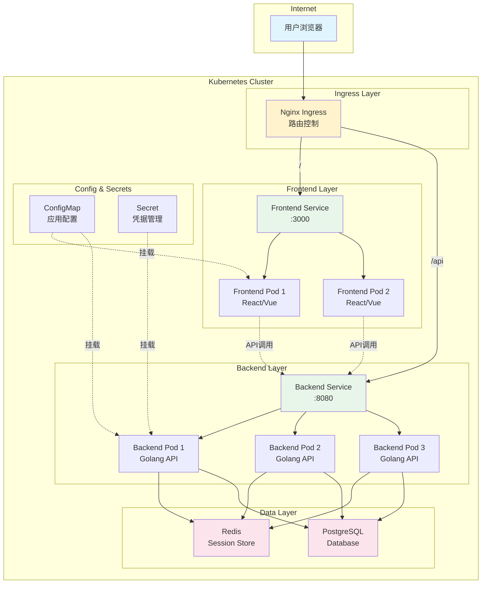
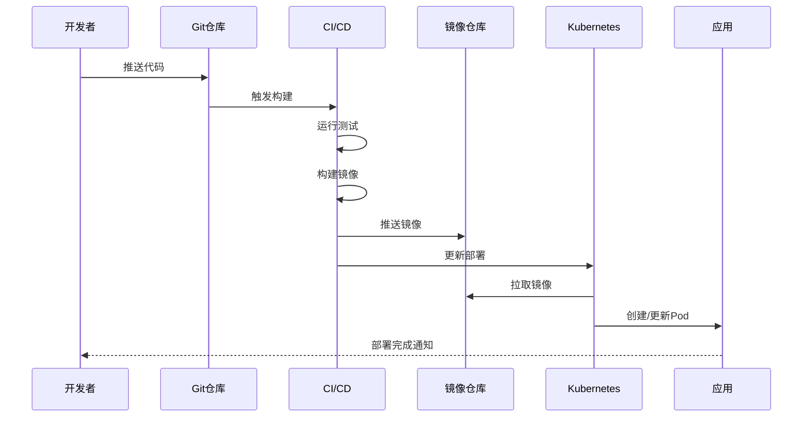
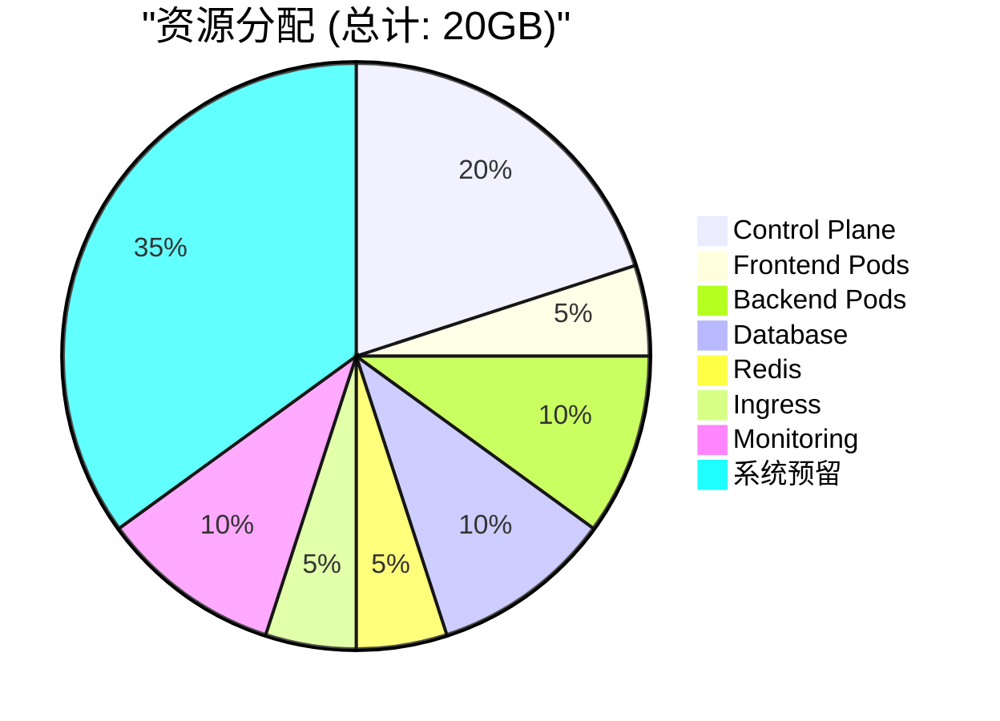
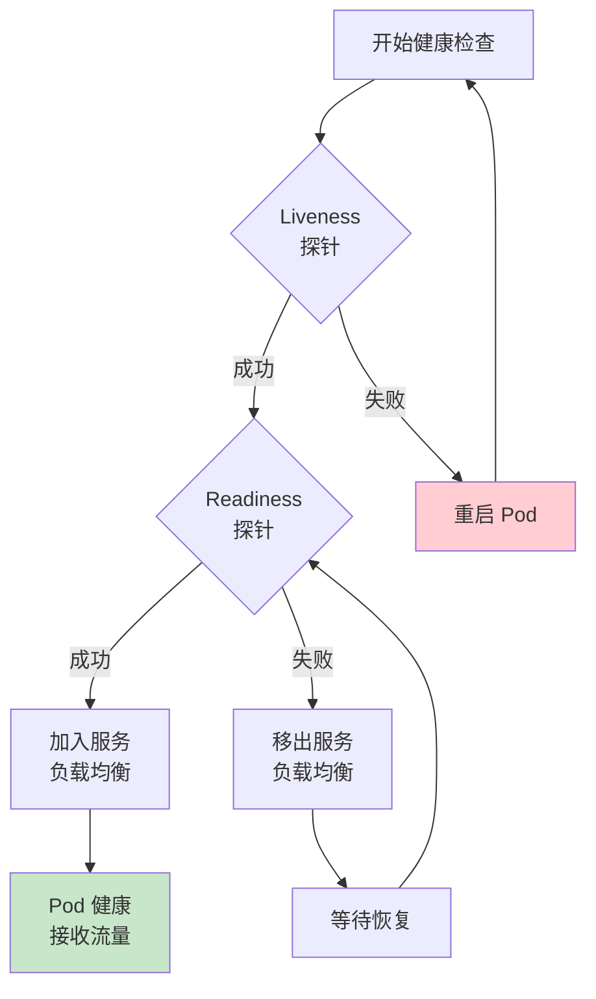
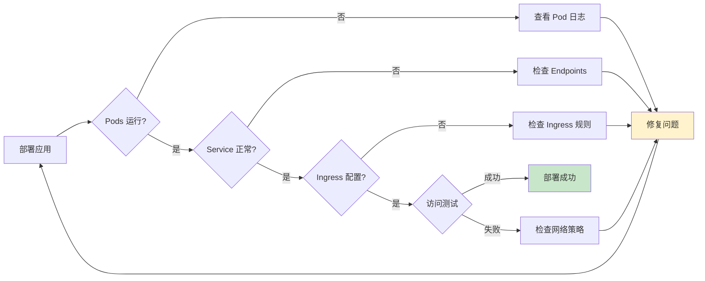
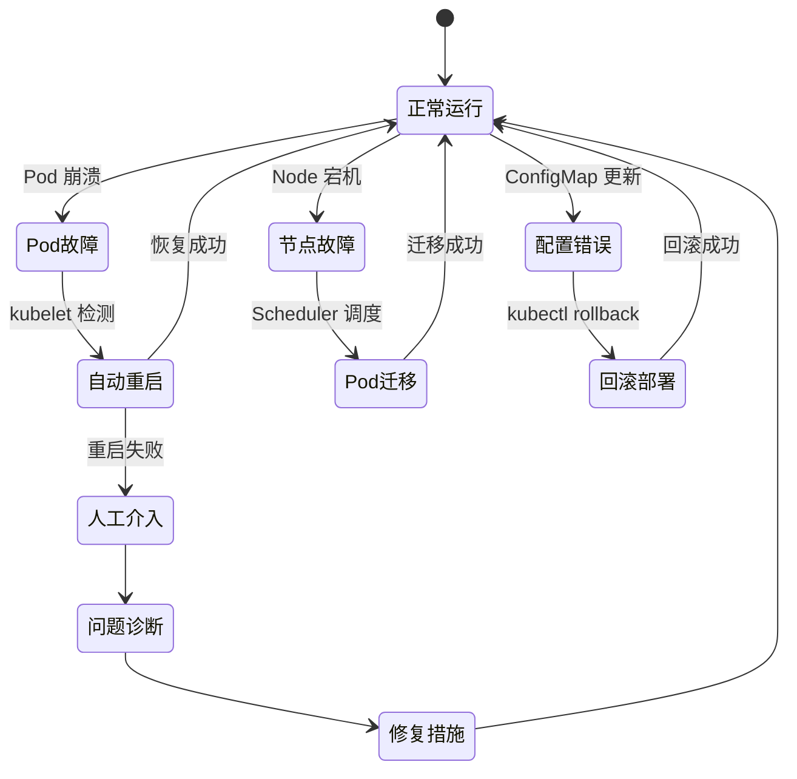

# Application Deployment Contract
# 应用部署契约 - nginx+golang+前端完整栈

## 架构概览



## 部署流程



## 组件规格

### 1. Frontend Application

```yaml
apiVersion: apps/v1
kind: Deployment
metadata:
  name: frontend
  namespace: demo-app
spec:
  replicas: 2
  strategy:
    type: RollingUpdate
    rollingUpdate:
      maxSurge: 1
      maxUnavailable: 0
  selector:
    matchLabels:
      app: frontend
      tier: presentation
  template:
    metadata:
      labels:
        app: frontend
        tier: presentation
        version: v1.0.0
    spec:
      containers:
      - name: frontend
        image: demo-app/frontend:latest
        ports:
        - containerPort: 3000
          name: http
        env:
        - name: API_URL
          valueFrom:
            configMapKeyRef:
              name: app-config
              key: api.url
        - name: ENV
          valueFrom:
            configMapKeyRef:
              name: app-config
              key: environment
        resources:
          requests:
            memory: "128Mi"
            cpu: "100m"
          limits:
            memory: "256Mi"
            cpu: "200m"
        livenessProbe:
          httpGet:
            path: /health
            port: 3000
          initialDelaySeconds: 30
          periodSeconds: 10
        readinessProbe:
          httpGet:
            path: /ready
            port: 3000
          initialDelaySeconds: 5
          periodSeconds: 5
```

### 2. Backend Application

```yaml
apiVersion: apps/v1
kind: Deployment
metadata:
  name: backend
  namespace: demo-app
spec:
  replicas: 3
  strategy:
    type: RollingUpdate
    rollingUpdate:
      maxSurge: 1
      maxUnavailable: 1
  selector:
    matchLabels:
      app: backend
      tier: api
  template:
    metadata:
      labels:
        app: backend
        tier: api
        version: v1.0.0
    spec:
      containers:
      - name: backend
        image: demo-app/backend:latest
        ports:
        - containerPort: 8080
          name: http
        env:
        - name: DB_HOST
          valueFrom:
            configMapKeyRef:
              name: app-config
              key: db.host
        - name: DB_NAME
          valueFrom:
            configMapKeyRef:
              name: app-config
              key: db.name
        - name: DB_USER
          valueFrom:
            secretKeyRef:
              name: db-secret
              key: username
        - name: DB_PASSWORD
          valueFrom:
            secretKeyRef:
              name: db-secret
              key: password
        - name: REDIS_URL
          valueFrom:
            configMapKeyRef:
              name: app-config
              key: redis.url
        resources:
          requests:
            memory: "256Mi"
            cpu: "200m"
          limits:
            memory: "512Mi"
            cpu: "500m"
        livenessProbe:
          httpGet:
            path: /api/health
            port: 8080
          initialDelaySeconds: 45
          periodSeconds: 10
        readinessProbe:
          httpGet:
            path: /api/ready
            port: 8080
          initialDelaySeconds: 10
          periodSeconds: 5
        volumeMounts:
        - name: config
          mountPath: /app/config
          readOnly: true
      volumes:
      - name: config
        configMap:
          name: app-config
```

### 3. Nginx Ingress Configuration

```yaml
apiVersion: networking.k8s.io/v1
kind: Ingress
metadata:
  name: app-ingress
  namespace: demo-app
  annotations:
    kubernetes.io/ingress.class: nginx
    nginx.ingress.kubernetes.io/rewrite-target: /
    nginx.ingress.kubernetes.io/ssl-redirect: "false"
spec:
  rules:
  - host: demo.local
    http:
      paths:
      - path: /
        pathType: Prefix
        backend:
          service:
            name: frontend-service
            port:
              number: 80
      - path: /api
        pathType: Prefix
        backend:
          service:
            name: backend-service
            port:
              number: 8080
```

## 资源配置



## 健康检查流程



## 配置管理

### ConfigMap 结构

```yaml
apiVersion: v1
kind: ConfigMap
metadata:
  name: app-config
  namespace: demo-app
data:
  # 前端配置
  api.url: "http://backend-service:8080"
  environment: "development"

  # 后端配置
  db.host: "postgres-service"
  db.name: "demo_app"
  db.port: "5432"
  redis.url: "redis://redis-service:6379"

  # 应用配置
  log.level: "info"
  max.connections: "100"
  timeout.seconds: "30"

  # Nginx 配置
  nginx.conf: |
    server {
        listen 80;
        server_name demo.local;

        location / {
            proxy_pass http://frontend-service:3000;
            proxy_set_header Host $host;
            proxy_set_header X-Real-IP $remote_addr;
        }

        location /api {
            proxy_pass http://backend-service:8080;
            proxy_set_header Host $host;
            proxy_set_header X-Real-IP $remote_addr;
        }
    }
```

### Secret 管理

```yaml
apiVersion: v1
kind: Secret
metadata:
  name: db-secret
  namespace: demo-app
type: Opaque
data:
  username: ZGVtb3VzZXI=  # base64: demouser
  password: ZGVtb3Bhc3M=  # base64: demopass
```

## 部署验证

### 验证步骤



### 验证脚本

```bash
#!/bin/bash
# 应用部署验证脚本

NAMESPACE="demo-app"

echo "🔍 验证应用部署状态..."

# 1. 检查 Namespace
echo "1️⃣ 检查 Namespace..."
kubectl get namespace $NAMESPACE

# 2. 检查 Deployments
echo "2️⃣ 检查 Deployments..."
kubectl get deployments -n $NAMESPACE

# 3. 检查 Pods
echo "3️⃣ 检查 Pods..."
kubectl get pods -n $NAMESPACE

# 4. 检查 Services
echo "4️⃣ 检查 Services..."
kubectl get services -n $NAMESPACE

# 5. 检查 Ingress
echo "5️⃣ 检查 Ingress..."
kubectl get ingress -n $NAMESPACE

# 6. 测试应用访问
echo "6️⃣ 测试应用访问..."
curl -s http://localhost:30000/ | head -n 5
curl -s http://localhost:30000/api/health

# 7. 查看资源使用
echo "7️⃣ 资源使用情况..."
kubectl top pods -n $NAMESPACE

echo "✅ 验证完成!"
```

## 故障恢复



## 性能基准

| 组件 | 指标 | 目标值 | 告警阈值 |
|------|------|--------|----------|
| Frontend | 响应时间 | <100ms | >500ms |
| Backend API | 响应时间 | <200ms | >1000ms |
| Backend API | QPS | 1000 | <100 |
| Database | 连接数 | <80 | >95 |
| Redis | 内存使用 | <80% | >90% |
| Pod | CPU使用率 | <70% | >85% |
| Pod | 内存使用率 | <80% | >90% |

## 扩缩容策略

```yaml
apiVersion: autoscaling/v2
kind: HorizontalPodAutoscaler
metadata:
  name: backend-hpa
  namespace: demo-app
spec:
  scaleTargetRef:
    apiVersion: apps/v1
    kind: Deployment
    name: backend
  minReplicas: 2
  maxReplicas: 10
  metrics:
  - type: Resource
    resource:
      name: cpu
      target:
        type: Utilization
        averageUtilization: 70
  - type: Resource
    resource:
      name: memory
      target:
        type: Utilization
        averageUtilization: 80
```

## 总结

此契约定义了完整的 nginx+golang+前端 应用栈在 Kubernetes 上的部署规范，包括：

- ✅ 完整的三层架构设计
- ✅ 详细的资源配置和限制
- ✅ 健康检查和自愈机制
- ✅ 配置和密钥管理
- ✅ 部署验证和故障恢复
- ✅ 性能监控和自动扩缩容

遵循此契约可确保应用在资源受限的 macOS 环境中稳定运行，同时为生产部署做好准备。