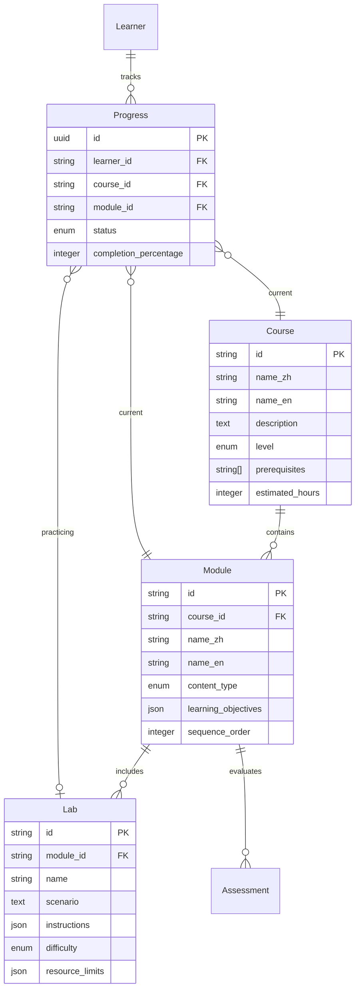
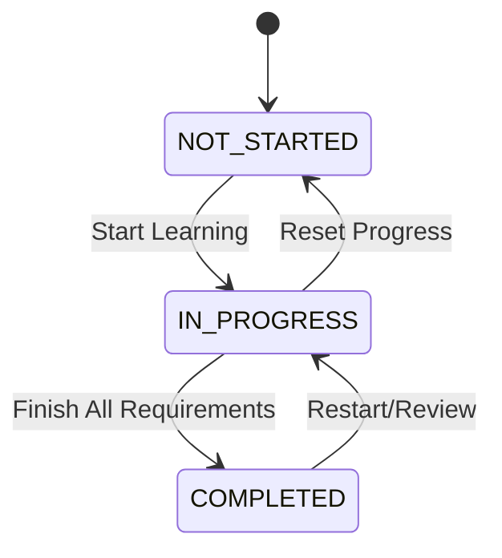
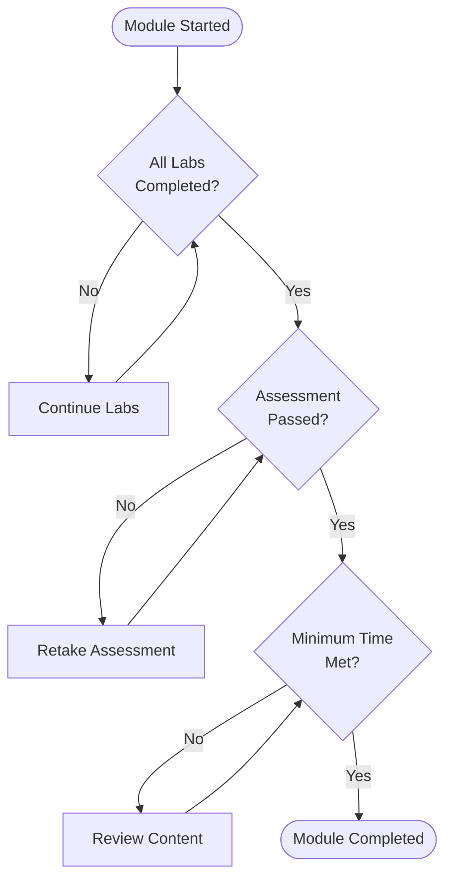

# Data Model: Kubernetes Learning Curriculum

**Feature**: Kubernetes Expert Learning Curriculum
**Date**: 2025-09-24

## Entity Relationship Diagram



## Core Entities

### 1. Course (课程)
Represents a major learning track in the curriculum.

**Attributes**:
```yaml
id: string                  # Unique identifier (e.g., "00-foundation")
name_zh: string            # Chinese name (e.g., "基础阶段")
name_en: string            # English name (e.g., "Foundation Level")
description: text          # Course overview and goals
level: enum                # BEGINNER | INTERMEDIATE | ADVANCED | PROJECT
prerequisites: string[]    # Required prior courses
estimated_hours: integer   # Expected completion time
sequence_order: integer    # Display/progression order
created_at: timestamp
updated_at: timestamp
```

**Constraints**:
- `id` must follow pattern: `\d{2}-[a-z]+`
- `level` determines access control
- `prerequisites` enforces learning path

### 2. Module (模块)
Specific topic within a course.

**Attributes**:
```yaml
id: string                  # Unique identifier (e.g., "01-docker-basics")
course_id: string          # Parent course reference
name_zh: string            # Chinese name (e.g., "Docker基础")
name_en: string            # English name (e.g., "Docker Basics")
description: text          # Module objectives
content_type: enum         # THEORY | PRACTICE | MIXED
learning_objectives: json  # Structured objectives list
resources: json            # Links, videos, documents
sequence_order: integer    # Order within course
estimated_minutes: integer # Expected completion time
created_at: timestamp
updated_at: timestamp
```

**Constraints**:
- Foreign key: `course_id` → Course.id
- `learning_objectives` minimum 3 items
- `content_type` determines delivery format

### 3. Lab (实验)
Hands-on practical exercise.

**Attributes**:
```yaml
id: string                  # Unique identifier (e.g., "lab-deploy-nginx")
module_id: string          # Parent module reference
name: string               # Lab title
scenario: text             # Problem description
instructions: json         # Step-by-step guide
validation_script: text    # Automated verification code
expected_output: json      # Success criteria
difficulty: enum           # EASY | MEDIUM | HARD
environment_config: json   # Required setup
resource_limits: json      # Memory/CPU constraints
timeout_minutes: integer   # Maximum duration
created_at: timestamp
updated_at: timestamp
```

**Constraints**:
- Foreign key: `module_id` → Module.id
- `validation_script` must be executable
- `resource_limits` enforces 20GB constraint

### 4. Assessment (评估)
Evaluation checkpoint for understanding.

**Attributes**:
```yaml
id: string                  # Unique identifier
module_id: string          # Module being assessed
type: enum                 # QUIZ | PROJECT | PRACTICAL
questions: json            # Assessment content
passing_score: integer     # Minimum percentage
max_attempts: integer      # Retry limit
time_limit_minutes: integer # Duration constraint
feedback_enabled: boolean  # Show answers after completion
created_at: timestamp
updated_at: timestamp
```

**Constraints**:
- Foreign key: `module_id` → Module.id
- `passing_score` between 60-100
- `questions` minimum 5 items

### 5. Progress (进度)
Tracks learner advancement.

**Attributes**:
```yaml
id: uuid                    # Unique identifier
learner_id: string         # User identifier
course_id: string          # Current course
module_id: string          # Current module
lab_id: string             # Current lab (nullable)
status: enum               # NOT_STARTED | IN_PROGRESS | COMPLETED
completion_percentage: integer # 0-100
time_spent_minutes: integer # Accumulated time
last_accessed: timestamp   # Recent activity
notes: text                # Learner's notes
bookmarks: json            # Saved positions
started_at: timestamp
completed_at: timestamp    # Nullable
```

**Constraints**:
- Foreign keys: course_id, module_id, lab_id
- `status` state machine rules
- `completion_percentage` auto-calculated

### 6. Learner (学习者)
User profile and preferences.

**Attributes**:
```yaml
id: string                  # Unique identifier
name: string               # Display name
email: string              # Contact (optional)
language_preference: enum  # ZH | EN | BOTH
learning_pace: enum        # SELF_PACED | GUIDED | INTENSIVE
skill_level: enum          # BEGINNER | INTERMEDIATE | ADVANCED
environment_setup: json    # System configuration
learning_goals: text       # Personal objectives
time_zone: string
created_at: timestamp
last_active: timestamp
```

**Constraints**:
- `email` unique if provided
- `language_preference` affects content delivery
- `skill_level` suggests starting point

## Relationships

### Course ← → Module (1:n)
- One course contains multiple modules
- Modules belong to exactly one course
- Cascade delete: removing course removes modules

### Module ← → Lab (1:n)
- One module contains multiple labs
- Labs belong to exactly one module
- Order preserved by sequence

### Module ← → Assessment (1:n)
- One module has multiple assessments
- Assessment tied to single module
- Types provide variety

### Learner ← → Progress (1:n)
- One learner has multiple progress records
- Each progress tied to one learner
- Tracks multi-course journey

### Progress >─< Lab (n:m)
- Progress can span multiple labs
- Labs can have multiple progress entries
- Junction table: progress_lab_completion

## State Transitions

### Progress Status Flow



### Module Completion Rules



## Data Validation Rules

### Business Rules
1. **Sequential Learning**: Cannot start module without completing prerequisites
2. **Resource Limits**: Total labs memory < 20GB
3. **Progress Tracking**: Auto-save every 5 minutes
4. **Assessment Retry**: Wait 30 minutes between attempts
5. **Completion Certificate**: All courses at 100%

### Integrity Constraints
```sql
-- Ensure valid progression
ALTER TABLE progress
ADD CONSTRAINT valid_percentage
CHECK (completion_percentage >= 0 AND completion_percentage <= 100);

-- Ensure resource limits
ALTER TABLE lab
ADD CONSTRAINT memory_limit
CHECK ((resource_limits->>'memory_mb')::int <= 20480);

-- Prevent invalid state
ALTER TABLE progress
ADD CONSTRAINT completion_status
CHECK (
  (status = 'COMPLETED' AND completion_percentage = 100) OR
  (status != 'COMPLETED' AND completion_percentage < 100)
);
```

## Sample Data

### Course Example
```json
{
  "id": "00-foundation",
  "name_zh": "基础阶段",
  "name_en": "Foundation Level",
  "description": "容器和Docker基础知识，为Kubernetes学习打下基础",
  "level": "BEGINNER",
  "prerequisites": [],
  "estimated_hours": 20,
  "sequence_order": 1
}
```

### Module Example
```json
{
  "id": "03-docker-networking",
  "course_id": "00-foundation",
  "name_zh": "Docker网络",
  "name_en": "Docker Networking",
  "content_type": "MIXED",
  "learning_objectives": [
    "理解容器网络原理",
    "配置Docker网络",
    "解决网络问题"
  ],
  "sequence_order": 3,
  "estimated_minutes": 120
}
```

### Lab Example
```json
{
  "id": "lab-nginx-deployment",
  "module_id": "02-deployments",
  "name": "部署Nginx应用",
  "difficulty": "EASY",
  "environment_config": {
    "cluster": "kind",
    "nodes": 2,
    "memory_mb": 4096
  },
  "resource_limits": {
    "memory_mb": 512,
    "cpu_cores": 0.5
  },
  "timeout_minutes": 30
}
```

## Implementation Notes

### Storage Strategy
- **Course/Module/Lab**: File-based (Markdown + YAML frontmatter)
- **Progress/Learner**: Local SQLite database
- **Assessments**: JSON files with answers separate

### Performance Considerations
- Index on: learner_id, course_id, status
- Cached: course structure, module dependencies
- Lazy load: lab instructions, assessment questions

### Security Considerations
- No sensitive data in course materials
- Progress data encrypted at rest
- Validation scripts sandboxed execution

## Migration Path
Version control for curriculum updates:
1. New content adds to existing structure
2. Deprecated content marked, not deleted
3. Progress preserved across updates
4. Rollback capability maintained