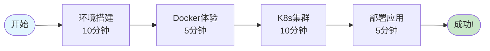
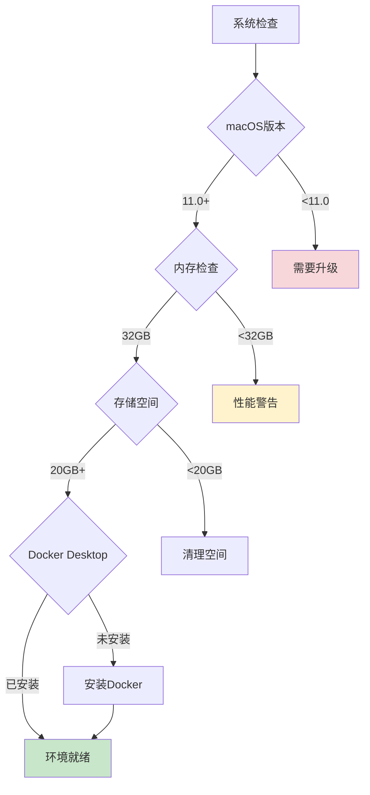
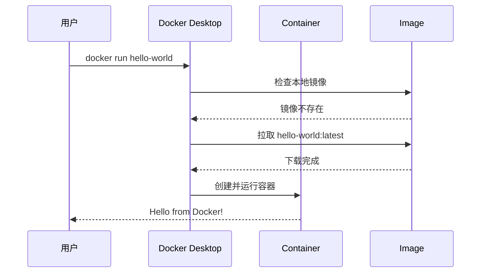
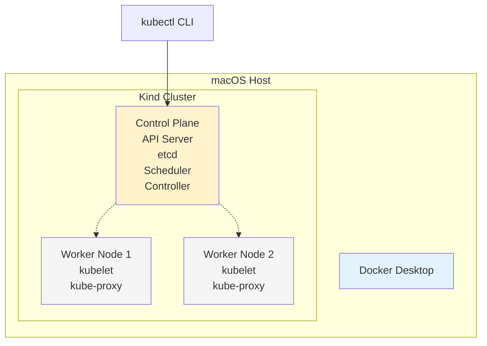
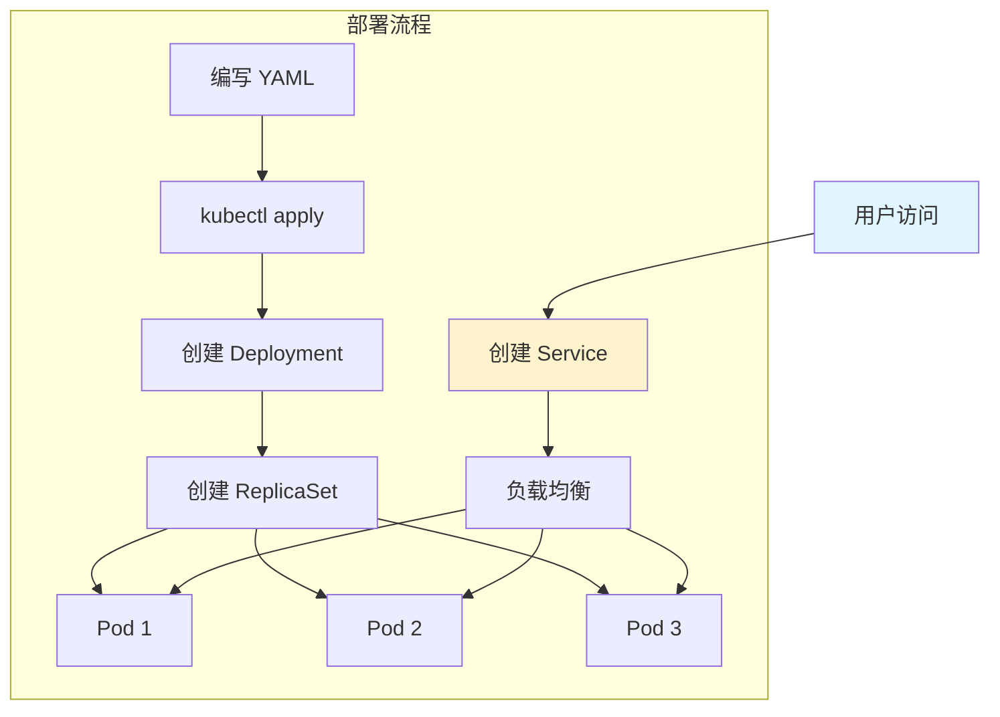
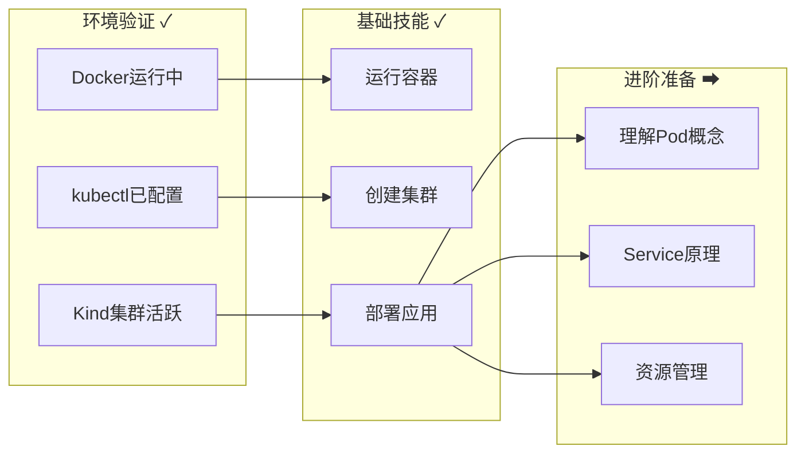
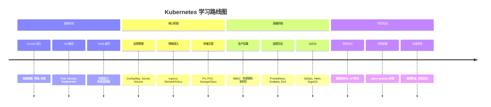
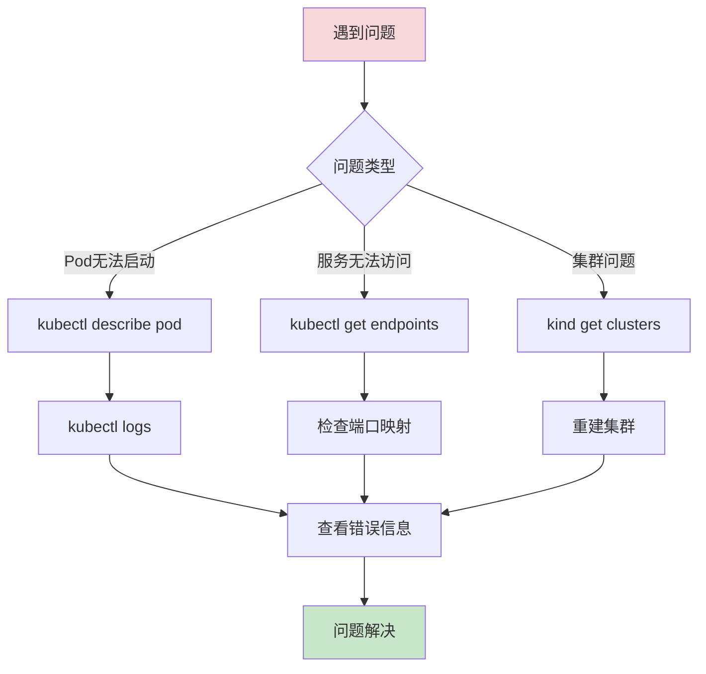

# Quick Start Guide: Kubernetes 学习之旅

## 🚀 30分钟快速体验

通过这个快速指南，您将在30分钟内搭建环境并部署第一个Kubernetes应用。

## 学习路径总览



## Step 1: 环境准备 (10分钟)

### 系统要求检查



### 快速安装脚本

```bash
#!/bin/bash
# 保存为 setup.sh 并执行

echo "🔧 开始配置 Kubernetes 学习环境..."

# 1. 检查并安装 Homebrew
if ! command -v brew &> /dev/null; then
    echo "📦 安装 Homebrew..."
    /bin/bash -c "$(curl -fsSL https://raw.githubusercontent.com/Homebrew/install/HEAD/install.sh)"
fi

# 2. 安装必需工具
echo "🛠️ 安装 Kubernetes 工具..."
brew install kubectl kind helm k9s

# 3. 验证安装
echo "✅ 验证安装..."
kubectl version --client
kind version
helm version

echo "🎉 环境配置完成!"
```

## Step 2: Docker 初体验 (5分钟)

### 运行第一个容器



执行命令：
```bash
# 1. 运行 hello-world
docker run hello-world

# 2. 查看运行的容器
docker ps -a

# 3. 运行交互式容器
docker run -it alpine sh
```

## Step 3: 创建 K8s 集群 (10分钟)

### Kind 集群架构



### 创建集群配置

创建文件 `kind-config.yaml`:
```yaml
# Kind cluster 配置 - 适合 20GB 内存限制
kind: Cluster
apiVersion: kind.x-k8s.io/v1alpha4
nodes:
  - role: control-plane
    extraPortMappings:
      - containerPort: 30000
        hostPort: 30000
        protocol: TCP
  - role: worker
  - role: worker
```

### 启动集群

```bash
# 1. 创建集群
kind create cluster --config kind-config.yaml --name learn-k8s

# 2. 验证集群状态
kubectl cluster-info
kubectl get nodes

# 3. 使用 k9s 查看集群
k9s
```

## Step 4: 部署第一个应用 (5分钟)

### 应用部署流程



### 部署 Nginx 应用

创建文件 `nginx-app.yaml`:
```yaml
apiVersion: apps/v1
kind: Deployment
metadata:
  name: nginx-deployment
spec:
  replicas: 3
  selector:
    matchLabels:
      app: nginx
  template:
    metadata:
      labels:
        app: nginx
    spec:
      containers:
      - name: nginx
        image: nginx:alpine
        ports:
        - containerPort: 80
        resources:
          requests:
            memory: "64Mi"
            cpu: "100m"
          limits:
            memory: "128Mi"
            cpu: "200m"
---
apiVersion: v1
kind: Service
metadata:
  name: nginx-service
spec:
  type: NodePort
  selector:
    app: nginx
  ports:
    - port: 80
      targetPort: 80
      nodePort: 30000
```

### 部署和访问

```bash
# 1. 部署应用
kubectl apply -f nginx-app.yaml

# 2. 查看部署状态
kubectl get deployments
kubectl get pods
kubectl get services

# 3. 访问应用
open http://localhost:30000

# 4. 查看日志
kubectl logs -l app=nginx

# 5. 扩缩容
kubectl scale deployment nginx-deployment --replicas=5
```

## 验证检查清单



## 🎯 恭喜完成！

您已经成功：
- ✅ 搭建了 Kubernetes 学习环境
- ✅ 创建了本地 K8s 集群
- ✅ 部署了第一个应用
- ✅ 学会了基础 kubectl 命令

## 下一步学习



## 常见问题排查

### 问题诊断流程



## 学习资源

- 📚 [Kubernetes 中文文档](https://kubernetes.io/zh/)
- 🎥 [视频教程播放列表](./resources/videos.md)
- 💬 [学习社区讨论组](./resources/community.md)
- 🔧 [工具和脚本集合](./tools/)

---

准备好深入学习了吗？继续前往 [基础课程](../../courses/00-foundation/) 📖